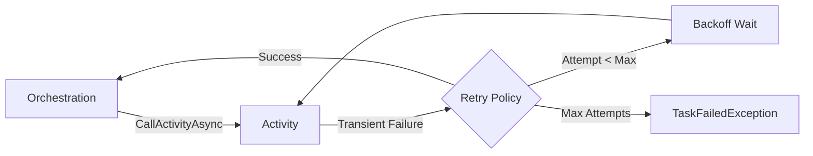

# Automatic Retries

The Durable Task .NET SDK with **Durable Task Scheduler** provides built-in retry mechanisms for handling transient failures in activities and sub-orchestrations.

## Overview



Cloud applications frequently interact with unreliable services that may experience transient failures. Automatic retries help build resilient applications without manual retry logic.

## Retry Policy

### Basic Configuration

```csharp
public override async Task<string> RunAsync(
    TaskOrchestrationContext context, 
    string input)
{
    var retryPolicy = new RetryPolicy(
        maxNumberOfAttempts: 5,
        firstRetryInterval: TimeSpan.FromSeconds(10));

    var options = new TaskOptions { Retry = retryPolicy };

    return await context.CallActivityAsync<string>(
        "UnreliableActivity", 
        input, 
        options);
}
```

### Full Configuration Options

```csharp
var retryPolicy = new RetryPolicy(
    // Maximum number of retry attempts
    maxNumberOfAttempts: 5,
    
    // Delay before the first retry
    firstRetryInterval: TimeSpan.FromSeconds(10),
    
    // Multiplier for exponential backoff
    // Delay = firstRetryInterval * (backoffCoefficient ^ attemptNumber)
    backoffCoefficient: 2.0,
    
    // Maximum delay between retries
    maxRetryInterval: TimeSpan.FromMinutes(5),
    
    // Total timeout for all retry attempts
    retryTimeout: TimeSpan.FromHours(1));
```

### Retry Behavior Example

With the configuration above:

| Attempt | Delay Before Retry |
|---------|-------------------|
| 1       | 10 seconds        |
| 2       | 20 seconds        |
| 3       | 40 seconds        |
| 4       | 80 seconds        |
| 5       | 160 seconds (capped at 5 min) |

## Using TaskOptions

### With Activities

```csharp
public override async Task<string> RunAsync(
    TaskOrchestrationContext context, 
    string input)
{
    var options = new TaskOptions
    {
        Retry = new RetryPolicy(
            maxNumberOfAttempts: 3,
            firstRetryInterval: TimeSpan.FromSeconds(5))
    };

    return await context.CallActivityAsync<string>(
        "ProcessData", 
        input, 
        options);
}
```

### With Sub-Orchestrations

```csharp
public override async Task<string> RunAsync(
    TaskOrchestrationContext context, 
    string input)
{
    var options = new TaskOptions
    {
        Retry = new RetryPolicy(
            maxNumberOfAttempts: 3,
            firstRetryInterval: TimeSpan.FromMinutes(1))
    };

    return await context.CallSubOrchestratorAsync<string>(
        "ChildOrchestration", 
        input, 
        options);
}
```

## Custom Retry Handler

For more control over retry logic, use `AsyncRetryHandler`:

### Basic Custom Handler

```csharp
public override async Task<string> RunAsync(
    TaskOrchestrationContext context, 
    string input)
{
    var retryHandler = new AsyncRetryHandler(async (failure, attemptNumber) =>
    {
        // Return TimeSpan to retry after that delay
        // Return null to stop retrying
        
        if (attemptNumber >= 5)
        {
            return null; // Stop retrying after 5 attempts
        }
        
        // Exponential backoff
        return TimeSpan.FromSeconds(Math.Pow(2, attemptNumber));
    });

    var options = new TaskOptions { Retry = retryHandler };

    return await context.CallActivityAsync<string>(
        "UnreliableActivity", 
        input, 
        options);
}
```

### Retry Based on Exception Type

```csharp
var retryHandler = new AsyncRetryHandler(async (failure, attemptNumber) =>
{
    // Don't retry validation errors
    if (failure.ErrorType.Contains("ValidationException"))
    {
        return null;
    }
    
    // Retry network errors with exponential backoff
    if (failure.ErrorType.Contains("HttpRequestException") ||
        failure.ErrorType.Contains("SocketException"))
    {
        if (attemptNumber < 5)
        {
            return TimeSpan.FromSeconds(Math.Pow(2, attemptNumber));
        }
    }
    
    // Retry rate limits with longer delay
    if (failure.ErrorType.Contains("RateLimitException") ||
        failure.ErrorMessage.Contains("429"))
    {
        if (attemptNumber < 3)
        {
            return TimeSpan.FromMinutes(attemptNumber);
        }
    }
    
    // Retry timeout errors
    if (failure.ErrorType.Contains("TimeoutException"))
    {
        if (attemptNumber < 10)
        {
            return TimeSpan.FromSeconds(30);
        }
    }
    
    // Don't retry unknown errors
    return null;
});
```

### Retry with Logging

```csharp
public override async Task<string> RunAsync(
    TaskOrchestrationContext context, 
    string input)
{
    var logger = context.CreateReplaySafeLogger("RetryHandler");

    var retryHandler = new AsyncRetryHandler(async (failure, attemptNumber) =>
    {
        logger.LogWarning(
            "Activity failed (attempt {Attempt}): {ErrorType} - {ErrorMessage}",
            attemptNumber,
            failure.ErrorType,
            failure.ErrorMessage);

        if (attemptNumber >= 5)
        {
            logger.LogError("Max retries exceeded, giving up");
            return null;
        }

        var delay = TimeSpan.FromSeconds(Math.Pow(2, attemptNumber));
        logger.LogInformation("Retrying in {Delay}", delay);
        
        return delay;
    });

    var options = new TaskOptions { Retry = retryHandler };

    return await context.CallActivityAsync<string>(
        "UnreliableActivity", 
        input, 
        options);
}
```

## Retry Patterns

### Different Policies for Different Activities

```csharp
public override async Task<OrderResult> RunAsync(
    TaskOrchestrationContext context, 
    OrderInfo order)
{
    // Database operations - fewer retries, short intervals
    var dbRetryPolicy = new RetryPolicy(
        maxNumberOfAttempts: 3,
        firstRetryInterval: TimeSpan.FromSeconds(1));

    // External API calls - more retries, longer intervals
    var apiRetryPolicy = new RetryPolicy(
        maxNumberOfAttempts: 5,
        firstRetryInterval: TimeSpan.FromSeconds(5),
        backoffCoefficient: 2.0,
        maxRetryInterval: TimeSpan.FromMinutes(1));

    // Payment processing - very few retries to avoid double charges
    var paymentRetryPolicy = new RetryPolicy(
        maxNumberOfAttempts: 2,
        firstRetryInterval: TimeSpan.FromSeconds(30));

    await context.CallActivityAsync(
        "ValidateOrder", 
        order, 
        new TaskOptions { Retry = dbRetryPolicy });

    await context.CallActivityAsync(
        "CheckInventory", 
        order, 
        new TaskOptions { Retry = apiRetryPolicy });

    var payment = await context.CallActivityAsync<PaymentResult>(
        "ProcessPayment", 
        order, 
        new TaskOptions { Retry = paymentRetryPolicy });

    return new OrderResult(payment);
}
```

### Retry with Fallback

```csharp
public override async Task<string> RunAsync(
    TaskOrchestrationContext context, 
    string input)
{
    var primaryOptions = new TaskOptions
    {
        Retry = new RetryPolicy(
            maxNumberOfAttempts: 3,
            firstRetryInterval: TimeSpan.FromSeconds(5))
    };

    try
    {
        // Try primary service
        return await context.CallActivityAsync<string>(
            "CallPrimaryService", 
            input, 
            primaryOptions);
    }
    catch (TaskFailedException)
    {
        // Fall back to secondary service
        return await context.CallActivityAsync<string>(
            "CallSecondaryService", 
            input, 
            primaryOptions);
    }
}
```

### Retry with Circuit Breaker

```csharp
public override async Task<string> RunAsync(
    TaskOrchestrationContext context, 
    string input)
{
    var circuitBreakerId = new EntityInstanceId("CircuitBreaker", "external-api");
    
    // Check circuit breaker state
    var state = await context.Entities.CallEntityAsync<CircuitState>(
        circuitBreakerId, 
        "GetState");

    if (state == CircuitState.Open)
    {
        throw new Exception("Circuit breaker is open - service unavailable");
    }

    var retryHandler = new AsyncRetryHandler(async (failure, attemptNumber) =>
    {
        // Record failure
        await context.Entities.SignalEntityAsync(circuitBreakerId, "RecordFailure");
        
        if (attemptNumber >= 3)
        {
            return null;
        }
        
        return TimeSpan.FromSeconds(Math.Pow(2, attemptNumber));
    });

    try
    {
        var result = await context.CallActivityAsync<string>(
            "CallExternalApi", 
            input, 
            new TaskOptions { Retry = retryHandler });

        // Record success
        await context.Entities.SignalEntityAsync(circuitBreakerId, "RecordSuccess");
        
        return result;
    }
    catch (TaskFailedException)
    {
        // All retries failed
        throw;
    }
}
```

## Retry Considerations

### When to Use Retries

✅ **Good candidates for retries:**
- Network timeouts
- Service temporarily unavailable (503)
- Rate limiting (429)
- Transient database errors
- External API failures

❌ **Don't retry these:**
- Validation errors (400)
- Authentication failures (401)
- Authorization failures (403)
- Not found errors (404)
- Business logic errors

### Idempotency Requirements

Activities being retried must be **idempotent** or use idempotency keys:

```csharp
[DurableTask("ProcessPayment")]
public class ProcessPaymentActivity : TaskActivity<PaymentRequest, PaymentResult>
{
    private readonly IPaymentService _paymentService;

    public override async Task<PaymentResult> RunAsync(
        TaskActivityContext context, 
        PaymentRequest request)
    {
        // Use orchestration instance ID as idempotency key
        string idempotencyKey = $"{context.InstanceId}-{request.OrderId}";
        
        // Check if already processed
        var existing = await _paymentService.GetByIdempotencyKeyAsync(idempotencyKey);
        if (existing != null)
        {
            return existing; // Return cached result
        }
        
        // Process with idempotency key
        return await _paymentService.ProcessAsync(request, idempotencyKey);
    }
}
```

### Retry Timeouts

Consider total execution time when configuring retries:

```csharp
// Total time with 5 attempts and exponential backoff:
// 10s + 20s + 40s + 80s + 160s = 310 seconds (5+ minutes)

var policy = new RetryPolicy(
    maxNumberOfAttempts: 5,
    firstRetryInterval: TimeSpan.FromSeconds(10),
    backoffCoefficient: 2.0,
    maxRetryInterval: TimeSpan.FromMinutes(5),
    retryTimeout: TimeSpan.FromMinutes(10)); // Cap total retry time
```

## Azure Functions Integration

In Azure Functions, configure retries the same way:

```csharp
[Function("MyOrchestrator")]
public static async Task<string> RunOrchestrator(
    [OrchestrationTrigger] TaskOrchestrationContext context)
{
    var retryPolicy = new RetryPolicy(
        maxNumberOfAttempts: 3,
        firstRetryInterval: TimeSpan.FromSeconds(5),
        backoffCoefficient: 2.0);

    var options = new TaskOptions { Retry = retryPolicy };

    return await context.CallActivityAsync<string>(
        "UnreliableActivity", 
        "input", 
        options);
}
```

## Best Practices

### 1. Configure Appropriate Delays

```csharp
// For fast operations (e.g., database)
var fastRetry = new RetryPolicy(
    maxNumberOfAttempts: 3,
    firstRetryInterval: TimeSpan.FromMilliseconds(100),
    maxRetryInterval: TimeSpan.FromSeconds(1));

// For slow operations (e.g., external APIs)
var slowRetry = new RetryPolicy(
    maxNumberOfAttempts: 5,
    firstRetryInterval: TimeSpan.FromSeconds(5),
    backoffCoefficient: 2.0,
    maxRetryInterval: TimeSpan.FromMinutes(2));
```

### 2. Add Jitter to Prevent Thundering Herd

```csharp
var retryHandler = new AsyncRetryHandler(async (failure, attemptNumber) =>
{
    if (attemptNumber >= 5) return null;
    
    var baseDelay = TimeSpan.FromSeconds(Math.Pow(2, attemptNumber));
    var jitter = TimeSpan.FromMilliseconds(Random.Shared.Next(0, 1000));
    
    return baseDelay + jitter;
});
```

### 3. Log Retry Attempts

```csharp
var retryHandler = new AsyncRetryHandler(async (failure, attemptNumber) =>
{
    logger.LogWarning(
        "Retry {Attempt} for {ErrorType}: {ErrorMessage}",
        attemptNumber,
        failure.ErrorType,
        failure.ErrorMessage);
    
    if (attemptNumber >= 5) return null;
    return TimeSpan.FromSeconds(Math.Pow(2, attemptNumber));
});
```

## Next Steps

- [Error Handling & Compensation](Error-Handling-and-Compensation.md) - Handle failures
- [Writing Task Activities](Writing-Task-Activities.md) - Activity best practices
- [Durable Timers](Durable-Timers.md) - Timeout patterns
