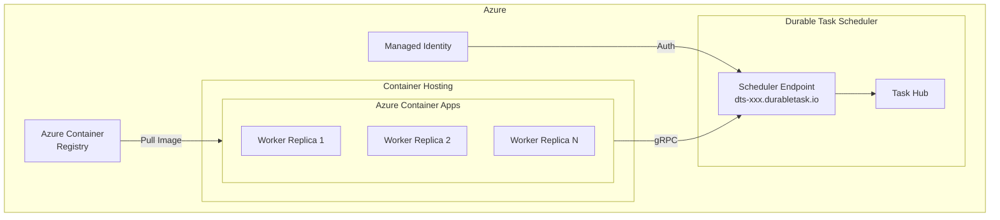
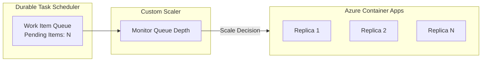

# Container Deployment

This guide covers deploying Durable Task SDK applications to containers using the Durable Task Scheduler, including Docker, Azure Container Apps (ACA), and Azure Kubernetes Service (AKS).

## Architecture Overview



## Docker (Local Development)

### Using the Emulator

```bash
# Pull and run the Durable Task Scheduler emulator
docker pull mcr.microsoft.com/dts/dts-emulator:latest
docker run -d -p 8080:8080 -p 8082:8082 --name dtsemulator mcr.microsoft.com/dts/dts-emulator:latest
```

**Ports:**
- `8080` - gRPC endpoint for worker/client connections
- `8082` - Web dashboard for monitoring

### Containerize Your Application

**Dockerfile:**
```dockerfile
# Build stage
FROM mcr.microsoft.com/dotnet/sdk:8.0 AS build
WORKDIR /src

COPY *.csproj ./
RUN dotnet restore

COPY . ./
RUN dotnet publish -c Release -o /app/publish

# Runtime stage
FROM mcr.microsoft.com/dotnet/aspnet:8.0 AS runtime
WORKDIR /app

COPY --from=build /app/publish .

# Set environment variables
ENV ASPNETCORE_URLS=http://+:8080
ENV DURABLE_TASK_SCHEDULER_CONNECTION_STRING=""

EXPOSE 8080
ENTRYPOINT ["dotnet", "MyDurableApp.dll"]
```

**docker-compose.yml:**
```yaml
version: '3.8'

services:
  dts-emulator:
    image: mcr.microsoft.com/dts/dts-emulator:latest
    ports:
      - "8080:8080"
      - "8082:8082"
    healthcheck:
      test: ["CMD", "curl", "-f", "http://localhost:8080"]
      interval: 10s
      timeout: 5s
      retries: 5

  worker:
    build: ./Worker
    environment:
      - DURABLE_TASK_SCHEDULER_CONNECTION_STRING=Endpoint=http://dts-emulator:8080;TaskHub=default;Authentication=None
    depends_on:
      dts-emulator:
        condition: service_healthy

  client:
    build: ./Client
    ports:
      - "5000:8080"
    environment:
      - DURABLE_TASK_SCHEDULER_CONNECTION_STRING=Endpoint=http://dts-emulator:8080;TaskHub=default;Authentication=None
    depends_on:
      dts-emulator:
        condition: service_healthy
      worker:
        condition: service_started
```

## Azure Container Apps

Azure Container Apps (ACA) is the recommended deployment target for Durable Task SDK applications due to its built-in support for the Durable Task Scheduler scaler.

### Prerequisites

- Azure CLI
- Azure Developer CLI (azd)
- Docker
- Azure subscription with Container Apps enabled

### Deployment with Azure Developer CLI

The easiest way to deploy is using the Azure Developer CLI with the provided samples:

```bash
# Clone the samples repository
git clone https://github.com/Azure-Samples/Durable-Task-Scheduler.git
cd Durable-Task-Scheduler/samples/durable-task-sdks/dotnet/FunctionChaining

# Deploy to Azure
azd up
```

This provisions:
- Azure Container Apps Environment
- Azure Container Registry
- Durable Task Scheduler
- Task Hub
- Worker and Client container apps

### Manual Deployment

**1. Create Azure Resources:**

```bash
# Set variables
RESOURCE_GROUP="my-durable-app-rg"
LOCATION="westus2"
ACR_NAME="mydurableappacr"
ACA_ENV_NAME="my-aca-env"
DTS_NAME="my-scheduler"
TASKHUB_NAME="default"

# Create resource group
az group create --name $RESOURCE_GROUP --location $LOCATION

# Create container registry
az acr create --resource-group $RESOURCE_GROUP --name $ACR_NAME --sku Basic

# Create Durable Task Scheduler
az durabletask scheduler create \
    --resource-group $RESOURCE_GROUP \
    --name $DTS_NAME \
    --location $LOCATION \
    --sku-name "Dedicated" \
    --sku-capacity 1

# Create Task Hub
az durabletask taskhub create \
    --resource-group $RESOURCE_GROUP \
    --scheduler-name $DTS_NAME \
    --name $TASKHUB_NAME

# Get scheduler endpoint
DTS_ENDPOINT=$(az durabletask scheduler show \
    --resource-group $RESOURCE_GROUP \
    --name $DTS_NAME \
    --query "properties.endpoint" \
    --output tsv)
```

**2. Build and Push Container Image:**

```bash
# Login to ACR
az acr login --name $ACR_NAME

# Build and push
az acr build --registry $ACR_NAME --image mydurableapp:v1 .
```

**3. Create Container Apps Environment:**

```bash
az containerapp env create \
    --name $ACA_ENV_NAME \
    --resource-group $RESOURCE_GROUP \
    --location $LOCATION
```

**4. Create Container App with Managed Identity:**

```bash
# Create the app with system-assigned identity
az containerapp create \
    --name my-worker-app \
    --resource-group $RESOURCE_GROUP \
    --environment $ACA_ENV_NAME \
    --image $ACR_NAME.azurecr.io/mydurableapp:v1 \
    --target-port 8080 \
    --ingress external \
    --registry-server $ACR_NAME.azurecr.io \
    --system-assigned \
    --env-vars "DURABLE_TASK_SCHEDULER_CONNECTION_STRING=Endpoint=$DTS_ENDPOINT;TaskHub=$TASKHUB_NAME;Authentication=ManagedIdentity"

# Grant role to managed identity
IDENTITY_PRINCIPAL_ID=$(az containerapp show \
    --name my-worker-app \
    --resource-group $RESOURCE_GROUP \
    --query identity.principalId \
    --output tsv)

DTS_RESOURCE_ID=$(az durabletask scheduler show \
    --resource-group $RESOURCE_GROUP \
    --name $DTS_NAME \
    --query id \
    --output tsv)

az role assignment create \
    --assignee $IDENTITY_PRINCIPAL_ID \
    --role "Durable Task Data Contributor" \
    --scope $DTS_RESOURCE_ID
```

### Auto-Scaling with Durable Task Scheduler

Configure auto-scaling based on orchestration workload:



**Bicep Configuration for Auto-Scaling:**

```bicep
resource workerApp 'Microsoft.App/containerApps@2024-03-01' = {
  name: 'worker-app'
  location: location
  properties: {
    environmentId: containerAppsEnvironment.id
    configuration: {
      ingress: {
        external: false
        targetPort: 8080
      }
    }
    template: {
      containers: [
        {
          name: 'worker'
          image: '${containerRegistry.properties.loginServer}/worker:latest'
          env: [
            {
              name: 'DURABLE_TASK_SCHEDULER_CONNECTION_STRING'
              value: 'Endpoint=${dts.properties.endpoint};TaskHub=${taskHub.name};Authentication=ManagedIdentity'
            }
          ]
        }
      ]
      scale: {
        minReplicas: 1
        maxReplicas: 10
        rules: [
          {
            name: 'dts-scaler'
            custom: {
              type: 'durabletask'
              metadata: {
                endpoint: dts.properties.endpoint
                taskHubName: taskHub.name
                maxConcurrentWorkItemsCount: '1'
                workItemType: 'Orchestration'
              }
              identity: 'system'
            }
          }
        ]
      }
    }
  }
}
```

**Portal Configuration:**

| Parameter | Description | Example |
|-----------|-------------|---------|
| Min replicas | Minimum number of replicas | 1 |
| Max replicas | Maximum number of replicas | 10 |
| endpoint | Durable Task Scheduler endpoint | https://dts-xxx.durabletask.io |
| taskHubName | Name of the task hub | default |
| maxConcurrentWorkItemsCount | Max concurrent work items per replica | 1 |
| workItemType | Type of work item to scale on | Orchestration, Activity, or Entity |

## Azure Kubernetes Service

For more complex deployments or existing Kubernetes infrastructure.

### Prerequisites

- AKS cluster with workload identity enabled
- Azure Container Registry
- kubectl configured

### Kubernetes Manifests

**deployment.yaml:**
```yaml
apiVersion: apps/v1
kind: Deployment
metadata:
  name: durable-worker
  labels:
    app: durable-worker
spec:
  replicas: 3
  selector:
    matchLabels:
      app: durable-worker
  template:
    metadata:
      labels:
        app: durable-worker
        azure.workload.identity/use: "true"
    spec:
      serviceAccountName: durable-app-sa
      containers:
      - name: worker
        image: myregistry.azurecr.io/durable-worker:latest
        ports:
        - containerPort: 8080
        env:
        - name: DURABLE_TASK_SCHEDULER_CONNECTION_STRING
          value: "Endpoint=https://dts-xxx.durabletask.io;TaskHub=mytaskhub;Authentication=ManagedIdentity"
        resources:
          requests:
            memory: "256Mi"
            cpu: "250m"
          limits:
            memory: "512Mi"
            cpu: "500m"
---
apiVersion: v1
kind: Service
metadata:
  name: durable-worker-service
spec:
  selector:
    app: durable-worker
  ports:
  - port: 80
    targetPort: 8080
```

**service-account.yaml:**
```yaml
apiVersion: v1
kind: ServiceAccount
metadata:
  name: durable-app-sa
  annotations:
    azure.workload.identity/client-id: "<YOUR_MANAGED_IDENTITY_CLIENT_ID>"
```

**Horizontal Pod Autoscaler (HPA):**
```yaml
apiVersion: autoscaling/v2
kind: HorizontalPodAutoscaler
metadata:
  name: durable-worker-hpa
spec:
  scaleTargetRef:
    apiVersion: apps/v1
    kind: Deployment
    name: durable-worker
  minReplicas: 2
  maxReplicas: 10
  metrics:
  - type: External
    external:
      metric:
        name: azure-durabletask-pending-work-items
        selector:
          matchLabels:
            metricName: "pending-orchestrations"
      target:
        type: AverageValue
        averageValue: "5"
```

### Deploy to AKS

```bash
# Configure kubectl
az aks get-credentials --resource-group $RESOURCE_GROUP --name $AKS_NAME

# Apply manifests
kubectl apply -f service-account.yaml
kubectl apply -f deployment.yaml

# Verify deployment
kubectl get pods -l app=durable-worker
kubectl logs -l app=durable-worker
```

## Authentication Options

| Authentication | Connection String | Use Case |
|----------------|-------------------|----------|
| None | `Authentication=None` | Local emulator only |
| DefaultAzure | `Authentication=DefaultAzure` | Local dev with Azure CLI login |
| ManagedIdentity | `Authentication=ManagedIdentity` | Azure Container Apps, AKS |
| ManagedIdentity with ClientID | `Authentication=ManagedIdentity;ClientID=xxx` | User-assigned identity |

### Program.cs Configuration

```csharp
var builder = WebApplication.CreateBuilder(args);

// Get connection string from environment
string connectionString = builder.Configuration["DURABLE_TASK_SCHEDULER_CONNECTION_STRING"]
    ?? throw new InvalidOperationException("Connection string not configured");

// Register worker
builder.Services.AddDurableTaskWorker(options =>
{
    options.AddTasks(r => r.AddAllGeneratedTasks());
    options.UseDurableTaskScheduler(connectionString);
});

// Register client
builder.Services.AddDurableTaskClient(options =>
{
    options.UseDurableTaskScheduler(connectionString);
});
```

## Monitoring

### Emulator Dashboard

When using the emulator, access the dashboard at `http://localhost:8082`:
- View running orchestrations
- Inspect orchestration history
- Query entities
- Monitor activity execution

### Azure Portal

For deployed schedulers:
1. Navigate to your Durable Task Scheduler resource
2. View metrics for:
   - Pending work items
   - Completed orchestrations
   - Failed orchestrations
   - Activity execution times

### Application Insights

```csharp
builder.Services.AddLogging(logging =>
{
    logging.AddApplicationInsights(
        configureTelemetryConfiguration: config =>
            config.ConnectionString = builder.Configuration["APPLICATIONINSIGHTS_CONNECTION_STRING"],
        configureApplicationInsightsLoggerOptions: options => { });
});
```

## Next Steps

- [Getting Started](Getting-Started.md) - Set up your first project
- [Orchestration Versioning](Orchestration-Versioning.md) - Deploy updates safely
- [Auto-scaling Best Practices](https://learn.microsoft.com/azure/azure-functions/durable/durable-task-scheduler/durable-task-scheduler-auto-scaling)
