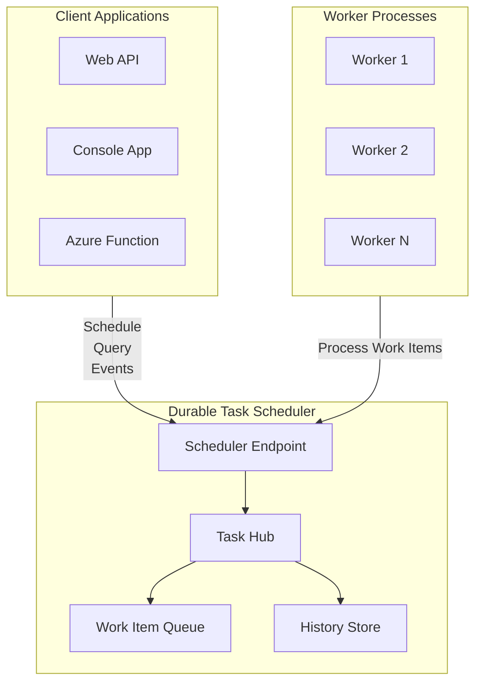
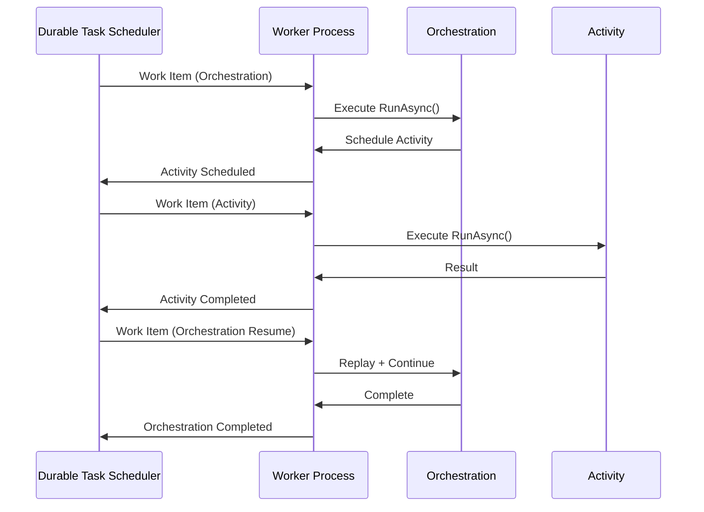
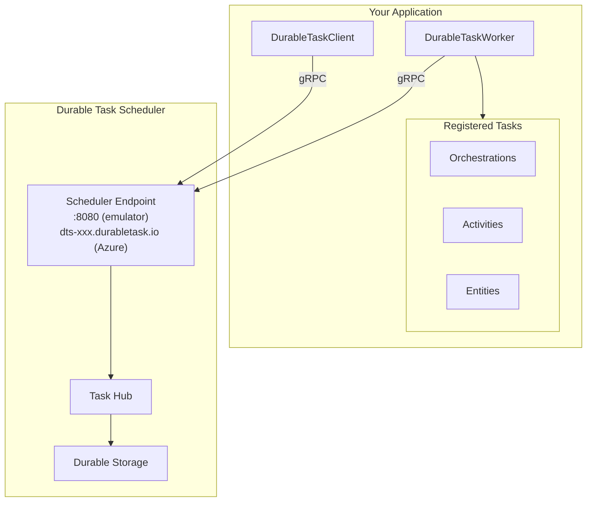
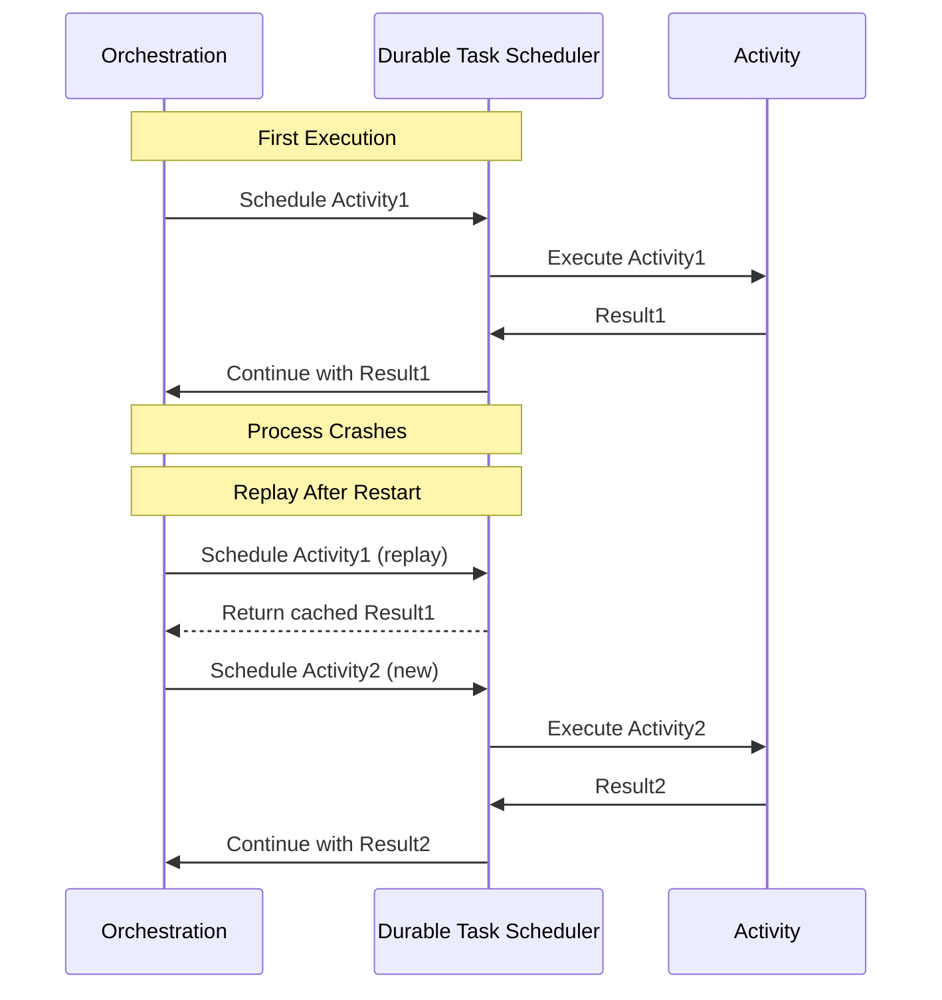

# Core Concepts

This page describes the core concepts of the Durable Task SDK for .NET when used with the **Durable Task Scheduler**. Understanding these concepts is essential for building reliable, scalable workflows.

## Durable Task Scheduler Architecture

The Durable Task Scheduler is a fully managed Azure service that provides the backend infrastructure for durable orchestrations.



### Key Components

| Component | Description |
|-----------|-------------|
| **Scheduler Endpoint** | gRPC endpoint (e.g., `dts-xxx.durabletask.io`) for client/worker connections |
| **Task Hub** | Logical container for orchestrations, entities, and their history |
| **Work Item Queue** | Distributes work items to available workers |
| **History Store** | Persists orchestration events for replay and recovery |

### Connection String

```csharp
// Local emulator
string connectionString = "Endpoint=http://localhost:8080;TaskHub=default;Authentication=None";

// Azure deployment
string connectionString = "Endpoint=https://dts-xxx.centralus.durabletask.io;TaskHub=mytaskhub;Authentication=DefaultAzure";
```

## Task Orchestrations

Task Orchestrations are the core building blocks of the Durable Task .NET SDK. They define the workflow logic that coordinates activities and other orchestrations.

### What is an Orchestration?

An orchestration is a durable, long-running workflow defined in code. Orchestrations:

- **Schedule activities** and wait for their results
- **Create timers** for delays and timeouts
- **Wait for external events** like human input or external triggers
- **Call sub-orchestrations** for composing complex workflows
- **Interact with durable entities** for stateful operations

### Key Characteristics

1. **Durability**: Orchestration state is automatically persisted and can survive process restarts
2. **Replay-safe**: The framework replays orchestration history to rebuild state
3. **Deterministic**: Orchestration code must be deterministic (same inputs produce same outputs)
4. **Single-threaded**: Orchestration code runs on a single thread, simplifying concurrency

### Example Orchestration

```csharp
using Microsoft.DurableTask;

[DurableTask(nameof(OrderProcessingOrchestration))]
public class OrderProcessingOrchestration : TaskOrchestrator<OrderInfo, OrderResult>
{
    public override async Task<OrderResult> RunAsync(
        TaskOrchestrationContext context, 
        OrderInfo order)
    {
        // Validate order
        await context.CallActivityAsync("ValidateOrder", order);
        
        // Process payment
        var payment = await context.CallActivityAsync<PaymentResult>("ProcessPayment", order);
        
        // Ship order
        var shipping = await context.CallActivityAsync<ShippingInfo>("ShipOrder", order);
        
        return new OrderResult(payment, shipping);
    }
}
```

## Task Activities

Task Activities are the "leaf" nodes of an orchestration - they perform the actual work. Unlike orchestrations, activities have no constraints on what code they can run.

### What is an Activity?

An activity is a single unit of work within an orchestration. Activities can:

- Make HTTP requests
- Access databases
- Read/write files
- Call external services
- Perform any I/O operation

### Execution Guarantees

Activities are guaranteed to execute **at least once**. In error cases, an activity might be invoked multiple times, so implementing activities as **idempotent operations** is recommended.

### Example Activity

```csharp
using Microsoft.DurableTask;

[DurableTask("ProcessPayment")]
public class ProcessPaymentActivity : TaskActivity<OrderInfo, PaymentResult>
{
    private readonly IPaymentService _paymentService;
    private readonly ILogger<ProcessPaymentActivity> _logger;

    public ProcessPaymentActivity(
        IPaymentService paymentService,
        ILogger<ProcessPaymentActivity> logger)
    {
        _paymentService = paymentService;
        _logger = logger;
    }

    public override async Task<PaymentResult> RunAsync(
        TaskActivityContext context, 
        OrderInfo order)
    {
        _logger.LogInformation(
            "Processing payment for order {OrderId}, amount: {Amount}",
            order.Id, order.Amount);
        
        return await _paymentService.ProcessAsync(order);
    }
}
```

## Durable Task Client

The `DurableTaskClient` provides APIs for managing orchestration instances from outside the orchestration context.

### Capabilities

- **Create orchestration instances** - Start new orchestrations
- **Query orchestration state** - Get status and output of running/completed orchestrations
- **Terminate instances** - Force-stop running orchestrations
- **Raise events** - Send events to waiting orchestrations
- **Purge history** - Clean up completed orchestration data

### Example Usage

```csharp
using Microsoft.DurableTask.Client;

public class OrderController
{
    private readonly DurableTaskClient _client;

    public OrderController(DurableTaskClient client)
    {
        _client = client;
    }

    public async Task<string> CreateOrder(OrderInfo order)
    {
        // Start a new orchestration instance
        string instanceId = await _client.ScheduleNewOrchestrationInstanceAsync(
            nameof(OrderProcessingOrchestration),
            order);

        return instanceId;
    }

    public async Task<OrchestrationMetadata?> GetOrderStatus(string instanceId)
    {
        return await _client.GetInstanceAsync(instanceId, getInputsAndOutputs: true);
    }
}
```

## Durable Task Worker

The `DurableTaskWorker` hosts orchestrations and activities, processing work items from the Durable Task Scheduler.



### Configuration with Durable Task Scheduler

```csharp
using Microsoft.DurableTask.Worker;
using Microsoft.DurableTask.Worker.AzureManaged;

var builder = WebApplication.CreateBuilder(args);

string connectionString = builder.Configuration["DURABLE_TASK_SCHEDULER_CONNECTION_STRING"]
    ?? "Endpoint=http://localhost:8080;TaskHub=default;Authentication=None";

builder.Services.AddDurableTaskWorker(options =>
{
    // Auto-register all tasks with [DurableTask] attribute
    options.AddTasks(tasks => tasks.AddAllGeneratedTasks());
    
    // Or manually register
    options.AddTasks(tasks =>
    {
        tasks.AddOrchestrator<OrderProcessingOrchestration>();
        tasks.AddActivity<ProcessPaymentActivity>();
        tasks.AddActivity<ShipOrderActivity>();
    });
    
    // Connect to Durable Task Scheduler
    options.UseDurableTaskScheduler(connectionString);
});
```

## Durable Entities

Durable Entities provide a way to manage small pieces of state that can be accessed and modified reliably.

### What is a Durable Entity?

A durable entity is a small, stateful object identified by a unique ID. Entities:

- Maintain state durably
- Process operations one at a time (serialized access)
- Can be called from orchestrations or directly from clients
- Support signaling (fire-and-forget) and calling (request-response)

### Example Entity

```csharp
using Microsoft.DurableTask.Entities;

public class CounterEntity : TaskEntity<int>
{
    public void Add(int amount)
    {
        this.State += amount;
    }

    public void Reset()
    {
        this.State = 0;
    }

    public int Get()
    {
        return this.State;
    }
}
```

### Calling Entities from Orchestrations

```csharp
public override async Task<int> RunAsync(TaskOrchestrationContext context, string input)
{
    var entityId = new EntityInstanceId(nameof(CounterEntity), "myCounter");
    
    // Call entity and get result
    int result = await context.Entities.CallEntityAsync<int>(entityId, "Get");
    
    // Signal entity (fire-and-forget)
    await context.Entities.SignalEntityAsync(entityId, "Add", 5);
    
    return result;
}
```

## Architecture Overview



### Component Responsibilities

| Component | Responsibility |
|-----------|----------------|
| **DurableTaskClient** | Schedule orchestrations, query status, raise events, terminate instances |
| **DurableTaskWorker** | Process orchestration and activity work items |
| **Orchestrations** | Define workflow logic, coordinate activities |
| **Activities** | Perform actual work (I/O, external calls) |
| **Entities** | Manage small pieces of durable state |
| **Durable Task Scheduler** | Persist state, distribute work, ensure durability |

## Execution Model

### Replay Mechanism

The framework uses **event sourcing** to maintain orchestration state:



1. When an orchestration runs, each action (scheduling activity, creating timer, etc.) generates an event
2. Events are persisted to durable storage in the Durable Task Scheduler
3. If the orchestration needs to restart (e.g., after a crash), the framework replays these events
4. During replay, the orchestration code re-executes, but completed actions return cached results

### Example Replay Scenario

```csharp
public override async Task<string> RunAsync(TaskOrchestrationContext context, string input)
{
    // First execution: Activity is actually scheduled
    // Replay: Returns cached result immediately
    var result1 = await context.CallActivityAsync<string>("Activity1", input);
    
    // If process crashes here...
    
    // First execution: Activity is scheduled
    // Replay: Returns cached result (Activity1), then schedules Activity2
    var result2 = await context.CallActivityAsync<string>("Activity2", result1);
    
    return result2;
}
```

## Next Steps

- [Writing Task Orchestrations](Writing-Task-Orchestrations.md) - Deep dive into orchestration development
- [Writing Task Activities](Writing-Task-Activities.md) - Learn activity best practices
- [Durable Entities](Durable-Entities.md) - Work with stateful entities
- [Getting Started](Getting-Started.md) - Build your first workflow
