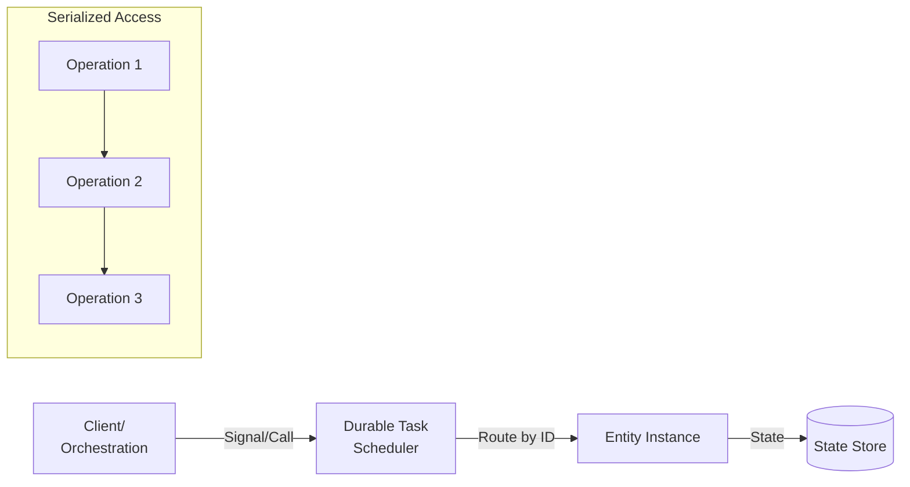
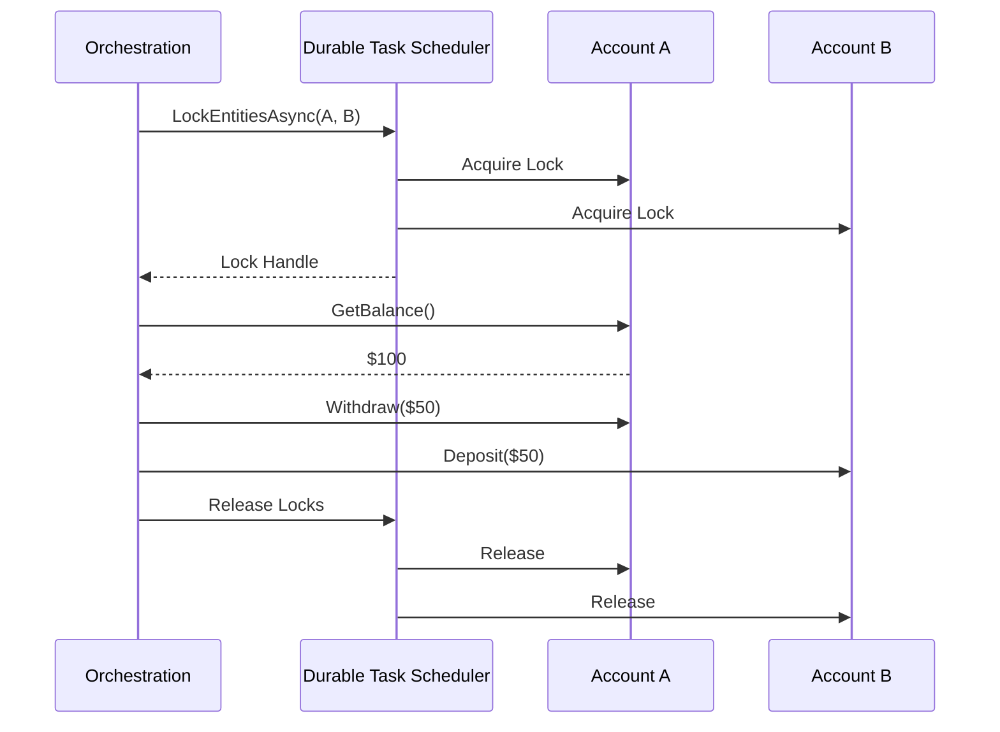

# Durable Entities

Durable Entities provide a way to define and manage small pieces of state that can be accessed and modified reliably. They are useful for scenarios requiring stateful, actor-like programming patterns with **Durable Task Scheduler**.

## Overview



### What is a Durable Entity?

A durable entity is:
- A small, stateful object with a unique identifier
- Accessible from orchestrations and clients
- Processes operations one at a time (serialized access)
- Persists state durably across restarts

### Entity Instance ID

Each entity is identified by:
- **Entity Name**: The type of entity (e.g., "Account", "User")
- **Entity Key**: A unique identifier within that type (e.g., "account-001", "user-123")

```csharp
// Create an entity ID
var entityId = new EntityInstanceId("Account", "account-001");
var entityId2 = new EntityInstanceId(nameof(CounterEntity), "counter-001");
```

## Defining Entities

### Class-Based Entity (Recommended)

The simplest way to define an entity is by inheriting from `TaskEntity<TState>`. Here's the **Account entity** from the Durable Task Scheduler samples:

```csharp
using Microsoft.DurableTask.Entities;

/// <summary>
/// Account entity that manages a balance with deposit/withdraw operations.
/// From: Azure-Samples/Durable-Task-Scheduler/dotnet/EntitiesSample
/// </summary>
public class Account : TaskEntity<int>
{
    public int Deposit(int amount)
    {
        this.State += amount;
        return this.State;
    }

    public int Withdraw(int amount)
    {
        if (amount > this.State)
        {
            throw new InvalidOperationException("Insufficient funds");
        }
        this.State -= amount;
        return this.State;
    }

    public int GetBalance()
    {
        return this.State;
    }
}
```

### Simple Counter Entity

```csharp
public class CounterEntity : TaskEntity<int>
{
    public void Add(int amount)
    {
        this.State += amount;
    }

    public void Subtract(int amount)
    {
        this.State -= amount;
    }

    public void Reset()
    {
        this.State = 0;
    }

    public int Get()
    {
        return this.State;
    }
}
```

### Entity with Complex State

```csharp
public class UserEntity : TaskEntity<UserState>
{
    private readonly ILogger<UserEntity> _logger;

    public UserEntity(ILogger<UserEntity> logger)
    {
        _logger = logger;
    }

    protected override UserState InitializeState(TaskEntityOperation operation)
    {
        // Initialize state if null
        return new UserState
        {
            CreatedAt = DateTime.UtcNow,
            IsActive = true
        };
    }

    public void SetProfile(UserProfile profile)
    {
        _logger.LogInformation("Updating profile for user");
        this.State.Name = profile.Name;
        this.State.Email = profile.Email;
        this.State.UpdatedAt = DateTime.UtcNow;
    }

    public void Deactivate()
    {
        this.State.IsActive = false;
        this.State.DeactivatedAt = DateTime.UtcNow;
    }

    public void Activate()
    {
        this.State.IsActive = true;
        this.State.DeactivatedAt = null;
    }

    public UserState GetState()
    {
        return this.State;
    }

    public bool IsActive()
    {
        return this.State.IsActive;
    }
}

public class UserState
{
    public string? Name { get; set; }
    public string? Email { get; set; }
    public DateTime CreatedAt { get; set; }
    public DateTime? UpdatedAt { get; set; }
    public bool IsActive { get; set; }
    public DateTime? DeactivatedAt { get; set; }
}
```

### Entity with Context Access

You can access the `TaskEntityContext` in entity operations:

```csharp
public class ShoppingCartEntity : TaskEntity<ShoppingCart>
{
    private readonly ILogger<ShoppingCartEntity> _logger;

    public ShoppingCartEntity(ILogger<ShoppingCartEntity> logger)
    {
        _logger = logger;
    }

    public void AddItem(TaskEntityContext context, CartItem item)
    {
        // Access entity context for the entity ID
        _logger.LogInformation(
            "Adding item to cart {CartId}", 
            context.Id.Key);

        this.State.Items ??= new List<CartItem>();
        this.State.Items.Add(item);
        this.State.UpdatedAt = DateTime.UtcNow;
    }

    public void Checkout(TaskEntityContext context)
    {
        // Start an orchestration from the entity
        string instanceId = context.ScheduleNewOrchestration(
            "CheckoutOrchestration",
            new CheckoutInput { CartId = context.Id.Key, Items = this.State.Items });

        _logger.LogInformation(
            "Started checkout orchestration {InstanceId} for cart {CartId}",
            instanceId,
            context.Id.Key);

        // Clear the cart
        this.State.Items?.Clear();
    }
}
```

### Interface-Based Entity

For more complex scenarios, implement `ITaskEntity`:

```csharp
public class AdvancedCounterEntity : ITaskEntity
{
    private int _value;

    public ValueTask<object?> RunAsync(TaskEntityOperation operation)
    {
        return operation.Name switch
        {
            "add" => AddAsync(operation),
            "get" => GetAsync(operation),
            "reset" => ResetAsync(operation),
            _ => throw new InvalidOperationException($"Unknown operation: {operation.Name}")
        };
    }

    private ValueTask<object?> AddAsync(TaskEntityOperation operation)
    {
        int amount = operation.GetInput<int>();
        _value += amount;
        return ValueTask.FromResult<object?>(_value);
    }

    private ValueTask<object?> GetAsync(TaskEntityOperation operation)
    {
        return ValueTask.FromResult<object?>(_value);
    }

    private ValueTask<object?> ResetAsync(TaskEntityOperation operation)
    {
        _value = 0;
        return ValueTask.FromResult<object?>(null);
    }
}
```

## Registering Entities

### With Durable Task Scheduler

```csharp
var builder = WebApplication.CreateBuilder(args);

// Connection string for local emulator
string connectionString = "Endpoint=http://localhost:8080;TaskHub=default;Authentication=None";

// Register Durable Task services
builder.Services.AddDurableTaskClient(client =>
{
    client.UseDurableTaskScheduler(connectionString);
});

builder.Services.AddDurableTaskWorker(worker =>
{
    worker.UseDurableTaskScheduler(connectionString);
    
    // Register entities explicitly
    worker.AddTasks(tasks =>
    {
        tasks.AddEntity<Account>();
        tasks.AddOrchestrator<TransferFundsOrchestration>();
    });
    
    // Or use source generators for automatic registration
    worker.AddAllGeneratedTasks();
});

var app = builder.Build();
app.Run();
```

### Manual Registration

```csharp
services.AddDurableTaskWorker(options =>
{
    options.AddTasks(tasks =>
    {
        // Register entity classes
        tasks.AddEntity<CounterEntity>();
        tasks.AddEntity<UserEntity>();
        tasks.AddEntity<ShoppingCartEntity>();
    });
});
```

## Calling Entities

### From Orchestrations

#### Calling (Request-Response)

```csharp
public override async Task<int> RunAsync(
    TaskOrchestrationContext context, 
    string input)
{
    var entityId = new EntityInstanceId(nameof(CounterEntity), "myCounter");
    
    // Call entity and wait for result
    int currentValue = await context.Entities.CallEntityAsync<int>(
        entityId, 
        "Get");
    
    // Call with input
    await context.Entities.CallEntityAsync(
        entityId, 
        "Add", 
        input: 10);
    
    // Get updated value
    return await context.Entities.CallEntityAsync<int>(entityId, "Get");
}
```

#### Signaling (Fire-and-Forget)

```csharp
public override async Task RunAsync(TaskOrchestrationContext context, string input)
{
    var entityId = new EntityInstanceId(nameof(CounterEntity), "myCounter");
    
    // Signal entity without waiting (fire-and-forget)
    await context.Entities.SignalEntityAsync(entityId, "Add", input: 5);
    
    // Can signal multiple entities in parallel
    var tasks = Enumerable.Range(0, 10).Select(i =>
        context.Entities.SignalEntityAsync(
            new EntityInstanceId(nameof(CounterEntity), $"counter-{i}"),
            "Add",
            input: 1));
    
    await Task.WhenAll(tasks);
}
```

#### Scheduled Signals

```csharp
public override async Task RunAsync(TaskOrchestrationContext context, string input)
{
    var entityId = new EntityInstanceId(nameof(CounterEntity), "myCounter");
    
    // Schedule a signal to be sent at a specific time
    var options = new SignalEntityOptions
    {
        SignalTime = context.CurrentUtcDateTime.AddMinutes(30)
    };
    
    await context.Entities.SignalEntityAsync(entityId, "Reset", options: options);
}
```

### From Clients

#### REST API Controller

Complete controller from the Durable Task Scheduler samples:

```csharp
using Microsoft.AspNetCore.Mvc;
using Microsoft.DurableTask.Client;
using Microsoft.DurableTask.Entities;

/// <summary>
/// REST API controller for entity operations.
/// From: Azure-Samples/Durable-Task-Scheduler/dotnet/EntitiesSample
/// </summary>
[ApiController]
[Route("api/[controller]")]
public class AccountsController : ControllerBase
{
    private readonly DurableTaskClient _client;

    public AccountsController(DurableTaskClient client)
    {
        _client = client;
    }

    [HttpPost("{accountId}/deposit")]
    public async Task<IActionResult> Deposit(string accountId, [FromBody] int amount)
    {
        var entityId = new EntityInstanceId(nameof(Account), accountId);
        await _client.Entities.SignalEntityAsync(entityId, nameof(Account.Deposit), amount);
        return Accepted();
    }

    [HttpPost("{accountId}/withdraw")]
    public async Task<IActionResult> Withdraw(string accountId, [FromBody] int amount)
    {
        var entityId = new EntityInstanceId(nameof(Account), accountId);
        await _client.Entities.SignalEntityAsync(entityId, nameof(Account.Withdraw), amount);
        return Accepted();
    }

    [HttpGet("{accountId}/balance")]
    public async Task<ActionResult<int>> GetBalance(string accountId)
    {
        var entityId = new EntityInstanceId(nameof(Account), accountId);
        var metadata = await _client.Entities.GetEntityAsync<int>(entityId);
        
        if (metadata == null)
        {
            return NotFound();
        }
        
        return Ok(metadata.State);
    }

    [HttpPost("transfer")]
    public async Task<ActionResult<string>> Transfer([FromBody] TransferRequest request)
    {
        // Start transfer orchestration
        string instanceId = await _client.ScheduleNewOrchestrationInstanceAsync(
            nameof(TransferFundsOrchestration),
            request);
        
        return Accepted(new { instanceId });
    }
}
```

#### Basic Client Usage

```csharp
public class EntityController
{
    private readonly DurableTaskClient _client;

    public EntityController(DurableTaskClient client)
    {
        _client = client;
    }

    public async Task<int> GetCounterValue(string counterId)
    {
        var entityId = new EntityInstanceId(nameof(CounterEntity), counterId);
        
        // Get entity state
        EntityMetadata<int>? metadata = await _client.Entities.GetEntityAsync<int>(entityId);
        
        return metadata?.State ?? 0;
    }

    public async Task IncrementCounter(string counterId, int amount)
    {
        var entityId = new EntityInstanceId(nameof(CounterEntity), counterId);
        
        // Signal entity from client
        await _client.Entities.SignalEntityAsync(entityId, "Add", amount);
    }
}
```

## Entity Locking

For operations that need to modify multiple entities consistently:



### Transfer Funds Orchestration

Here's the complete **TransferFundsOrchestration** from the Durable Task Scheduler samples:

```csharp
using Microsoft.DurableTask;
using Microsoft.DurableTask.Entities;

/// <summary>
/// Orchestration that transfers funds between two accounts atomically.
/// From: Azure-Samples/Durable-Task-Scheduler/dotnet/EntitiesSample
/// </summary>
[DurableTask(nameof(TransferFundsOrchestration))]
public class TransferFundsOrchestration : TaskOrchestrator<TransferRequest, TransferResult>
{
    public override async Task<TransferResult> RunAsync(
        TaskOrchestrationContext context, 
        TransferRequest request)
    {
        var sourceEntity = new EntityInstanceId(nameof(Account), request.SourceAccountId);
        var targetEntity = new EntityInstanceId(nameof(Account), request.TargetAccountId);
        
        // Lock both entities - operations on locked entities are serialized
        using var lockHandle = await context.Entities.LockEntitiesAsync(
            sourceEntity, 
            targetEntity);
        
        // Check source balance
        int sourceBalance = await context.Entities.CallEntityAsync<int>(
            sourceEntity, 
            nameof(Account.GetBalance));
        
        if (sourceBalance < request.Amount)
        {
            return new TransferResult 
            { 
                Success = false, 
                Message = "Insufficient funds" 
            };
        }
        
        // Perform atomic transfer
        await context.Entities.CallEntityAsync(
            sourceEntity, 
            nameof(Account.Withdraw), 
            request.Amount);
            
        await context.Entities.CallEntityAsync(
            targetEntity, 
            nameof(Account.Deposit), 
            request.Amount);
        
        return new TransferResult 
        { 
            Success = true, 
            Message = $"Transferred {request.Amount} from {request.SourceAccountId} to {request.TargetAccountId}" 
        };
        
        // Lock is automatically released when disposed
    }
}

public class TransferRequest
{
    public string SourceAccountId { get; set; } = "";
    public string TargetAccountId { get; set; } = "";
    public int Amount { get; set; }
}

public class TransferResult
{
    public bool Success { get; set; }
    public string Message { get; set; } = "";
}
```

### Basic Locking Example

```csharp
public override async Task RunAsync(TaskOrchestrationContext context, TransferRequest request)
{
    var sourceEntity = new EntityInstanceId("Account", request.SourceAccountId);
    var targetEntity = new EntityInstanceId("Account", request.TargetAccountId);
    
    // Lock both entities - operations on locked entities are serialized
    using var lockHandle = await context.Entities.LockEntitiesAsync(
        sourceEntity, 
        targetEntity);
    
    // Now we have exclusive access to both entities
    int sourceBalance = await context.Entities.CallEntityAsync<int>(
        sourceEntity, 
        "GetBalance");
    
    if (sourceBalance < request.Amount)
    {
        throw new InvalidOperationException("Insufficient funds");
    }
    
    // Transfer is atomic - both operations succeed or fail together
    await context.Entities.CallEntityAsync(sourceEntity, "Debit", request.Amount);
    await context.Entities.CallEntityAsync(targetEntity, "Credit", request.Amount);
    
    // Lock is released when disposed
}
```

## Querying Entities

### Query Entity State

```csharp
public async Task<EntityMetadata<UserState>?> GetUser(string userId)
{
    var entityId = new EntityInstanceId(nameof(UserEntity), userId);
    return await _client.Entities.GetEntityAsync<UserState>(entityId);
}
```

### List All Entities

```csharp
public async Task<List<EntityMetadata<int>>> GetAllCounters()
{
    var query = new EntityQuery
    {
        // Filter by entity name
        InstanceIdStartsWith = nameof(CounterEntity),
        
        // Include state in results
        FetchState = true,
        
        // Pagination
        PageSize = 100
    };
    
    var results = new List<EntityMetadata<int>>();
    
    await foreach (var page in _client.Entities.GetAllEntitiesAsync<int>(query))
    {
        results.AddRange(page);
    }
    
    return results;
}
```

## Entity Patterns

### Aggregator Pattern

Collect and aggregate events:

```csharp
public class EventAggregatorEntity : TaskEntity<AggregatorState>
{
    public void AddEvent(Event @event)
    {
        this.State.Events ??= new List<Event>();
        this.State.Events.Add(@event);
        this.State.LastUpdated = DateTime.UtcNow;
    }

    public AggregationResult GetAggregation()
    {
        return new AggregationResult
        {
            Count = this.State.Events?.Count ?? 0,
            Sum = this.State.Events?.Sum(e => e.Value) ?? 0,
            Average = this.State.Events?.Any() == true 
                ? this.State.Events.Average(e => e.Value) 
                : 0
        };
    }

    public void Clear()
    {
        this.State.Events?.Clear();
    }
}
```

### Singleton Pattern

Global configuration or state:

```csharp
public class ConfigurationEntity : TaskEntity<AppConfiguration>
{
    protected override AppConfiguration InitializeState(TaskEntityOperation operation)
    {
        return new AppConfiguration
        {
            MaxConcurrentJobs = 10,
            TimeoutMinutes = 30,
            EnableFeatureX = false
        };
    }

    public void UpdateConfig(ConfigurationUpdate update)
    {
        if (update.MaxConcurrentJobs.HasValue)
            this.State.MaxConcurrentJobs = update.MaxConcurrentJobs.Value;
        
        if (update.TimeoutMinutes.HasValue)
            this.State.TimeoutMinutes = update.TimeoutMinutes.Value;
        
        if (update.EnableFeatureX.HasValue)
            this.State.EnableFeatureX = update.EnableFeatureX.Value;
    }

    public AppConfiguration GetConfig()
    {
        return this.State;
    }
}

// Usage - single instance
var configId = new EntityInstanceId(nameof(ConfigurationEntity), "global");
var config = await context.Entities.CallEntityAsync<AppConfiguration>(configId, "GetConfig");
```

### Workflow Coordination Pattern

Coordinate across multiple orchestrations:

```csharp
public class WorkflowCoordinatorEntity : TaskEntity<CoordinatorState>
{
    public void RegisterParticipant(string orchestrationId)
    {
        this.State.Participants ??= new HashSet<string>();
        this.State.Participants.Add(orchestrationId);
    }

    public void MarkComplete(string orchestrationId)
    {
        this.State.Completed ??= new HashSet<string>();
        this.State.Completed.Add(orchestrationId);
    }

    public bool AllComplete()
    {
        if (this.State.Participants == null || this.State.Completed == null)
            return false;
        
        return this.State.Participants.All(p => this.State.Completed.Contains(p));
    }

    public CoordinatorState GetStatus()
    {
        return this.State;
    }
}
```

## Azure Functions Integration

```csharp
// Entity trigger function
[Function(nameof(CounterEntity))]
public static Task Counter(
    [EntityTrigger] TaskEntityDispatcher dispatcher)
{
    return dispatcher.DispatchAsync<CounterEntity>();
}

// Using entities from orchestrations
[Function("CounterOrchestration")]
public static async Task<int> RunCounterOrchestration(
    [OrchestrationTrigger] TaskOrchestrationContext context, 
    string counterId)
{
    var entityId = new EntityInstanceId(nameof(CounterEntity), counterId);
    
    await context.Entities.CallEntityAsync(entityId, "Add", 1);
    return await context.Entities.CallEntityAsync<int>(entityId, "Get");
}
```

## Best Practices

### 1. Keep Entity State Small

```csharp
// ❌ Large state
public class BadEntity : TaskEntity<LargeState>
{
    // State with megabytes of data
}

// ✅ Small state with references
public class GoodEntity : TaskEntity<SmallState>
{
    // State contains references to large data in blob storage
}
```

### 2. Avoid Long-Running Operations

```csharp
// ❌ Long-running operation blocks entity
public class BadEntity : TaskEntity<int>
{
    public async Task<int> SlowOperation()
    {
        await Task.Delay(TimeSpan.FromMinutes(5)); // Blocks entity!
        return this.State;
    }
}

// ✅ Use orchestrations for long operations
public class GoodEntity : TaskEntity<int>
{
    public void StartLongOperation(TaskEntityContext context, string input)
    {
        // Start orchestration and return immediately
        context.ScheduleNewOrchestration("LongRunningOrchestration", input);
    }
}
```

### 3. Design for Idempotency

```csharp
public class IdempotentEntity : TaskEntity<OrderState>
{
    public void ProcessOrder(ProcessOrderRequest request)
    {
        // Check if already processed
        if (this.State.ProcessedOrderIds?.Contains(request.OrderId) == true)
        {
            return; // Already processed
        }
        
        // Process order
        this.State.ProcessedOrderIds ??= new HashSet<string>();
        this.State.ProcessedOrderIds.Add(request.OrderId);
        this.State.TotalAmount += request.Amount;
    }
}
```

## Next Steps

- [Writing Task Orchestrations](Writing-Task-Orchestrations.md) - Coordinate entities from orchestrations
- [Core Concepts](Core-Concepts.md) - Understand the fundamentals
- [Orchestration Instance Management](Orchestration-Instance-Management.md) - Manage instances
