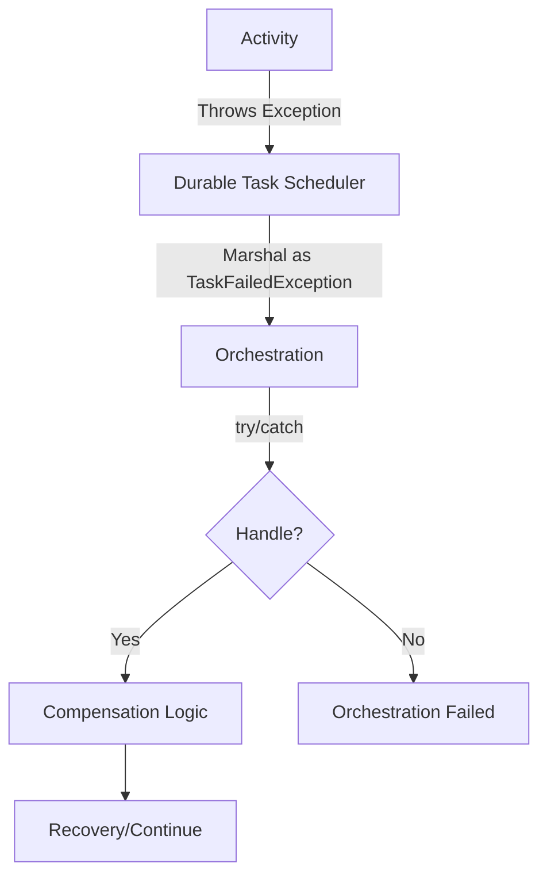

# Error Handling & Compensation

Robust error handling is essential for building reliable workflows with **Durable Task Scheduler**. The Durable Task .NET SDK provides mechanisms to handle failures gracefully and implement compensation logic.

## Exception Handling Basics



### How Exceptions Propagate

When a task activity throws an exception, it's marshaled back to the orchestration as a `TaskFailedException`:

```csharp
public override async Task<OrderResult> RunAsync(
    TaskOrchestrationContext context, 
    OrderInfo order)
{
    try
    {
        await context.CallActivityAsync("ProcessPayment", order);
    }
    catch (TaskFailedException ex)
    {
        // Activity threw an exception
        // ex.FailureDetails contains information about the original exception
        logger.LogError("Activity failed: {Message}", ex.FailureDetails.ErrorMessage);
        throw;
    }
}
```

### TaskFailedException Properties

```csharp
catch (TaskFailedException ex)
{
    // Information about the failure
    TaskFailureDetails details = ex.FailureDetails;
    
    string errorType = details.ErrorType;     // Exception type name
    string errorMessage = details.ErrorMessage; // Exception message
    string stackTrace = details.StackTrace;   // Stack trace (if available)
    
    // Check for inner exception details
    if (details.InnerFailure != null)
    {
        // Handle nested exception
    }
}
```

## Compensation Pattern

The compensation pattern allows you to undo previously completed work when a later step fails:

### Basic Compensation

```csharp
public override async Task<TransferResult> RunAsync(
    TaskOrchestrationContext context, 
    TransferRequest request)
{
    bool debited = false;
    
    try
    {
        // Step 1: Debit source account
        await context.CallActivityAsync("DebitAccount", 
            new DebitRequest(request.SourceAccount, request.Amount));
        debited = true;
        
        // Step 2: Credit target account
        await context.CallActivityAsync("CreditAccount", 
            new CreditRequest(request.TargetAccount, request.Amount));
        
        return new TransferResult { Success = true };
    }
    catch (TaskFailedException ex)
    {
        // Compensation: reverse the debit if it succeeded
        if (debited)
        {
            await context.CallActivityAsync("CreditAccount", 
                new CreditRequest(request.SourceAccount, request.Amount));
        }
        
        return new TransferResult 
        { 
            Success = false, 
            Error = ex.FailureDetails.ErrorMessage 
        };
    }
}
```

### Multi-Step Compensation

For complex workflows with multiple steps:

```csharp
public override async Task<OrderResult> RunAsync(
    TaskOrchestrationContext context, 
    OrderInfo order)
{
    var compensationStack = new Stack<Func<Task>>();
    
    try
    {
        // Step 1: Reserve inventory
        await context.CallActivityAsync("ReserveInventory", order);
        compensationStack.Push(() => 
            context.CallActivityAsync("ReleaseInventory", order));
        
        // Step 2: Charge customer
        var chargeId = await context.CallActivityAsync<string>("ChargeCustomer", order);
        compensationStack.Push(() => 
            context.CallActivityAsync("RefundCustomer", chargeId));
        
        // Step 3: Ship order
        await context.CallActivityAsync("ShipOrder", order);
        compensationStack.Push(() => 
            context.CallActivityAsync("CancelShipment", order));
        
        // Step 4: Send confirmation
        await context.CallActivityAsync("SendConfirmation", order);
        
        return new OrderResult { Success = true };
    }
    catch (TaskFailedException ex)
    {
        // Execute compensation in reverse order
        while (compensationStack.Count > 0)
        {
            var compensate = compensationStack.Pop();
            try
            {
                await compensate();
            }
            catch (TaskFailedException compensationEx)
            {
                // Log compensation failure but continue
                context.CreateReplaySafeLogger("Compensation")
                    .LogWarning("Compensation failed: {Error}", 
                        compensationEx.FailureDetails.ErrorMessage);
            }
        }
        
        return new OrderResult 
        { 
            Success = false, 
            Error = ex.FailureDetails.ErrorMessage 
        };
    }
}
```

## Retry Patterns

### Using Retry Policy

```csharp
public override async Task<string> RunAsync(
    TaskOrchestrationContext context, 
    string input)
{
    var retryOptions = new TaskOptions
    {
        Retry = new RetryPolicy(
            maxNumberOfAttempts: 5,
            firstRetryInterval: TimeSpan.FromSeconds(5),
            backoffCoefficient: 2.0,      // Exponential backoff
            maxRetryInterval: TimeSpan.FromMinutes(1),
            retryTimeout: TimeSpan.FromMinutes(10))
    };

    try
    {
        return await context.CallActivityAsync<string>(
            "UnreliableActivity", 
            input, 
            retryOptions);
    }
    catch (TaskFailedException ex)
    {
        // All retries failed
        return $"Failed after retries: {ex.FailureDetails.ErrorMessage}";
    }
}
```

### Custom Retry Handler

For more control over retry logic:

```csharp
public override async Task<string> RunAsync(
    TaskOrchestrationContext context, 
    string input)
{
    var retryHandler = new AsyncRetryHandler(async (failure, attempt) =>
    {
        // Custom logic to determine if we should retry
        if (failure.ErrorType == "System.Net.Http.HttpRequestException")
        {
            // Retry network errors with increasing delay
            if (attempt < 5)
            {
                return TimeSpan.FromSeconds(Math.Pow(2, attempt));
            }
        }
        
        if (failure.ErrorType == "RateLimitException")
        {
            // Retry rate limits after longer delay
            if (attempt < 3)
            {
                return TimeSpan.FromMinutes(1);
            }
        }
        
        // Don't retry other errors
        return null; // null means stop retrying
    });

    var options = new TaskOptions { Retry = retryHandler };

    return await context.CallActivityAsync<string>(
        "ExternalApiCall", 
        input, 
        options);
}
```

### Retry with Different Inputs

```csharp
public override async Task<string> RunAsync(
    TaskOrchestrationContext context, 
    ApiRequest request)
{
    var endpoints = new[] { "primary.api.com", "backup.api.com", "fallback.api.com" };
    
    Exception? lastException = null;
    
    foreach (var endpoint in endpoints)
    {
        try
        {
            var modifiedRequest = request with { Endpoint = endpoint };
            return await context.CallActivityAsync<string>("CallApi", modifiedRequest);
        }
        catch (TaskFailedException ex)
        {
            lastException = ex;
            // Continue to next endpoint
        }
    }
    
    throw new Exception($"All endpoints failed", lastException);
}
```

## Circuit Breaker Pattern

Implement circuit breaker using entities:

```csharp
public class CircuitBreakerEntity : TaskEntity<CircuitBreakerState>
{
    protected override CircuitBreakerState InitializeState(TaskEntityOperation operation)
    {
        return new CircuitBreakerState
        {
            State = CircuitState.Closed,
            FailureCount = 0,
            LastFailureTime = null
        };
    }

    public void RecordSuccess()
    {
        this.State.FailureCount = 0;
        if (this.State.State == CircuitState.HalfOpen)
        {
            this.State.State = CircuitState.Closed;
        }
    }

    public void RecordFailure()
    {
        this.State.FailureCount++;
        this.State.LastFailureTime = DateTime.UtcNow;
        
        if (this.State.FailureCount >= 5)
        {
            this.State.State = CircuitState.Open;
        }
    }

    public bool CanExecute()
    {
        if (this.State.State == CircuitState.Closed)
            return true;
        
        if (this.State.State == CircuitState.Open)
        {
            // Check if we should try half-open
            if (this.State.LastFailureTime.HasValue &&
                DateTime.UtcNow - this.State.LastFailureTime.Value > TimeSpan.FromMinutes(1))
            {
                this.State.State = CircuitState.HalfOpen;
                return true;
            }
            return false;
        }
        
        return true; // HalfOpen allows one request
    }
}

// Usage in orchestration
public override async Task<string> RunAsync(
    TaskOrchestrationContext context, 
    string input)
{
    var circuitBreakerId = new EntityInstanceId(nameof(CircuitBreakerEntity), "service-x");
    
    bool canExecute = await context.Entities.CallEntityAsync<bool>(
        circuitBreakerId, 
        "CanExecute");
    
    if (!canExecute)
    {
        return "Service temporarily unavailable";
    }
    
    try
    {
        var result = await context.CallActivityAsync<string>("CallServiceX", input);
        await context.Entities.SignalEntityAsync(circuitBreakerId, "RecordSuccess");
        return result;
    }
    catch (TaskFailedException)
    {
        await context.Entities.SignalEntityAsync(circuitBreakerId, "RecordFailure");
        throw;
    }
}
```

## Timeout Handling

### Activity Timeout with Timer

```csharp
public override async Task<string> RunAsync(
    TaskOrchestrationContext context, 
    string input)
{
    using var cts = new CancellationTokenSource();
    
    // Create a timer for timeout
    var timeoutTask = context.CreateTimer(
        context.CurrentUtcDateTime.AddMinutes(5), 
        cts.Token);
    
    // Schedule the activity
    var activityTask = context.CallActivityAsync<string>("LongRunningActivity", input);
    
    // Wait for either to complete
    var winner = await Task.WhenAny(activityTask, timeoutTask);
    
    if (winner == timeoutTask)
    {
        // Activity timed out
        // Note: The activity may still be running, but we won't wait for it
        return "Operation timed out";
    }
    else
    {
        // Activity completed - cancel the timer
        cts.Cancel();
        return await activityTask;
    }
}
```

### External Event Timeout

```csharp
public override async Task<ApprovalResult> RunAsync(
    TaskOrchestrationContext context, 
    ApprovalRequest request)
{
    // Send approval request
    await context.CallActivityAsync("SendApprovalRequest", request);
    
    using var cts = new CancellationTokenSource();
    
    var approvalTask = context.WaitForExternalEvent<bool>("ApprovalResponse");
    var timeoutTask = context.CreateTimer(
        context.CurrentUtcDateTime.AddDays(7), 
        cts.Token);
    
    var winner = await Task.WhenAny(approvalTask, timeoutTask);
    
    if (winner == approvalTask)
    {
        cts.Cancel();
        bool approved = await approvalTask;
        return new ApprovalResult 
        { 
            Status = approved ? "Approved" : "Rejected",
            RespondedAt = context.CurrentUtcDateTime
        };
    }
    else
    {
        // Escalate if no response within deadline
        await context.CallActivityAsync("EscalateApproval", request);
        return new ApprovalResult 
        { 
            Status = "Escalated",
            Reason = "No response within 7 days"
        };
    }
}
```

## Saga Pattern

For long-running transactions across multiple services:

```csharp
public override async Task<SagaResult> RunAsync(
    TaskOrchestrationContext context, 
    BookingRequest request)
{
    var logger = context.CreateReplaySafeLogger("BookingSaga");
    var compensations = new List<SagaStep>();
    
    try
    {
        // Step 1: Book flight
        var flightBooking = await context.CallActivityAsync<FlightBooking>(
            "BookFlight", request.Flight);
        compensations.Add(new SagaStep("CancelFlight", flightBooking.Id));
        logger.LogInformation("Flight booked: {Id}", flightBooking.Id);
        
        // Step 2: Book hotel
        var hotelBooking = await context.CallActivityAsync<HotelBooking>(
            "BookHotel", request.Hotel);
        compensations.Add(new SagaStep("CancelHotel", hotelBooking.Id));
        logger.LogInformation("Hotel booked: {Id}", hotelBooking.Id);
        
        // Step 3: Book car
        var carBooking = await context.CallActivityAsync<CarBooking>(
            "BookCar", request.Car);
        compensations.Add(new SagaStep("CancelCar", carBooking.Id));
        logger.LogInformation("Car booked: {Id}", carBooking.Id);
        
        // Step 4: Charge customer
        var payment = await context.CallActivityAsync<Payment>(
            "ChargeCustomer", 
            new ChargeRequest(request.CustomerId, 
                flightBooking.Price + hotelBooking.Price + carBooking.Price));
        logger.LogInformation("Payment processed: {Id}", payment.Id);
        
        return new SagaResult
        {
            Success = true,
            FlightBookingId = flightBooking.Id,
            HotelBookingId = hotelBooking.Id,
            CarBookingId = carBooking.Id,
            PaymentId = payment.Id
        };
    }
    catch (TaskFailedException ex)
    {
        logger.LogError("Saga failed at step, starting compensation: {Error}", 
            ex.FailureDetails.ErrorMessage);
        
        // Execute compensations in reverse order
        for (int i = compensations.Count - 1; i >= 0; i--)
        {
            var step = compensations[i];
            try
            {
                await context.CallActivityAsync(step.CompensationActivity, step.BookingId);
                logger.LogInformation("Compensation completed: {Activity}", 
                    step.CompensationActivity);
            }
            catch (TaskFailedException compensationEx)
            {
                // Log but continue compensation
                logger.LogError("Compensation failed for {Activity}: {Error}", 
                    step.CompensationActivity, 
                    compensationEx.FailureDetails.ErrorMessage);
            }
        }
        
        return new SagaResult
        {
            Success = false,
            Error = ex.FailureDetails.ErrorMessage
        };
    }
}

record SagaStep(string CompensationActivity, string BookingId);
```

## Best Practices

### 1. Always Handle TaskFailedException

```csharp
// ✅ Good: Explicit error handling
try
{
    await context.CallActivityAsync("Activity", input);
}
catch (TaskFailedException ex)
{
    // Handle or log the error
    logger.LogError("Activity failed: {Error}", ex.FailureDetails.ErrorMessage);
    throw; // Re-throw if you want the orchestration to fail
}
```

### 2. Use Idempotent Compensation

```csharp
// Compensation activities should be idempotent
[DurableTask("RefundPayment")]
public class RefundPaymentActivity : TaskActivity<string, bool>
{
    public override async Task<bool> RunAsync(TaskActivityContext context, string paymentId)
    {
        // Check if already refunded
        var payment = await _paymentService.GetAsync(paymentId);
        if (payment.Status == PaymentStatus.Refunded)
        {
            return true; // Already refunded, no-op
        }
        
        await _paymentService.RefundAsync(paymentId);
        return true;
    }
}
```

### 3. Log Failure Context

```csharp
catch (TaskFailedException ex)
{
    logger.LogError(
        "Activity {ActivityName} failed for orchestration {InstanceId}. " +
        "Error: {ErrorType} - {ErrorMessage}",
        activityName,
        context.InstanceId,
        ex.FailureDetails.ErrorType,
        ex.FailureDetails.ErrorMessage);
}
```

## Next Steps

- [Automatic Retries](Automatic-Retries.md) - Configure retry policies
- [Writing Task Orchestrations](Writing-Task-Orchestrations.md) - Orchestration patterns
- [Durable Timers](Durable-Timers.md) - Timeout handling
