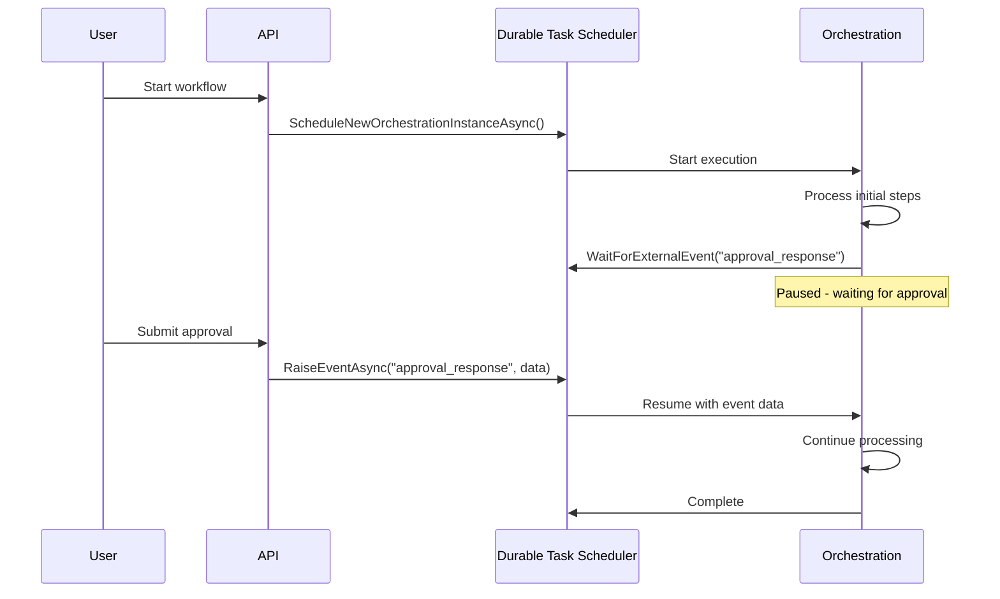

# External Events (Human Interaction)

Orchestrations can wait for external events, enabling human interaction patterns, approval workflows, and integration with external systems using **Durable Task Scheduler**.

## Overview



External events allow orchestrations to:
- Wait for human input (approvals, decisions)
- Receive signals from external systems
- Implement webhook-style callbacks
- Handle asynchronous notifications

## Approval Orchestration

Complete example from the **Durable Task Scheduler samples**:

```csharp
using Microsoft.DurableTask;
using Microsoft.Extensions.Logging;

/// <summary>
/// Human interaction orchestration that waits for external approval.
/// From: Azure-Samples/Durable-Task-Scheduler/dotnet/HumanInteractionSample
/// </summary>
[DurableTask(nameof(ApprovalOrchestration))]
public class ApprovalOrchestration : TaskOrchestrator<ApprovalRequestData, ApprovalResultData>
{
    public override async Task<ApprovalResultData> RunAsync(
        TaskOrchestrationContext context, 
        ApprovalRequestData request)
    {
        ILogger logger = context.CreateReplaySafeLogger<ApprovalOrchestration>();
        
        // Step 1: Send approval request notification
        logger.LogInformation("Sending approval request for {RequestId}", request.RequestId);
        await context.CallActivityAsync(
            nameof(SendApprovalRequestActivity), 
            new ApprovalNotification
            {
                RequestId = request.RequestId,
                RequesterEmail = request.RequesterEmail,
                Description = request.Description,
                Amount = request.Amount,
                InstanceId = context.InstanceId
            });

        // Step 2: Wait for approval response with timeout
        using var cts = new CancellationTokenSource();
        
        Task<ApprovalResponseData> approvalTask = context.WaitForExternalEvent<ApprovalResponseData>(
            "approval_response");
        Task timeoutTask = context.CreateTimer(
            context.CurrentUtcDateTime.AddDays(request.TimeoutDays), 
            cts.Token);

        Task winner = await Task.WhenAny(approvalTask, timeoutTask);

        if (winner == approvalTask)
        {
            cts.Cancel();
            var response = await approvalTask;
            
            logger.LogInformation(
                "Approval {Decision} by {Approver} for request {RequestId}",
                response.Approved ? "granted" : "denied",
                response.ApproverEmail,
                request.RequestId);

            // Step 3: Process based on approval decision
            if (response.Approved)
            {
                await context.CallActivityAsync(
                    nameof(ProcessApprovedRequestActivity), 
                    request);
            }
            else
            {
                await context.CallActivityAsync(
                    nameof(SendRejectionNotificationActivity), 
                    new RejectionNotification
                    {
                        RequestId = request.RequestId,
                        RequesterEmail = request.RequesterEmail,
                        RejectedBy = response.ApproverEmail,
                        Reason = response.Comments
                    });
            }

            return new ApprovalResultData
            {
                RequestId = request.RequestId,
                Status = response.Approved ? "Approved" : "Rejected",
                ProcessedBy = response.ApproverEmail,
                ProcessedAt = context.CurrentUtcDateTime,
                Comments = response.Comments
            };
        }
        else
        {
            // Timeout - send escalation
            logger.LogWarning("Approval request {RequestId} timed out", request.RequestId);
            
            await context.CallActivityAsync(
                nameof(SendTimeoutNotificationActivity), 
                request);

            return new ApprovalResultData
            {
                RequestId = request.RequestId,
                Status = "TimedOut",
                ProcessedAt = context.CurrentUtcDateTime,
                Comments = "Request expired without response"
            };
        }
    }
}

// Data classes
public class ApprovalRequestData
{
    public string RequestId { get; set; } = "";
    public string RequesterEmail { get; set; } = "";
    public string Description { get; set; } = "";
    public decimal Amount { get; set; }
    public int TimeoutDays { get; set; } = 7;
}

public class ApprovalResponseData
{
    public bool Approved { get; set; }
    public string ApproverEmail { get; set; } = "";
    public string? Comments { get; set; }
}

public class ApprovalResultData
{
    public string RequestId { get; set; } = "";
    public string Status { get; set; } = "";
    public string? ProcessedBy { get; set; }
    public DateTime ProcessedAt { get; set; }
    public string? Comments { get; set; }
}
```

### Activities for Approval Workflow

```csharp
[DurableTask(nameof(SendApprovalRequestActivity))]
public class SendApprovalRequestActivity : TaskActivity<ApprovalNotification, bool>
{
    private readonly ILogger<SendApprovalRequestActivity> _logger;
    private readonly IEmailService _emailService;

    public SendApprovalRequestActivity(
        ILogger<SendApprovalRequestActivity> logger,
        IEmailService emailService)
    {
        _logger = logger;
        _emailService = emailService;
    }

    public override async Task<bool> RunAsync(
        TaskActivityContext context, 
        ApprovalNotification notification)
    {
        _logger.LogInformation(
            "Sending approval request email for {RequestId}", 
            notification.RequestId);

        // Build approval URL with instance ID for callback
        string approvalUrl = $"https://myapp.com/api/approval/{notification.InstanceId}";
        
        await _emailService.SendAsync(new Email
        {
            To = "approvers@company.com",
            Subject = $"Approval Required: {notification.Description}",
            Body = $"""
                Request ID: {notification.RequestId}
                Requester: {notification.RequesterEmail}
                Amount: {notification.Amount:C}
                Description: {notification.Description}
                
                Approve: {approvalUrl}?approved=true
                Reject: {approvalUrl}?approved=false
                """
        });

        return true;
    }
}
```

### REST API Controller for Approvals

```csharp
[ApiController]
[Route("api/[controller]")]
public class ApprovalController : ControllerBase
{
    private readonly DurableTaskClient _client;

    public ApprovalController(DurableTaskClient client)
    {
        _client = client;
    }

    /// <summary>
    /// Start a new approval workflow.
    /// </summary>
    [HttpPost("start")]
    public async Task<ActionResult<object>> StartApproval([FromBody] ApprovalRequestData request)
    {
        string instanceId = await _client.ScheduleNewOrchestrationInstanceAsync(
            nameof(ApprovalOrchestration),
            request);
        
        return Accepted(new 
        { 
            instanceId,
            statusUrl = $"/api/approval/status/{instanceId}",
            approveUrl = $"/api/approval/{instanceId}/respond"
        });
    }

    /// <summary>
    /// Submit approval/rejection response (raises external event).
    /// </summary>
    [HttpPost("{instanceId}/respond")]
    public async Task<IActionResult> SubmitResponse(
        string instanceId, 
        [FromBody] ApprovalResponseData response)
    {
        // Raise external event to the waiting orchestration
        await _client.RaiseEventAsync(
            instanceId, 
            "approval_response", 
            response);
        
        return Ok(new { message = "Response submitted successfully" });
    }

    /// <summary>
    /// Get approval workflow status.
    /// </summary>
    [HttpGet("status/{instanceId}")]
    public async Task<ActionResult<object>> GetStatus(string instanceId)
    {
        var metadata = await _client.GetInstanceAsync(instanceId);
        
        if (metadata == null)
        {
            return NotFound();
        }
        
        return Ok(new
        {
            instanceId = metadata.InstanceId,
            status = metadata.RuntimeStatus.ToString(),
            createdAt = metadata.CreatedAt,
            lastUpdatedAt = metadata.LastUpdatedAt,
            output = metadata.IsCompleted 
                ? metadata.ReadOutputAs<ApprovalResultData>() 
                : null
        });
    }
}
```

## Waiting for Events

### Basic Event Wait

```csharp
public override async Task<string> RunAsync(
    TaskOrchestrationContext context, 
    string input)
{
    // Wait for an external event named "ApprovalEvent"
    bool approved = await context.WaitForExternalEvent<bool>("ApprovalEvent");
    
    if (approved)
    {
        return await context.CallActivityAsync<string>("ProcessApproved", input);
    }
    else
    {
        return "Request rejected";
    }
}
```

### Event with Complex Data

```csharp
public override async Task<OrderResult> RunAsync(
    TaskOrchestrationContext context, 
    OrderRequest request)
{
    // Wait for shipping information from external system
    ShippingInfo shippingInfo = await context.WaitForExternalEvent<ShippingInfo>(
        "ShippingInfoReceived");
    
    // Use the received data
    return await context.CallActivityAsync<OrderResult>(
        "CompleteOrder", 
        new { request, shippingInfo });
}
```

## Raising Events

### From Client Code

```csharp
public class ApprovalController
{
    private readonly DurableTaskClient _client;

    public ApprovalController(DurableTaskClient client)
    {
        _client = client;
    }

    public async Task<IActionResult> ApproveRequest(
        string instanceId, 
        [FromBody] ApprovalDecision decision)
    {
        // Raise event to waiting orchestration
        await _client.RaiseEventAsync(
            instanceId, 
            "ApprovalEvent", 
            decision.Approved);
        
        return Ok();
    }
}
```

### From Another Orchestration

Events can also be raised from orchestrations:

```csharp
public override async Task RunAsync(
    TaskOrchestrationContext context, 
    NotificationRequest request)
{
    // Process notification
    await context.CallActivityAsync("ProcessNotification", request);
    
    // Raise event to another orchestration
    await context.CallActivityAsync("RaiseExternalEvent", 
        new RaiseEventRequest
        {
            InstanceId = request.TargetInstanceId,
            EventName = "NotificationReceived",
            EventData = request.Data
        });
}
```

## Event Patterns

### Approval Workflow

```csharp
public override async Task<ApprovalResult> RunAsync(
    TaskOrchestrationContext context, 
    ApprovalRequest request)
{
    var logger = context.CreateReplaySafeLogger("ApprovalWorkflow");
    
    // Send approval request notification
    await context.CallActivityAsync("SendApprovalRequest", request);
    logger.LogInformation("Approval request sent for {RequestId}", request.Id);
    
    using var cts = new CancellationTokenSource();
    
    // Wait for approval with timeout
    Task<ApprovalResponse> approvalTask = context.WaitForExternalEvent<ApprovalResponse>(
        "ApprovalResponse");
    Task timeoutTask = context.CreateTimer(
        context.CurrentUtcDateTime.AddDays(7), 
        cts.Token);
    
    Task winner = await Task.WhenAny(approvalTask, timeoutTask);
    
    if (winner == approvalTask)
    {
        cts.Cancel();
        var response = await approvalTask;
        
        logger.LogInformation(
            "Approval response received: {Decision} by {Approver}",
            response.Approved ? "Approved" : "Rejected",
            response.ApproverEmail);
        
        return new ApprovalResult
        {
            Status = response.Approved ? "Approved" : "Rejected",
            ApprovedBy = response.ApproverEmail,
            Timestamp = context.CurrentUtcDateTime
        };
    }
    else
    {
        // Timeout - auto-reject or escalate
        logger.LogWarning("Approval timed out for {RequestId}", request.Id);
        
        await context.CallActivityAsync("NotifyTimeout", request);
        
        return new ApprovalResult
        {
            Status = "TimedOut",
            Timestamp = context.CurrentUtcDateTime
        };
    }
}
```

### Multi-Level Approval

```csharp
public override async Task<MultiLevelApprovalResult> RunAsync(
    TaskOrchestrationContext context, 
    PurchaseRequest request)
{
    var approvers = new[] { "manager@company.com", "director@company.com", "vp@company.com" };
    var approvals = new List<ApprovalStep>();
    
    foreach (var approver in approvers)
    {
        // Send approval request
        await context.CallActivityAsync("SendApprovalRequest", 
            new { request, Approver = approver });
        
        using var cts = new CancellationTokenSource();
        
        // Wait for this level's approval
        Task<bool> approvalTask = context.WaitForExternalEvent<bool>(
            $"Approval_{approver.Replace("@", "_")}");
        Task timeoutTask = context.CreateTimer(
            context.CurrentUtcDateTime.AddDays(2), 
            cts.Token);
        
        Task winner = await Task.WhenAny(approvalTask, timeoutTask);
        
        if (winner == timeoutTask)
        {
            return new MultiLevelApprovalResult
            {
                Status = "TimedOut",
                CompletedLevels = approvals
            };
        }
        
        cts.Cancel();
        bool approved = await approvalTask;
        
        approvals.Add(new ApprovalStep
        {
            Approver = approver,
            Approved = approved,
            Timestamp = context.CurrentUtcDateTime
        });
        
        if (!approved)
        {
            return new MultiLevelApprovalResult
            {
                Status = "Rejected",
                CompletedLevels = approvals
            };
        }
    }
    
    // All levels approved
    await context.CallActivityAsync("ProcessApprovedPurchase", request);
    
    return new MultiLevelApprovalResult
    {
        Status = "Approved",
        CompletedLevels = approvals
    };
}
```

### Parallel Event Collection

Collect events from multiple sources:

```csharp
public override async Task<AggregatedData> RunAsync(
    TaskOrchestrationContext context, 
    DataCollectionRequest request)
{
    // Request data from multiple sources
    await context.CallActivityAsync("RequestDataFromSourceA", request);
    await context.CallActivityAsync("RequestDataFromSourceB", request);
    await context.CallActivityAsync("RequestDataFromSourceC", request);
    
    using var cts = new CancellationTokenSource();
    
    // Wait for all sources or timeout
    var eventTasks = new[]
    {
        context.WaitForExternalEvent<SourceData>("DataFromSourceA"),
        context.WaitForExternalEvent<SourceData>("DataFromSourceB"),
        context.WaitForExternalEvent<SourceData>("DataFromSourceC")
    };
    
    Task timeoutTask = context.CreateTimer(
        context.CurrentUtcDateTime.AddMinutes(30), 
        cts.Token);
    
    var collectedData = new List<SourceData>();
    var pendingTasks = new List<Task>(eventTasks);
    pendingTasks.Add(timeoutTask);
    
    while (pendingTasks.Any(t => !t.IsCompleted))
    {
        Task completed = await Task.WhenAny(pendingTasks);
        
        if (completed == timeoutTask)
        {
            // Timeout - return what we have
            break;
        }
        
        pendingTasks.Remove(completed);
        
        // Check which event completed
        var eventIndex = Array.FindIndex(eventTasks, t => t == completed);
        if (eventIndex >= 0 && eventTasks[eventIndex].IsCompletedSuccessfully)
        {
            collectedData.Add(await eventTasks[eventIndex]);
        }
        
        // Check if all events received
        if (collectedData.Count == eventTasks.Length)
        {
            cts.Cancel();
            break;
        }
    }
    
    return new AggregatedData
    {
        Sources = collectedData,
        CollectedAt = context.CurrentUtcDateTime,
        IsComplete = collectedData.Count == eventTasks.Length
    };
}
```

### Event-Driven State Machine

```csharp
public override async Task<OrderStatus> RunAsync(
    TaskOrchestrationContext context, 
    Order order)
{
    string currentState = "Created";
    
    while (currentState != "Completed" && currentState != "Cancelled")
    {
        switch (currentState)
        {
            case "Created":
                var paymentEvent = await context.WaitForExternalEvent<PaymentEvent>(
                    "PaymentReceived");
                if (paymentEvent.Success)
                {
                    await context.CallActivityAsync("RecordPayment", paymentEvent);
                    currentState = "Paid";
                }
                else
                {
                    currentState = "Cancelled";
                }
                break;
                
            case "Paid":
                var shipEvent = await context.WaitForExternalEvent<ShipmentEvent>(
                    "Shipped");
                await context.CallActivityAsync("RecordShipment", shipEvent);
                currentState = "Shipped";
                break;
                
            case "Shipped":
                var deliveryEvent = await context.WaitForExternalEvent<DeliveryEvent>(
                    "Delivered");
                await context.CallActivityAsync("RecordDelivery", deliveryEvent);
                currentState = "Completed";
                break;
        }
    }
    
    return new OrderStatus
    {
        OrderId = order.Id,
        FinalState = currentState
    };
}
```

## Event with Multiple Handlers

Handle different types of events in a loop:

```csharp
public override async Task<ProcessResult> RunAsync(
    TaskOrchestrationContext context, 
    ProcessRequest request)
{
    var logger = context.CreateReplaySafeLogger("EventProcessor");
    bool running = true;
    var processedEvents = new List<string>();
    
    while (running)
    {
        using var cts = new CancellationTokenSource();
        
        // Wait for any of multiple events
        Task<string> dataEventTask = context.WaitForExternalEvent<string>("DataEvent");
        Task<object?> stopEventTask = context.WaitForExternalEvent<object?>("StopEvent");
        Task timeoutTask = context.CreateTimer(
            context.CurrentUtcDateTime.AddHours(1), 
            cts.Token);
        
        Task winner = await Task.WhenAny(dataEventTask, stopEventTask, timeoutTask);
        
        if (winner == dataEventTask)
        {
            string data = await dataEventTask;
            await context.CallActivityAsync("ProcessData", data);
            processedEvents.Add(data);
            logger.LogInformation("Processed data event: {Data}", data);
        }
        else if (winner == stopEventTask)
        {
            running = false;
            cts.Cancel();
            logger.LogInformation("Received stop event");
        }
        else
        {
            // Hourly timeout - could do periodic work
            logger.LogInformation("Hourly check - still running");
        }
    }
    
    return new ProcessResult
    {
        ProcessedEventCount = processedEvents.Count,
        Events = processedEvents
    };
}
```

## Azure Functions Integration

### Raising Events via HTTP

```csharp
public static class ApprovalFunctions
{
    [Function("StartApproval")]
    public static async Task<HttpResponseData> StartApproval(
        [HttpTrigger(AuthorizationLevel.Function, "post")] HttpRequestData req,
        [DurableClient] DurableTaskClient client)
    {
        var request = await req.ReadFromJsonAsync<ApprovalRequest>();
        string instanceId = await client.ScheduleNewOrchestrationInstanceAsync(
            "ApprovalOrchestration", 
            request);
        
        return client.CreateCheckStatusResponse(req, instanceId);
    }
    
    [Function("Approve")]
    public static async Task<HttpResponseData> Approve(
        [HttpTrigger(AuthorizationLevel.Function, "post", Route = "approve/{instanceId}")] 
        HttpRequestData req,
        string instanceId,
        [DurableClient] DurableTaskClient client)
    {
        var decision = await req.ReadFromJsonAsync<ApprovalDecision>();
        
        await client.RaiseEventAsync(instanceId, "ApprovalResponse", decision.Approved);
        
        return req.CreateResponse(HttpStatusCode.OK);
    }
}
```

### Webhook Pattern

```csharp
[Function("WebhookReceiver")]
public static async Task<HttpResponseData> WebhookReceiver(
    [HttpTrigger(AuthorizationLevel.Function, "post", Route = "webhook/{instanceId}/{eventName}")] 
    HttpRequestData req,
    string instanceId,
    string eventName,
    [DurableClient] DurableTaskClient client)
{
    string body = await new StreamReader(req.Body).ReadToEndAsync();
    
    await client.RaiseEventAsync(instanceId, eventName, body);
    
    return req.CreateResponse(HttpStatusCode.OK);
}
```

## Best Practices

### 1. Use Descriptive Event Names

```csharp
// ❌ Generic names
await context.WaitForExternalEvent<bool>("event1");

// ✅ Descriptive names
await context.WaitForExternalEvent<bool>("ManagerApproval");
await context.WaitForExternalEvent<ShippingInfo>("ShippingConfirmation");
```

### 2. Always Include Timeout

```csharp
// ❌ No timeout - could wait forever
await context.WaitForExternalEvent<bool>("Approval");

// ✅ With timeout
using var cts = new CancellationTokenSource();
Task approvalTask = context.WaitForExternalEvent<bool>("Approval");
Task timeoutTask = context.CreateTimer(context.CurrentUtcDateTime.AddDays(7), cts.Token);

await Task.WhenAny(approvalTask, timeoutTask);
```

### 3. Handle Duplicate Events

```csharp
public override async Task<string> RunAsync(
    TaskOrchestrationContext context, 
    string input)
{
    // Use ContinueAsNew to handle multiple events cleanly
    var result = await context.WaitForExternalEvent<EventData>("MyEvent");
    
    // Process event
    await context.CallActivityAsync("ProcessEvent", result);
    
    // Continue listening for more events
    context.ContinueAsNew(input, preserveUnprocessedEvents: true);
    
    return "Processing";
}
```

### 4. Log Event Receipt

```csharp
var logger = context.CreateReplaySafeLogger("EventOrchestration");

var eventData = await context.WaitForExternalEvent<ApprovalData>("Approval");

logger.LogInformation(
    "Received approval event: Approved={Approved}, Approver={Approver}",
    eventData.Approved,
    eventData.ApproverEmail);
```

## Next Steps

- [Durable Timers](Durable-Timers.md) - Timeout patterns
- [Orchestration Instance Management](Orchestration-Instance-Management.md) - Manage instances
- [Writing Task Orchestrations](Writing-Task-Orchestrations.md) - Orchestration patterns
