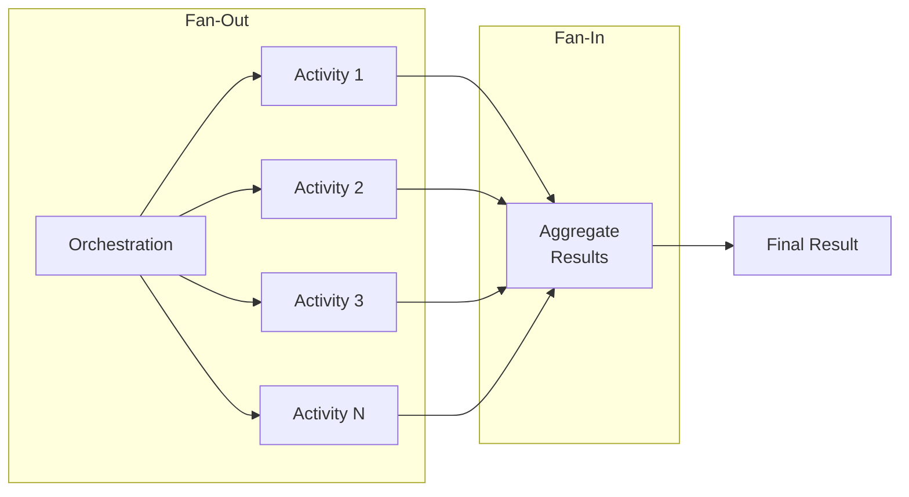

# Fan-Out/Fan-In Pattern

The Fan-Out/Fan-In pattern is a powerful orchestration pattern that executes multiple activities in parallel and aggregates their results. This enables efficient parallel processing while maintaining the reliability guarantees of durable orchestrations with **Durable Task Scheduler**.

## Overview



The pattern consists of two phases:
1. **Fan-Out**: Start multiple activities or sub-orchestrations in parallel
2. **Fan-In**: Wait for all parallel tasks to complete and aggregate results

## Parallel Processing Orchestration

Complete example from the **Durable Task Scheduler samples**:

```csharp
using Microsoft.DurableTask;
using Microsoft.Extensions.Logging;

/// <summary>
/// Parallel processing orchestration that demonstrates fan-out/fan-in pattern.
/// From: Azure-Samples/Durable-Task-Scheduler/dotnet/FanOutFanInSample
/// </summary>
[DurableTask(nameof(ParallelProcessingOrchestration))]
public class ParallelProcessingOrchestration : TaskOrchestrator<int, int[]>
{
    public override async Task<int[]> RunAsync(
        TaskOrchestrationContext context, 
        int workItemCount)
    {
        ILogger logger = context.CreateReplaySafeLogger<ParallelProcessingOrchestration>();
        logger.LogInformation("Starting parallel processing of {Count} work items", workItemCount);

        // Fan-out: Start all activities in parallel
        var tasks = new List<Task<int>>();
        for (int i = 0; i < workItemCount; i++)
        {
            tasks.Add(context.CallActivityAsync<int>(nameof(ProcessWorkItem), i));
        }

        // Fan-in: Wait for all to complete
        int[] results = await Task.WhenAll(tasks);

        logger.LogInformation("Completed processing {Count} work items", results.Length);
        return results;
    }
}

/// <summary>
/// Activity that processes a single work item.
/// </summary>
[DurableTask(nameof(ProcessWorkItem))]
public class ProcessWorkItem : TaskActivity<int, int>
{
    private readonly ILogger<ProcessWorkItem> _logger;

    public ProcessWorkItem(ILogger<ProcessWorkItem> logger)
    {
        _logger = logger;
    }

    public override Task<int> RunAsync(TaskActivityContext context, int workItemId)
    {
        _logger.LogInformation("Processing work item {Id}", workItemId);
        
        // Simulate processing
        int result = workItemId * 2;
        
        return Task.FromResult(result);
    }
}
```

### REST API Controller

```csharp
[ApiController]
[Route("api/[controller]")]
public class ParallelProcessingController : ControllerBase
{
    private readonly DurableTaskClient _client;

    public ParallelProcessingController(DurableTaskClient client)
    {
        _client = client;
    }

    [HttpPost("start")]
    public async Task<ActionResult<string>> StartProcessing([FromBody] int workItemCount)
    {
        string instanceId = await _client.ScheduleNewOrchestrationInstanceAsync(
            nameof(ParallelProcessingOrchestration),
            workItemCount);
        
        return Ok(new { instanceId });
    }

    [HttpGet("status/{instanceId}")]
    public async Task<ActionResult<object>> GetStatus(string instanceId)
    {
        var metadata = await _client.GetInstanceAsync(instanceId);
        
        if (metadata == null)
        {
            return NotFound();
        }
        
        return Ok(new
        {
            instanceId = metadata.InstanceId,
            status = metadata.RuntimeStatus.ToString(),
            output = metadata.ReadOutputAs<int[]>()
        });
    }
}
```

## Basic Fan-Out/Fan-In

### Simple Parallel Execution

```csharp
[DurableTask(nameof(FanOutFanInOrchestration))]
public class FanOutFanInOrchestration : TaskOrchestrator<List<string>, List<ProcessingResult>>
{
    public override async Task<List<ProcessingResult>> RunAsync(
        TaskOrchestrationContext context, 
        List<string> items)
    {
        // Fan-out: Start all activities in parallel
        var tasks = items.Select(item =>
            context.CallActivityAsync<ProcessingResult>("ProcessItem", item));
        
        // Fan-in: Wait for all to complete
        var results = await Task.WhenAll(tasks);
        
        return results.ToList();
    }
}
```

### With Different Result Types

```csharp
public override async Task<AggregatedResult> RunAsync(
    TaskOrchestrationContext context, 
    WorkloadInput input)
{
    // Start different activities in parallel
    var validateTask = context.CallActivityAsync<ValidationResult>("ValidateData", input);
    var enrichTask = context.CallActivityAsync<EnrichmentResult>("EnrichData", input);
    var classifyTask = context.CallActivityAsync<ClassificationResult>("ClassifyData", input);
    
    // Wait for all
    await Task.WhenAll(validateTask, enrichTask, classifyTask);
    
    // Aggregate results
    return new AggregatedResult
    {
        Validation = await validateTask,
        Enrichment = await enrichTask,
        Classification = await classifyTask
    };
}
```

## Batched Fan-Out

### Processing in Batches

For large datasets, process in batches to avoid memory issues:

```csharp
[DurableTask(nameof(BatchedFanOutOrchestration))]
public class BatchedFanOutOrchestration : TaskOrchestrator<BatchInput, BatchResult>
{
    private const int BatchSize = 10;
    
    public override async Task<BatchResult> RunAsync(
        TaskOrchestrationContext context, 
        BatchInput input)
    {
        var logger = context.CreateReplaySafeLogger("BatchedFanOut");
        var allResults = new List<ItemResult>();
        
        // Process in batches
        for (int i = 0; i < input.Items.Count; i += BatchSize)
        {
            var batch = input.Items.Skip(i).Take(BatchSize).ToList();
            
            logger.LogInformation(
                "Processing batch {BatchNumber} of {TotalBatches}",
                (i / BatchSize) + 1,
                Math.Ceiling((double)input.Items.Count / BatchSize));
            
            // Fan-out for this batch
            var batchTasks = batch.Select(item =>
                context.CallActivityAsync<ItemResult>("ProcessItem", item));
            
            // Fan-in for this batch
            var batchResults = await Task.WhenAll(batchTasks);
            allResults.AddRange(batchResults);
        }
        
        return new BatchResult
        {
            TotalProcessed = allResults.Count,
            Results = allResults
        };
    }
}
```

### Dynamic Batch Size

```csharp
public override async Task<BatchResult> RunAsync(
    TaskOrchestrationContext context, 
    DynamicBatchInput input)
{
    // Determine batch size based on item complexity
    int batchSize = input.ItemComplexity switch
    {
        Complexity.Low => 50,
        Complexity.Medium => 20,
        Complexity.High => 5,
        _ => 10
    };
    
    var results = new List<ProcessingResult>();
    
    foreach (var batch in input.Items.Chunk(batchSize))
    {
        var tasks = batch.Select(item =>
            context.CallActivityAsync<ProcessingResult>("ProcessItem", item));
        
        var batchResults = await Task.WhenAll(tasks);
        results.AddRange(batchResults);
    }
    
    return new BatchResult { Results = results };
}
```

## Fan-Out with Sub-Orchestrations

### Parallel Sub-Orchestrations

```csharp
[DurableTask(nameof(OrderBatchOrchestration))]
public class OrderBatchOrchestration : TaskOrchestrator<List<Order>, BatchOrderResult>
{
    public override async Task<BatchOrderResult> RunAsync(
        TaskOrchestrationContext context, 
        List<Order> orders)
    {
        // Fan-out to sub-orchestrations
        var orderTasks = orders.Select((order, index) =>
        {
            var options = new SubOrchestrationOptions
            {
                InstanceId = $"{context.InstanceId}-order-{index}"
            };
            
            return context.CallSubOrchestratorAsync<OrderResult>(
                "ProcessOrderOrchestration",
                order,
                options);
        });
        
        // Fan-in
        var results = await Task.WhenAll(orderTasks);
        
        return new BatchOrderResult
        {
            TotalOrders = results.Length,
            Successful = results.Count(r => r.Success),
            Failed = results.Count(r => !r.Success),
            Results = results.ToList()
        };
    }
}
```

## Error Handling Strategies

### Collect All Results (Including Failures)

```csharp
public override async Task<FanOutResult> RunAsync(
    TaskOrchestrationContext context, 
    List<string> items)
{
    var tasks = items.Select(async item =>
    {
        try
        {
            var result = await context.CallActivityAsync<ItemResult>("ProcessItem", item);
            return new TaskResult { Item = item, Success = true, Result = result };
        }
        catch (TaskFailedException ex)
        {
            return new TaskResult { Item = item, Success = false, Error = ex.Message };
        }
    });
    
    var results = await Task.WhenAll(tasks);
    
    return new FanOutResult
    {
        TotalItems = results.Length,
        SuccessCount = results.Count(r => r.Success),
        FailureCount = results.Count(r => !r.Success),
        Failures = results.Where(r => !r.Success).ToList()
    };
}
```

### Fail Fast

```csharp
public override async Task<List<ProcessingResult>> RunAsync(
    TaskOrchestrationContext context, 
    List<string> items)
{
    var tasks = items.Select(item =>
        context.CallActivityAsync<ProcessingResult>("ProcessItem", item)).ToList();
    
    try
    {
        // Throws on first failure
        var results = await Task.WhenAll(tasks);
        return results.ToList();
    }
    catch (TaskFailedException)
    {
        // Cancel remaining work (if supported) and rethrow
        throw;
    }
}
```

### Partial Success with Threshold

```csharp
public override async Task<PartialResult> RunAsync(
    TaskOrchestrationContext context, 
    PartialSuccessInput input)
{
    var results = new List<TaskResult>();
    int failureCount = 0;
    int maxFailures = (int)(input.Items.Count * input.FailureThreshold);
    
    var tasks = input.Items.Select(async item =>
    {
        try
        {
            var result = await context.CallActivityAsync<ItemResult>("ProcessItem", item);
            return new TaskResult { Item = item, Success = true, Result = result };
        }
        catch (TaskFailedException ex)
        {
            return new TaskResult { Item = item, Success = false, Error = ex.Message };
        }
    });
    
    var completedTasks = await Task.WhenAll(tasks);
    
    foreach (var result in completedTasks)
    {
        results.Add(result);
        if (!result.Success)
        {
            failureCount++;
            if (failureCount > maxFailures)
            {
                throw new InvalidOperationException(
                    $"Exceeded failure threshold: {failureCount} failures out of {input.Items.Count} items");
            }
        }
    }
    
    return new PartialResult
    {
        TotalProcessed = results.Count,
        SuccessCount = results.Count - failureCount,
        FailureCount = failureCount,
        Results = results
    };
}
```

## Progress Tracking

### With Entity State

```csharp
[DurableTask(nameof(TrackedFanOutOrchestration))]
public class TrackedFanOutOrchestration : TaskOrchestrator<List<string>, List<ItemResult>>
{
    public override async Task<List<ItemResult>> RunAsync(
        TaskOrchestrationContext context, 
        List<string> items)
    {
        var progressEntityId = new EntityInstanceId("ProgressTracker", context.InstanceId);
        
        // Initialize progress
        await context.CallEntityAsync(progressEntityId, "Initialize", items.Count);
        
        var results = new List<ItemResult>();
        
        // Process with progress updates
        foreach (var batch in items.Chunk(10))
        {
            var tasks = batch.Select(async item =>
            {
                var result = await context.CallActivityAsync<ItemResult>("ProcessItem", item);
                await context.CallEntityAsync(progressEntityId, "IncrementProcessed", null);
                return result;
            });
            
            var batchResults = await Task.WhenAll(tasks);
            results.AddRange(batchResults);
        }
        
        return results;
    }
}

[DurableTask(nameof(ProgressTrackerEntity))]
public class ProgressTrackerEntity : TaskEntity<ProgressState>
{
    public void Initialize(int totalItems)
    {
        State = new ProgressState
        {
            TotalItems = totalItems,
            ProcessedItems = 0,
            StartTime = DateTime.UtcNow
        };
    }
    
    public void IncrementProcessed()
    {
        State.ProcessedItems++;
        State.LastUpdateTime = DateTime.UtcNow;
    }
    
    public ProgressState GetProgress() => State;
}
```

## Aggregation Patterns

### Sum Aggregation

```csharp
public override async Task<decimal> RunAsync(
    TaskOrchestrationContext context, 
    List<OrderInput> orders)
{
    var totalTasks = orders.Select(order =>
        context.CallActivityAsync<decimal>("CalculateOrderTotal", order));
    
    var totals = await Task.WhenAll(totalTasks);
    
    return totals.Sum();
}
```

### Custom Aggregation

```csharp
public override async Task<AnalyticsResult> RunAsync(
    TaskOrchestrationContext context, 
    List<DataSource> sources)
{
    var analysisTasks = sources.Select(source =>
        context.CallActivityAsync<SourceAnalysis>("AnalyzeSource", source));
    
    var analyses = await Task.WhenAll(analysisTasks);
    
    // Custom aggregation
    return new AnalyticsResult
    {
        TotalRecords = analyses.Sum(a => a.RecordCount),
        AverageProcessingTime = analyses.Average(a => a.ProcessingTime.TotalSeconds),
        UniqueCategories = analyses.SelectMany(a => a.Categories).Distinct().ToList(),
        ErrorSummary = analyses
            .SelectMany(a => a.Errors)
            .GroupBy(e => e.ErrorType)
            .ToDictionary(g => g.Key, g => g.Count())
    };
}
```

### Reduce Pattern

```csharp
public override async Task<ReduceResult> RunAsync(
    TaskOrchestrationContext context, 
    MapReduceInput input)
{
    // Map phase - fan-out
    var mapTasks = input.Chunks.Select(chunk =>
        context.CallActivityAsync<MapResult>("MapFunction", chunk));
    
    var mapResults = await Task.WhenAll(mapTasks);
    
    // Reduce phase - can also fan-out if needed
    var intermediateResults = mapResults.ToList();
    
    while (intermediateResults.Count > 1)
    {
        var reduceTasks = intermediateResults
            .Chunk(2)
            .Select(pair => context.CallActivityAsync<MapResult>(
                "ReduceFunction", 
                pair.ToList()));
        
        intermediateResults = (await Task.WhenAll(reduceTasks)).ToList();
    }
    
    return new ReduceResult { FinalResult = intermediateResults.Single() };
}
```

## Performance Considerations

### Limit Concurrent Tasks

```csharp
public override async Task<List<ProcessingResult>> RunAsync(
    TaskOrchestrationContext context, 
    ConcurrencyInput input)
{
    var results = new List<ProcessingResult>();
    var semaphore = new SemaphoreSlim(input.MaxConcurrency);
    
    var tasks = input.Items.Select(async item =>
    {
        await semaphore.WaitAsync();
        try
        {
            return await context.CallActivityAsync<ProcessingResult>("ProcessItem", item);
        }
        finally
        {
            semaphore.Release();
        }
    });
    
    var completedResults = await Task.WhenAll(tasks);
    return completedResults.ToList();
}
```

### Chunked Processing for Large Datasets

```csharp
public override async Task<string> RunAsync(
    TaskOrchestrationContext context, 
    LargeDatasetInput input)
{
    // For very large datasets, use sub-orchestrations
    var chunkSize = 1000;
    var chunks = input.Items.Chunk(chunkSize).ToList();
    
    var subOrchTasks = chunks.Select((chunk, index) =>
    {
        var options = new SubOrchestrationOptions
        {
            InstanceId = $"{context.InstanceId}-chunk-{index}"
        };
        
        return context.CallSubOrchestratorAsync<ChunkResult>(
            "ProcessChunkOrchestration",
            chunk.ToList(),
            options);
    });
    
    var chunkResults = await Task.WhenAll(subOrchTasks);
    
    // Final aggregation
    var finalResult = await context.CallActivityAsync<string>(
        "AggregateChunkResults",
        chunkResults.ToList());
    
    return finalResult;
}
```

## Best Practices

### 1. Monitor History Size

```csharp
// ❌ Might create very large history
var tasks = millionItems.Select(item => 
    context.CallActivityAsync("Process", item));

// ✅ Batch to keep history manageable
foreach (var batch in millionItems.Chunk(100))
{
    var batchTasks = batch.Select(item =>
        context.CallActivityAsync("Process", item));
    await Task.WhenAll(batchTasks);
}
```

### 2. Use Meaningful Instance IDs for Sub-Orchestrations

```csharp
// ✅ Traceable sub-orchestration IDs
var options = new SubOrchestrationOptions
{
    InstanceId = $"order-{orderId}-shipping-{context.CurrentUtcDateTime:yyyyMMdd}"
};
```

### 3. Log Progress

```csharp
var logger = context.CreateReplaySafeLogger("FanOut");

for (int i = 0; i < batches.Count; i++)
{
    logger.LogInformation(
        "Processing batch {Current}/{Total}",
        i + 1,
        batches.Count);
    
    await ProcessBatch(context, batches[i]);
}
```

## Next Steps

- [Sub-Orchestrations](Sub-Orchestrations.md) - Compose orchestrations
- [Error Handling and Compensation](Error-Handling-and-Compensation.md) - Handle failures
- [Writing Task Orchestrations](Writing-Task-Orchestrations.md) - Orchestration basics
