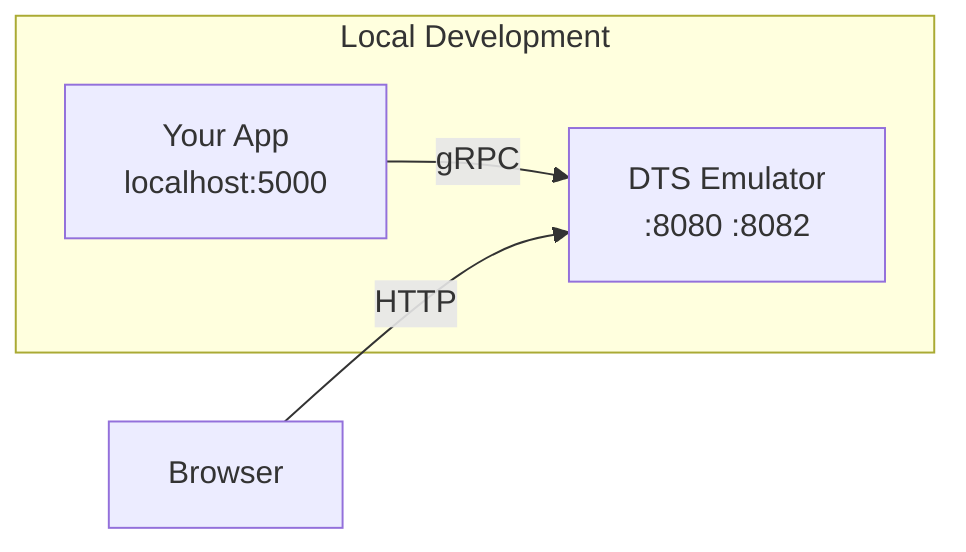
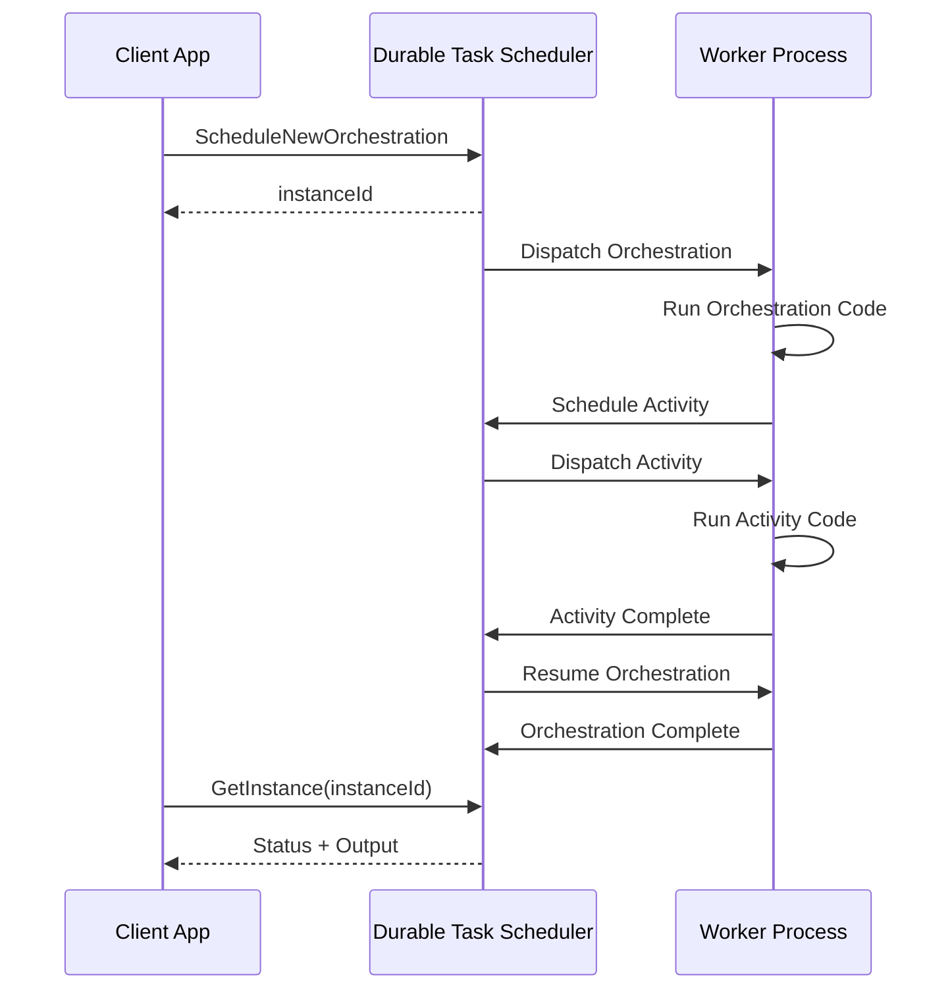

# Getting Started

This guide walks you through setting up the Durable Task SDK for .NET with the Durable Task Scheduler.

## Prerequisites

- [.NET 8 SDK](https://dotnet.microsoft.com/download/dotnet/8.0) or later
- [Docker](https://www.docker.com/products/docker-desktop/) for local development
- [Azure CLI](https://docs.microsoft.com/cli/azure/install-azure-cli) (for Azure deployment)
- [Azure Developer CLI](https://learn.microsoft.com/azure/developer/azure-developer-cli/install-azd) (optional, for azd deployment)

## Local Development with the Emulator

The Durable Task Scheduler Emulator provides a full-featured local development experience in Docker.

### Start the Emulator

```bash
# Pull the emulator image
docker pull mcr.microsoft.com/dts/dts-emulator:latest

# Run the emulator
docker run -d -p 8080:8080 -p 8082:8082 --name dtsemulator mcr.microsoft.com/dts/dts-emulator:latest
```

**Ports:**
- `8080` - gRPC endpoint for worker/client connections
- `8082` - Web dashboard for monitoring

**Dashboard:** Navigate to `http://localhost:8082` to view orchestrations, activities, and entities.



## Connection Strings

The connection string tells the SDK how to connect to the Durable Task Scheduler.

### Local Emulator

```csharp
string connectionString = "Endpoint=http://localhost:8080;TaskHub=default;Authentication=None";
```

### Azure Deployment

```csharp
// Using DefaultAzureCredential (recommended)
string connectionString = "Endpoint=https://dts-xxx.centralus.durabletask.io;TaskHub=mytaskhub;Authentication=DefaultAzure";

// Using Managed Identity with specific Client ID
string connectionString = "Endpoint=https://dts-xxx.centralus.durabletask.io;TaskHub=mytaskhub;Authentication=ManagedIdentity;ClientID=xxx-xxx-xxx";
```

### Environment-Based Configuration

```csharp
// Common pattern for environment-aware connection
string endpoint = Environment.GetEnvironmentVariable("ENDPOINT") ?? "http://localhost:8080";
string taskHubName = Environment.GetEnvironmentVariable("TASKHUB") ?? "default";

bool isLocalEmulator = endpoint == "http://localhost:8080";
string connectionString = isLocalEmulator
    ? $"Endpoint={endpoint};TaskHub={taskHubName};Authentication=None"
    : $"Endpoint={endpoint};TaskHub={taskHubName};Authentication=DefaultAzure";
```

## Project Setup

### Create a New Project

```bash
# Create a new ASP.NET Core Web API project
dotnet new webapi -n MyDurableApp
cd MyDurableApp
```

### Install NuGet Packages

```bash
# Core packages for Durable Task Scheduler
dotnet add package Microsoft.DurableTask.Worker.AzureManaged
dotnet add package Microsoft.DurableTask.Client.AzureManaged

# Source generators for simplified registration
dotnet add package Microsoft.DurableTask.Generators

# Optional: For entities support
dotnet add package Microsoft.DurableTask.Entities
```

## Complete Example

### Program.cs

```csharp
using System.Text.Json.Serialization;
using Microsoft.DurableTask;
using Microsoft.DurableTask.Client;
using Microsoft.DurableTask.Worker;
using Microsoft.DurableTask.Worker.AzureManaged;
using Microsoft.DurableTask.Client.AzureManaged;

var builder = WebApplication.CreateBuilder(args);

// Get connection string from configuration or use default emulator connection
string connectionString = builder.Configuration["DURABLE_TASK_SCHEDULER_CONNECTION_STRING"]
    ?? "Endpoint=http://localhost:8080;TaskHub=default;Authentication=None";

// Register the Durable Task worker (processes orchestrations and activities)
builder.Services.AddDurableTaskWorker(options =>
{
    // Auto-register all tasks marked with [DurableTask] attribute
    options.AddTasks(r => r.AddAllGeneratedTasks());
    options.UseDurableTaskScheduler(connectionString);
});

// Register the Durable Task client (starts and manages orchestrations)
builder.Services.AddDurableTaskClient(options =>
{
    options.UseDurableTaskScheduler(connectionString);
});

// Configure JSON serialization
builder.Services.AddControllers().AddJsonOptions(options =>
{
    options.JsonSerializerOptions.Converters.Add(new JsonStringEnumConverter());
});

// Configure logging
builder.Services.AddLogging(logging =>
{
    logging.AddSimpleConsole(options =>
    {
        options.SingleLine = true;
        options.UseUtcTimestamp = true;
    });
});

var app = builder.Build();
app.MapControllers();
app.Run();
```

### Orchestration (Orchestrations/GreetingOrchestration.cs)

```csharp
using Microsoft.DurableTask;

namespace MyDurableApp.Orchestrations;

[DurableTask]
public class GreetingOrchestration : TaskOrchestrator<string, string>
{
    public override async Task<string> RunAsync(
        TaskOrchestrationContext context, 
        string name)
    {
        // Step 1: Say hello
        string greeting = await context.CallActivityAsync<string>(
            nameof(SayHelloActivity), name);
        
        // Step 2: Process the greeting
        string processed = await context.CallActivityAsync<string>(
            nameof(ProcessGreetingActivity), greeting);
        
        // Step 3: Finalize
        string final = await context.CallActivityAsync<string>(
            nameof(FinalizeResponseActivity), processed);
        
        return final;
    }
}

[DurableTask]
public class SayHelloActivity : TaskActivity<string, string>
{
    private readonly ILogger<SayHelloActivity> _logger;

    public SayHelloActivity(ILogger<SayHelloActivity> logger)
    {
        _logger = logger;
    }

    public override Task<string> RunAsync(TaskActivityContext context, string name)
    {
        _logger.LogInformation("Saying hello to {Name}", name);
        return Task.FromResult($"Hello, {name}!");
    }
}

[DurableTask]
public class ProcessGreetingActivity : TaskActivity<string, string>
{
    public override Task<string> RunAsync(TaskActivityContext context, string greeting)
    {
        return Task.FromResult($"[Processed] {greeting}");
    }
}

[DurableTask]
public class FinalizeResponseActivity : TaskActivity<string, string>
{
    public override Task<string> RunAsync(TaskActivityContext context, string input)
    {
        return Task.FromResult($"{input} - Completed at {DateTime.UtcNow:O}");
    }
}
```

### Controller (Controllers/OrchestrationController.cs)

```csharp
using Microsoft.AspNetCore.Mvc;
using Microsoft.DurableTask.Client;
using MyDurableApp.Orchestrations;

namespace MyDurableApp.Controllers;

[ApiController]
[Route("api/[controller]")]
public class OrchestrationController : ControllerBase
{
    private readonly DurableTaskClient _client;
    private readonly ILogger<OrchestrationController> _logger;

    public OrchestrationController(
        DurableTaskClient client,
        ILogger<OrchestrationController> logger)
    {
        _client = client;
        _logger = logger;
    }

    [HttpPost("greet/{name}")]
    public async Task<IActionResult> StartGreeting(string name)
    {
        string instanceId = await _client.ScheduleNewOrchestrationInstanceAsync(
            nameof(GreetingOrchestration),
            name);

        _logger.LogInformation("Started orchestration {InstanceId}", instanceId);

        return Accepted(new { instanceId });
    }

    [HttpGet("{instanceId}")]
    public async Task<IActionResult> GetStatus(string instanceId)
    {
        var metadata = await _client.GetInstanceAsync(instanceId, getInputsAndOutputs: true);
        
        if (metadata == null)
        {
            return NotFound();
        }

        return Ok(new
        {
            instanceId = metadata.InstanceId,
            status = metadata.RuntimeStatus.ToString(),
            createdAt = metadata.CreatedAt,
            lastUpdatedAt = metadata.LastUpdatedAt,
            input = metadata.SerializedInput,
            output = metadata.SerializedOutput
        });
    }

    [HttpPost("{instanceId}/wait")]
    public async Task<IActionResult> WaitForCompletion(
        string instanceId, 
        CancellationToken cancellationToken)
    {
        var metadata = await _client.WaitForInstanceCompletionAsync(
            instanceId,
            getInputsAndOutputs: true,
            cancellationToken);

        return Ok(new
        {
            instanceId = metadata.InstanceId,
            status = metadata.RuntimeStatus.ToString(),
            output = metadata.SerializedOutput
        });
    }
}
```

## Running Your Application

```bash
# Start the emulator (if not already running)
docker start dtsemulator

# Run your application
dotnet run
```

Test the API:

```bash
# Start an orchestration
curl -X POST "http://localhost:5000/api/orchestration/greet/World"

# Check status (use the instanceId from the response)
curl "http://localhost:5000/api/orchestration/{instanceId}"

# Wait for completion
curl -X POST "http://localhost:5000/api/orchestration/{instanceId}/wait"
```

## Console Application Pattern

For worker-only applications (no HTTP API):

```csharp
using Microsoft.DurableTask;
using Microsoft.DurableTask.Worker;
using Microsoft.DurableTask.Worker.AzureManaged;
using Microsoft.Extensions.DependencyInjection;
using Microsoft.Extensions.Hosting;
using Microsoft.Extensions.Logging;

// Build the host
var builder = Host.CreateApplicationBuilder();

string connectionString = Environment.GetEnvironmentVariable("DURABLE_TASK_SCHEDULER_CONNECTION_STRING")
    ?? "Endpoint=http://localhost:8080;TaskHub=default;Authentication=None";

builder.Services.AddDurableTaskWorker(options =>
{
    options.AddTasks(r => r.AddAllGeneratedTasks());
    options.UseDurableTaskScheduler(connectionString);
});

builder.Logging.AddConsole();

var host = builder.Build();

Console.WriteLine("Starting worker. Press Ctrl+C to stop.");
await host.RunAsync();
```

## Client-Only Application

For applications that only start orchestrations (don't process them):

```csharp
using Microsoft.DurableTask.Client;
using Microsoft.DurableTask.Client.AzureManaged;
using Microsoft.Extensions.DependencyInjection;

var services = new ServiceCollection();

string connectionString = "Endpoint=http://localhost:8080;TaskHub=default;Authentication=None";

services.AddDurableTaskClient(options =>
{
    options.UseDurableTaskScheduler(connectionString);
});

var provider = services.BuildServiceProvider();
var client = provider.GetRequiredService<DurableTaskClient>();

// Start an orchestration
string instanceId = await client.ScheduleNewOrchestrationInstanceAsync(
    "GreetingOrchestration",
    "World");

Console.WriteLine($"Started orchestration: {instanceId}");

// Wait for completion
var result = await client.WaitForInstanceCompletionAsync(instanceId, getInputsAndOutputs: true);
Console.WriteLine($"Result: {result.SerializedOutput}");
```

## Workflow



## Next Steps

- [Core Concepts](Core-Concepts.md) - Understand orchestrations, activities, and entities
- [Writing Task Orchestrations](Writing-Task-Orchestrations.md) - Learn orchestration patterns
- [Container Deployment](Container-Deployment.md) - Deploy to Azure Container Apps or AKS
- [Orchestration Versioning](Orchestration-Versioning.md) - Manage version upgrades

## Troubleshooting

### Common Issues

**Emulator not starting:**
```bash
# Check if port is in use
lsof -i :8080

# Remove and recreate container
docker rm -f dtsemulator
docker run -d -p 8080:8080 -p 8082:8082 --name dtsemulator mcr.microsoft.com/dts/dts-emulator:latest
```

**Connection refused:**
- Ensure emulator is running: `docker ps`
- Check the endpoint in your connection string
- Verify firewall settings

**Tasks not registered:**
- Ensure `[DurableTask]` attribute is applied
- Verify `AddAllGeneratedTasks()` is called
- Check that `Microsoft.DurableTask.Generators` package is installed

**View Logs:**
```bash
# Emulator logs
docker logs dtsemulator

# Application logs
dotnet run --verbosity detailed
```
