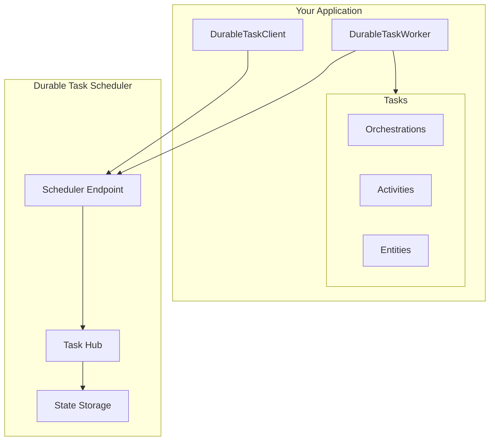
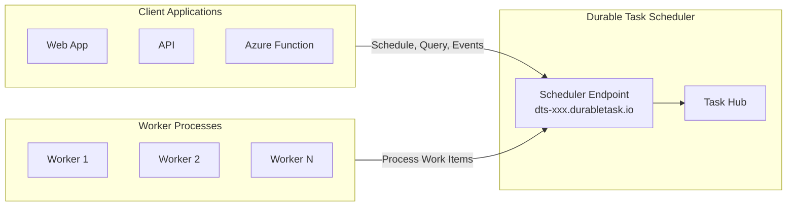

# Durable Task Scheduler

Welcome to the **Durable Task Scheduler** wiki! This SDK enables you to build durable, fault-tolerant workflows using the **Durable Task Scheduler** - a fully managed Azure service for orchestrating long-running, stateful operations.

## What is the Durable Task Scheduler?

The **Durable Task Scheduler** is a managed Azure service that provides durable execution for your workflows without requiring Azure Functions. It's the recommended backend for the Durable Task SDK for .NET.



## Key Features

| Feature | Description |
|---------|-------------|
| **Durable Execution** | Workflows survive crashes, restarts, and deployments |
| **Built-in Patterns** | Function chaining, fan-out/fan-in, human interaction, and more |
| **Durable Entities** | Manage small pieces of state reliably |
| **Orchestration Versioning** | Deploy new versions without breaking in-flight orchestrations |
| **Auto-scaling** | Scale workers based on orchestration load |
| **Local Development** | Full-featured emulator in Docker |
| **Multiple Hosting Options** | ASP.NET Core, Azure Container Apps, AKS, or Azure Functions |

## Architecture Overview



## Quick Start

### 1. Start the Emulator

```bash
# Pull and run the Durable Task Scheduler emulator
docker pull mcr.microsoft.com/dts/dts-emulator:latest
docker run -d -p 8080:8080 -p 8082:8082 mcr.microsoft.com/dts/dts-emulator:latest
```

### 2. Install NuGet Packages

```bash
dotnet add package Microsoft.DurableTask.Worker.AzureManaged
dotnet add package Microsoft.DurableTask.Client.AzureManaged
dotnet add package Microsoft.DurableTask.Generators
```

### 3. Create Your First Orchestration

```csharp
using Microsoft.DurableTask;

[DurableTask]
public class GreetingOrchestration : TaskOrchestrator<string, string>
{
    public override async Task<string> RunAsync(
        TaskOrchestrationContext context, 
        string name)
    {
        string greeting = await context.CallActivityAsync<string>(
            nameof(SayHelloActivity), name);
        
        return greeting;
    }
}

[DurableTask]
public class SayHelloActivity : TaskActivity<string, string>
{
    public override Task<string> RunAsync(
        TaskActivityContext context, 
        string name)
    {
        return Task.FromResult($"Hello, {name}!");
    }
}
```

### 4. Configure and Run

```csharp
var builder = WebApplication.CreateBuilder(args);

string connectionString = "Endpoint=http://localhost:8080;TaskHub=default;Authentication=None";

// Register worker (processes orchestrations and activities)
builder.Services.AddDurableTaskWorker(builder =>
{
    builder.AddTasks(r => r.AddAllGeneratedTasks());
    builder.UseDurableTaskScheduler(connectionString);
});

// Register client (starts and manages orchestrations)
builder.Services.AddDurableTaskClient(builder =>
{
    builder.UseDurableTaskScheduler(connectionString);
});

var app = builder.Build();
app.Run();
```

## Samples Repository

Explore the complete samples at [Azure-Samples/Durable-Task-Scheduler](https://github.com/Azure-Samples/Durable-Task-Scheduler):

| Sample | Description |
|--------|-------------|
| [Function Chaining](https://github.com/Azure-Samples/Durable-Task-Scheduler/tree/main/samples/durable-task-sdks/dotnet/FunctionChaining) | Sequential activity execution |
| [Fan-Out/Fan-In](https://github.com/Azure-Samples/Durable-Task-Scheduler/tree/main/samples/durable-task-sdks/dotnet/FanOutFanIn) | Parallel processing with aggregation |
| [Human Interaction](https://github.com/Azure-Samples/Durable-Task-Scheduler/tree/main/samples/durable-task-sdks/dotnet/HumanInteraction) | Approval workflows with external events |
| [Entities](https://github.com/Azure-Samples/Durable-Task-Scheduler/tree/main/samples/durable-task-sdks/dotnet/EntitiesSample) | Funds transfer with durable entities |
| [Versioning](https://github.com/Azure-Samples/Durable-Task-Scheduler/tree/main/samples/durable-task-sdks/dotnet/OrchestrationVersioning) | Orchestration versioning strategies |
| [Autoscaling](https://github.com/Azure-Samples/Durable-Task-Scheduler/tree/main/samples/scenarios/AutoscalingInACA) | Auto-scaling in Azure Container Apps |

## Deployment Options

The Durable Task SDK for .NET can be deployed to:

- **[Azure Container Apps](Container-Deployment.md#azure-container-apps)** - Serverless containers with auto-scaling
- **[Azure Kubernetes Service](Container-Deployment.md#azure-kubernetes-service)** - Full Kubernetes deployment
- **[Azure Functions](Azure-Functions-Integration.md)** - Serverless function hosting
- **[ASP.NET Core](AspNetCore-Integration.md)** - Traditional web hosting

## Documentation

### Getting Started
- [Getting Started](Getting-Started.md) - Installation and first orchestration
- [Core Concepts](Core-Concepts.md) - Orchestrations, activities, and entities

### Development
- [Writing Task Orchestrations](Writing-Task-Orchestrations.md) - Orchestration patterns
- [Writing Task Activities](Writing-Task-Activities.md) - Activity implementation
- [Durable Entities](Durable-Entities.md) - Stateful entity patterns

### Patterns
- [Fan-Out/Fan-In](Fan-Out-Fan-In.md) - Parallel processing
- [Human Interaction](External-Events.md) - Approval workflows
- [Sub-Orchestrations](Sub-Orchestrations.md) - Composing workflows
- [Eternal Orchestrations](Eternal-Orchestrations.md) - Long-running monitors

### Operations
- [Container Deployment](Container-Deployment.md) - Docker, ACA, AKS deployment
- [Orchestration Versioning](Orchestration-Versioning.md) - Version management
- [Diagnostics and Logging](Diagnostics-and-Logging.md) - Monitoring and troubleshooting

### Reference
- [Orchestration Constraints](Orchestration-Constraints.md) - Determinism requirements
- [API: DurableTaskClient](API-DurableTaskClient.md) - Client API reference
- [API: TaskOrchestrationContext](API-TaskOrchestrationContext.md) - Context API reference

## Resources

- **SDK Repository**: [microsoft/durabletask-dotnet](https://github.com/microsoft/durabletask-dotnet)
- **Samples Repository**: [Azure-Samples/Durable-Task-Scheduler](https://github.com/Azure-Samples/Durable-Task-Scheduler)
- **Documentation**: [Durable Task Scheduler on MS Learn](https://learn.microsoft.com/azure/azure-functions/durable/durable-task-scheduler/)
- **Emulator Dashboard**: `http://localhost:8082` (when running emulator)
