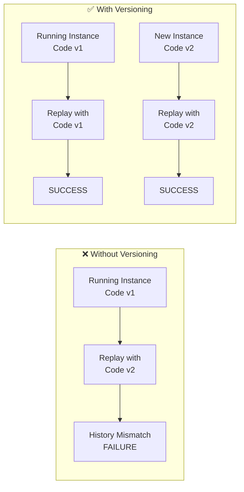
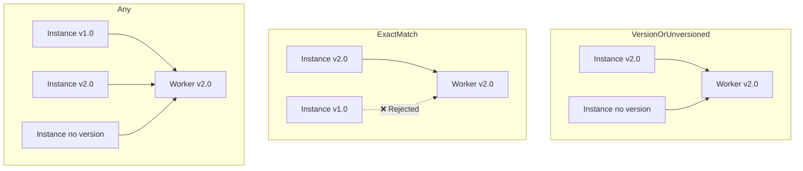

# Orchestration Versioning

As your application evolves, you'll need to update orchestrations while existing instances are still running. This guide covers strategies for versioning orchestrations safely using the **Durable Task Scheduler SDK**.

## The Versioning Challenge

Orchestrations are replayed from their execution history. If you change orchestration code while instances are running, the replay might fail because:

1. The new code expects different activities/sub-orchestrations
2. The order of operations has changed
3. Input/output types have changed
4. Activity names have changed



## Built-in Versioning Support

The Durable Task Scheduler SDK provides **built-in versioning support** with two complementary approaches:

| Approach | Scope | Use Case |
|----------|-------|----------|
| Client/Context-based | Individual orchestrations | Check version in orchestration code |
| Worker-based | Entire worker | Route instances to correct worker version |

## Client/Context-Based Versioning

Use `CompareVersionTo()` inside your orchestration to handle different code paths:

```csharp
[DurableTask(nameof(HelloCities))]
public class HelloCities : TaskOrchestrator<string, string>
{
    public override async Task<string> RunAsync(
        TaskOrchestrationContext context, 
        string input)
    {
        // Check if this instance was started with version 2.0.0 or later
        if (context.CompareVersionTo("2.0.0") >= 0)
        {
            // New behavior for v2.0.0+
            var result = await context.CallActivityAsync<string>(
                nameof(SayHelloV2), 
                input);
            return $"V2: {result}";
        }
        else
        {
            // Original behavior for older instances
            var result = await context.CallActivityAsync<string>(
                nameof(SayHello), 
                input);
            return result;
        }
    }
}
```

### Starting Orchestrations with Versions

Specify the version when starting new orchestrations:

```csharp
// Start with specific version
await client.ScheduleNewOrchestrationInstanceAsync(
    nameof(HelloCities),
    "Seattle",
    new StartOrchestrationOptions
    {
        // This version is stored in history and used during replay
        Version = "2.0.0"
    });
```

### Setting Default Version

Configure a default version for all new orchestrations:

```csharp
var builder = WebApplication.CreateBuilder(args);

builder.Services.AddDurableTaskClient(client =>
{
    client.UseDurableTaskScheduler(connectionString);
    
    // All new orchestrations will use this version unless overridden
    client.UseDefaultVersion("2.0.0");
});
```

## Worker-Based Versioning

For more complex deployments, use worker-based versioning to route orchestration instances to workers running compatible code:

```csharp
var builder = WebApplication.CreateBuilder(args);

builder.Services.AddDurableTaskWorker(worker =>
{
    worker.UseDurableTaskScheduler(connectionString);
    
    // Configure worker versioning
    worker.UseVersioning(versioning =>
    {
        // This worker handles version 2.0
        versioning.Version = "2.0";
        
        // Match strategy: which instances this worker should process
        versioning.MatchStrategy = VersionMatchStrategy.VersionOrUnversioned;
        
        // What happens when no matching worker is found
        versioning.FailureStrategy = VersioningFailureStrategy.Fail;
    });
});
```

### Version Match Strategies



| Strategy | Description |
|----------|-------------|
| `ExactMatch` | Only process instances with exactly matching version |
| `VersionOrUnversioned` | Process matching version OR instances without version |
| `Any` | Process all instances regardless of version |

### Failure Strategies

| Strategy | Description |
|----------|-------------|
| `Fail` | Fail the orchestration if no compatible worker exists |
| `Succeed` | Allow processing even without version match (use cautiously) |

### Deployment Example with Multiple Versions

```csharp
// Worker handling v1.x instances (legacy)
builder.Services.AddDurableTaskWorker(worker =>
{
    worker.UseDurableTaskScheduler(connectionString);
    worker.UseVersioning(v =>
    {
        v.Version = "1.0";
        v.MatchStrategy = VersionMatchStrategy.ExactMatch;
        v.FailureStrategy = VersioningFailureStrategy.Fail;
    });
    worker.AddTasks<LegacyOrchestrations>();
});

// Worker handling v2.x instances (current)
builder.Services.AddDurableTaskWorker(worker =>
{
    worker.UseDurableTaskScheduler(connectionString);
    worker.UseVersioning(v =>
    {
        v.Version = "2.0";
        v.MatchStrategy = VersionMatchStrategy.VersionOrUnversioned;
        v.FailureStrategy = VersioningFailureStrategy.Fail;
    });
    worker.AddTasks<CurrentOrchestrations>();
});
```

## Versioning Strategies

### Strategy 1: Side-by-Side Versioning

Run multiple versions of an orchestration simultaneously:

```csharp
// Version 1 - Original
[DurableTask("OrderOrchestration_v1")]
public class OrderOrchestrationV1 : TaskOrchestrator<OrderInput, OrderResult>
{
    public override async Task<OrderResult> RunAsync(
        TaskOrchestrationContext context, 
        OrderInput input)
    {
        await context.CallActivityAsync("ValidateOrder", input);
        await context.CallActivityAsync("ProcessPayment", input.Payment);
        await context.CallActivityAsync("ShipOrder", input.Shipping);
        
        return new OrderResult { Status = "Completed" };
    }
}

// Version 2 - Added fraud check
[DurableTask("OrderOrchestration_v2")]
public class OrderOrchestrationV2 : TaskOrchestrator<OrderInputV2, OrderResult>
{
    public override async Task<OrderResult> RunAsync(
        TaskOrchestrationContext context, 
        OrderInputV2 input)
    {
        await context.CallActivityAsync("ValidateOrder", input);
        
        // New step in v2
        var fraudCheck = await context.CallActivityAsync<FraudCheckResult>(
            "CheckFraud", 
            input);
        
        if (fraudCheck.IsSuspicious)
        {
            return new OrderResult { Status = "FraudSuspected" };
        }
        
        await context.CallActivityAsync("ProcessPayment", input.Payment);
        await context.CallActivityAsync("ShipOrder", input.Shipping);
        
        return new OrderResult { Status = "Completed" };
    }
}
```

### Client Code for Side-by-Side

```csharp
public class OrderService
{
    private readonly DurableTaskClient _client;
    private readonly string _currentVersion = "OrderOrchestration_v2";
    
    public async Task<string> StartOrder(OrderInputV2 input)
    {
        // Always start with current version
        return await _client.ScheduleNewOrchestrationInstanceAsync(
            _currentVersion,
            input);
    }
}
```

### Strategy 2: Version Detection in Orchestration

Use a version flag in the orchestration state:

```csharp
[DurableTask(nameof(VersionedOrchestration))]
public class VersionedOrchestration : TaskOrchestrator<VersionedInput, VersionedOutput>
{
    public override async Task<VersionedOutput> RunAsync(
        TaskOrchestrationContext context, 
        VersionedInput input)
    {
        // Default to latest version for new instances
        int version = input.Version ?? 3;
        
        // Version 1 & 2 behavior
        await context.CallActivityAsync("CommonStep1", input);
        
        // Version 2+ added this step
        if (version >= 2)
        {
            await context.CallActivityAsync("Step2AddedInV2", input);
        }
        
        // Version 3+ changed this step
        if (version >= 3)
        {
            await context.CallActivityAsync("Step3ReplacedInV3", input);
        }
        else
        {
            await context.CallActivityAsync("OriginalStep3", input);
        }
        
        return new VersionedOutput { ProcessedVersion = version };
    }
}

public class VersionedInput
{
    public int? Version { get; set; }
    public string Data { get; set; } = "";
}
```

### Strategy 3: Feature Flags

Use feature flags to gradually roll out changes:

```csharp
[DurableTask(nameof(FeatureFlagOrchestration))]
public class FeatureFlagOrchestration : TaskOrchestrator<FeatureFlagInput, ProcessingResult>
{
    public override async Task<ProcessingResult> RunAsync(
        TaskOrchestrationContext context, 
        FeatureFlagInput input)
    {
        // Get feature flags at start (deterministically)
        var features = await context.CallActivityAsync<FeatureFlags>(
            "GetFeatureFlags",
            input.UserId);
        
        await context.CallActivityAsync("ProcessOrder", input);
        
        // New feature behind flag
        if (features.EnableNewPaymentFlow)
        {
            await context.CallActivityAsync("NewPaymentProcessing", input);
        }
        else
        {
            await context.CallActivityAsync("LegacyPaymentProcessing", input);
        }
        
        // Another feature
        if (features.EnableAsyncShipping)
        {
            await context.CallSubOrchestratorAsync("AsyncShippingOrchestration", input);
        }
        else
        {
            await context.CallActivityAsync("SyncShipping", input);
        }
        
        return new ProcessingResult { Success = true };
    }
}
```

### Strategy 4: Instance ID Routing

Route to different versions based on instance ID patterns:

```csharp
public class VersionRouter
{
    private readonly DurableTaskClient _client;
    
    public async Task<string> StartOrchestration(OrderInput input)
    {
        // Use date-based versioning
        string datePrefix = DateTime.UtcNow.ToString("yyyyMMdd");
        string instanceId = $"order-{datePrefix}-{Guid.NewGuid():N}";
        
        // Route based on date (new code starts on specific date)
        string orchestrationName = DateTime.UtcNow >= new DateTime(2024, 6, 1)
            ? "OrderOrchestration_v2"
            : "OrderOrchestration_v1";
        
        return await _client.ScheduleNewOrchestrationInstanceAsync(
            orchestrationName,
            input,
            new StartOrchestrationOptions { InstanceId = instanceId });
    }
}
```

## Safe Update Patterns

### Pattern 1: Activity Name Versioning

Keep old activity names and add new ones:

```csharp
// Keep both activities registered
[DurableTask("ProcessPayment")]      // Original
[DurableTask("ProcessPayment_v2")]   // New version

public class PaymentActivities
{
    // Original - keep for running instances
    [DurableTask("ProcessPayment")]
    public async Task<PaymentResult> ProcessPaymentV1(PaymentInput input)
    {
        // Original implementation
        return await ProcessPaymentInternal(input, useNewFlow: false);
    }
    
    // New version
    [DurableTask("ProcessPayment_v2")]
    public async Task<PaymentResultV2> ProcessPaymentV2(PaymentInputV2 input)
    {
        // New implementation
        return await ProcessPaymentInternal(input, useNewFlow: true);
    }
}
```

### Pattern 2: Backward-Compatible Input

Design inputs to be backward compatible:

```csharp
public class OrderInput
{
    // Original properties
    public string OrderId { get; set; } = "";
    public decimal Amount { get; set; }
    
    // New properties with defaults (backward compatible)
    public string? CurrencyCode { get; set; } = "USD";
    public List<string> Tags { get; set; } = new();
    public CustomerInfo? Customer { get; set; }
}

// Orchestration handles missing values
public override async Task<OrderResult> RunAsync(
    TaskOrchestrationContext context, 
    OrderInput input)
{
    // Handle potentially null new properties
    string currency = input.CurrencyCode ?? "USD";
    
    // Process with backward compatibility
    await context.CallActivityAsync("ProcessOrder", new
    {
        input.OrderId,
        input.Amount,
        Currency = currency
    });
    
    return new OrderResult { Success = true };
}
```

### Pattern 3: Migration Orchestration

Create a migration orchestration to handle in-flight instances:

```csharp
[DurableTask(nameof(MigrationOrchestration))]
public class MigrationOrchestration : TaskOrchestrator<MigrationConfig, MigrationResult>
{
    public override async Task<MigrationResult> RunAsync(
        TaskOrchestrationContext context, 
        MigrationConfig config)
    {
        var logger = context.CreateReplaySafeLogger("Migration");
        
        // Find all running instances of old version
        var runningInstances = await context.CallActivityAsync<List<string>>(
            "FindRunningInstances",
            config.OldOrchestratorName);
        
        logger.LogInformation("Found {Count} running instances to migrate",
            runningInstances.Count);
        
        var migrationResults = new List<InstanceMigrationResult>();
        
        foreach (var instanceId in runningInstances)
        {
            // Option 1: Wait for completion
            var status = await context.CallActivityAsync<InstanceStatus>(
                "GetInstanceStatus", 
                instanceId);
            
            if (status.IsCompleted)
            {
                migrationResults.Add(new InstanceMigrationResult
                {
                    InstanceId = instanceId,
                    Action = "AlreadyCompleted"
                });
                continue;
            }
            
            // Option 2: Terminate and restart with new version
            if (config.RestartStuckInstances && status.IsStuck)
            {
                await context.CallActivityAsync("TerminateInstance", instanceId);
                
                string newInstanceId = await context.CallActivityAsync<string>(
                    "RestartWithNewVersion",
                    new { instanceId, config.NewOrchestratorName });
                
                migrationResults.Add(new InstanceMigrationResult
                {
                    InstanceId = instanceId,
                    Action = "Restarted",
                    NewInstanceId = newInstanceId
                });
            }
        }
        
        return new MigrationResult
        {
            TotalInstances = runningInstances.Count,
            Results = migrationResults
        };
    }
}
```

## Deployment Strategies

### Blue-Green Deployment

```csharp
public class BlueGreenDeployment
{
    private readonly DurableTaskClient _client;
    private readonly IConfiguration _config;
    
    public async Task<string> StartOrchestration(OrderInput input)
    {
        // Get active color from configuration
        string activeColor = _config["ActiveDeployment"]; // "blue" or "green"
        
        string orchestrationName = activeColor == "green"
            ? "OrderOrchestration_Green"
            : "OrderOrchestration_Blue";
        
        return await _client.ScheduleNewOrchestrationInstanceAsync(
            orchestrationName,
            input);
    }
}
```

### Canary Deployment

```csharp
public class CanaryDeployment
{
    private readonly DurableTaskClient _client;
    private readonly Random _random = new();
    
    public async Task<string> StartOrchestration(OrderInput input)
    {
        // Route percentage of traffic to new version
        double canaryPercentage = 10.0; // 10% to new version
        
        bool useCanary = _random.NextDouble() * 100 < canaryPercentage;
        
        string orchestrationName = useCanary
            ? "OrderOrchestration_v2"
            : "OrderOrchestration_v1";
        
        string instanceId = await _client.ScheduleNewOrchestrationInstanceAsync(
            orchestrationName,
            input);
        
        // Log which version was used for analysis
        Console.WriteLine($"Started {instanceId} with {orchestrationName}");
        
        return instanceId;
    }
}
```

## Best Practices

### 1. Never Remove Code That Running Instances Need

```csharp
// ❌ Don't remove old activities while instances use them
// await context.CallActivityAsync("OldActivity", input);

// ✅ Keep both during transition period
if (input.Version >= 2)
{
    await context.CallActivityAsync("NewActivity", input);
}
else
{
    await context.CallActivityAsync("OldActivity", input);
}
```

### 2. Use Deterministic Version Checks

```csharp
// ❌ Non-deterministic - version changes on replay
if (Environment.GetEnvironmentVariable("VERSION") == "2")

// ✅ Deterministic - stored in input
if (input.Version >= 2)

// ✅ Deterministic - fetched as activity (cached in history)
var version = await context.CallActivityAsync<int>("GetVersion", null);
```

### 3. Version Input/Output Types Carefully

```csharp
// ✅ Add new properties with defaults
public class OrderInputV2 : OrderInput
{
    public string? NewProperty { get; set; } = "default";
}

// ✅ Use nullable for new required fields
public class OrderResultV2
{
    public string Status { get; set; } = "";
    public string? NewRequiredField { get; set; }  // Nullable during transition
}
```

### 4. Document Version Lifecycles

```csharp
/// <summary>
/// Order processing orchestration.
/// 
/// Version History:
/// - v1 (2024-01): Initial version
/// - v2 (2024-03): Added fraud check step
/// - v3 (2024-06): Changed payment provider integration
/// 
/// Deprecation Schedule:
/// - v1: Deprecated 2024-04, removed after 2024-07
/// - v2: Current stable version
/// </summary>
[DurableTask("OrderOrchestration_v2")]
public class OrderOrchestrationV2 : TaskOrchestrator<OrderInput, OrderResult>
{
    // ...
}
```

### 5. Monitor Version Distribution

```csharp
// Track which versions are running
public async Task<VersionStats> GetVersionStats()
{
    var stats = new Dictionary<string, int>();
    
    var query = new OrchestrationQuery
    {
        RuntimeStatus = new[] { OrchestrationRuntimeStatus.Running }
    };
    
    var result = await _client.GetAllInstancesAsync(query);
    
    foreach (var instance in result.Instances)
    {
        string version = instance.Name ?? "unknown";
        stats[version] = stats.GetValueOrDefault(version) + 1;
    }
    
    return new VersionStats { VersionCounts = stats };
}
```

## Next Steps

- [Orchestration Instance Management](Orchestration-Instance-Management.md) - Manage instances
- [Instance Queries](Instance-Queries.md) - Query running instances
- [Writing Task Orchestrations](Writing-Task-Orchestrations.md) - Orchestration basics
