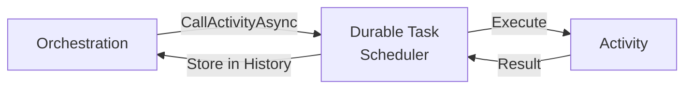

# Writing Task Activities

Task activities are the fundamental units of work in a Durable Task orchestration with **Durable Task Scheduler**. They perform the actual I/O and computation that orchestrations coordinate.

## Activity Basics

### What is an Activity?

An activity is a single unit of work that:
- Performs actual business logic
- Can make I/O calls (HTTP, database, file system)
- Can use non-deterministic operations
- Is guaranteed to execute **at least once**



### Class-Based Syntax

The recommended approach is to create a class that inherits from `TaskActivity<TInput, TOutput>`:

```csharp
using Microsoft.DurableTask;

[DurableTask("ProcessOrder")]
public class ProcessOrderActivity : TaskActivity<OrderInfo, OrderResult>
{
    private readonly IOrderService _orderService;
    private readonly ILogger<ProcessOrderActivity> _logger;

    public ProcessOrderActivity(
        IOrderService orderService,
        ILogger<ProcessOrderActivity> logger)
    {
        _orderService = orderService;
        _logger = logger;
    }

    public override async Task<OrderResult> RunAsync(
        TaskActivityContext context, 
        OrderInfo input)
    {
        _logger.LogInformation(
            "Processing order {OrderId} for instance {InstanceId}",
            input.OrderId,
            context.InstanceId);

        var result = await _orderService.ProcessAsync(input);
        return result;
    }
}
```

### Function-Based Syntax

For simpler scenarios, use function-based registration:

```csharp
services.AddDurableTaskWorker(options =>
{
    options.UseDurableTaskScheduler(connectionString);
    
    options.AddTasks(tasks =>
    {
        // Sync activity
        tasks.AddActivityFunc<string, string>(
            "SayHello", 
            (ctx, name) => $"Hello, {name}!");

        // Async activity
        tasks.AddActivityFunc<OrderInfo, OrderResult>(
            "ProcessOrder",
            async (ctx, order) =>
            {
                var service = ctx.GetRequiredService<IOrderService>();
                return await service.ProcessAsync(order);
            });
    });
});
```

## Activity Registration

### Registering Activity Classes

```csharp
services.AddDurableTaskWorker(options =>
{
    options.AddTasks(tasks =>
    {
        // Register individual activities
        tasks.AddActivity<ProcessOrderActivity>();
        tasks.AddActivity<SendEmailActivity>();
        
        // Register all activities from an assembly
        tasks.AddAllActivitiesFromAssembly(typeof(Program).Assembly);
    });
});
```

### Dependency Injection

Activities fully support dependency injection:

```csharp
[DurableTask("SendEmail")]
public class SendEmailActivity : TaskActivity<EmailRequest, bool>
{
    private readonly IEmailService _emailService;
    private readonly IConfiguration _config;
    private readonly ILogger<SendEmailActivity> _logger;

    public SendEmailActivity(
        IEmailService emailService,
        IConfiguration config,
        ILogger<SendEmailActivity> logger)
    {
        _emailService = emailService;
        _config = config;
        _logger = logger;
    }

    public override async Task<bool> RunAsync(
        TaskActivityContext context, 
        EmailRequest input)
    {
        await _emailService.SendAsync(input);
        return true;
    }
}
```

## Activity Context

The `TaskActivityContext` provides information about the activity execution:

```csharp
public override async Task<string> RunAsync(
    TaskActivityContext context, 
    string input)
{
    // Get the activity name
    TaskName activityName = context.Name;
    
    // Get the orchestration instance ID that invoked this activity
    string instanceId = context.InstanceId;
    
    _logger.LogInformation(
        "Activity {ActivityName} running for orchestration {InstanceId}",
        activityName,
        instanceId);
    
    return $"Processed: {input}";
}
```

## Execution Guarantees

### At-Least-Once Execution

Activities are guaranteed to execute **at least once**. This means:
- An activity may execute multiple times if there are failures
- Results are cached after successful completion
- Retries use the same activity input

### Why Multiple Executions?

- Process crash before result is saved
- Network issues during result transmission
- Backend infrastructure issues

### Handling Multiple Executions

Design activities to be **idempotent** when possible:

```csharp
[DurableTask("ProcessPayment")]
public class ProcessPaymentActivity : TaskActivity<PaymentRequest, PaymentResult>
{
    private readonly IPaymentService _paymentService;

    public ProcessPaymentActivity(IPaymentService paymentService)
    {
        _paymentService = paymentService;
    }

    public override async Task<PaymentResult> RunAsync(
        TaskActivityContext context, 
        PaymentRequest request)
    {
        // Use idempotency key to prevent duplicate payments
        string idempotencyKey = $"{context.InstanceId}-{request.OrderId}";
        
        // Check if payment was already processed
        var existing = await _paymentService.GetByIdempotencyKeyAsync(idempotencyKey);
        if (existing != null)
        {
            return existing;
        }
        
        // Process new payment with idempotency key
        return await _paymentService.ProcessAsync(request, idempotencyKey);
    }
}
```

## Best Practices

### 1. Keep Activities Focused

Each activity should do one thing well:

```csharp
// ❌ Activity doing too much
[DurableTask("ProcessOrderFull")]
public class ProcessOrderFullActivity : TaskActivity<Order, OrderResult>
{
    public override async Task<OrderResult> RunAsync(TaskActivityContext context, Order order)
    {
        await ValidateOrder(order);
        await ReserveInventory(order);
        await ChargeCustomer(order);
        await ShipOrder(order);
        await SendConfirmation(order);
        return new OrderResult(true);
    }
}

// ✅ Separate activities for each step
[DurableTask("ValidateOrder")]
public class ValidateOrderActivity : TaskActivity<Order, ValidationResult> { /* ... */ }

[DurableTask("ReserveInventory")]
public class ReserveInventoryActivity : TaskActivity<Order, ReservationResult> { /* ... */ }

[DurableTask("ChargeCustomer")]
public class ChargeCustomerActivity : TaskActivity<Order, PaymentResult> { /* ... */ }
```

### 2. Implement Idempotency

```csharp
[DurableTask("UpdateDatabase")]
public class UpdateDatabaseActivity : TaskActivity<UpdateRequest, bool>
{
    private readonly IDbContext _db;

    public override async Task<bool> RunAsync(
        TaskActivityContext context, 
        UpdateRequest request)
    {
        // Use optimistic concurrency
        var entity = await _db.Entities.FindAsync(request.Id);
        
        if (entity == null)
        {
            return false;
        }
        
        // Check version to prevent duplicate updates
        if (entity.Version != request.ExpectedVersion)
        {
            // Already updated or concurrent modification
            return entity.Version > request.ExpectedVersion;
        }
        
        entity.Data = request.NewData;
        entity.Version = request.ExpectedVersion + 1;
        
        await _db.SaveChangesAsync();
        return true;
    }
}
```

### 3. Handle Large Data Properly

Avoid passing large data through activities:

```csharp
// ❌ Passing large data directly
[DurableTask("ProcessLargeFile")]
public class ProcessLargeFileActivity : TaskActivity<byte[], ProcessResult>
{
    public override async Task<ProcessResult> RunAsync(
        TaskActivityContext context, 
        byte[] fileData) // Large payload
    {
        // Process data
    }
}

// ✅ Pass references instead
[DurableTask("ProcessLargeFile")]
public class ProcessLargeFileActivity : TaskActivity<BlobReference, ProcessResult>
{
    private readonly IBlobStorage _blobStorage;

    public override async Task<ProcessResult> RunAsync(
        TaskActivityContext context, 
        BlobReference reference)
    {
        // Fetch data from storage
        byte[] data = await _blobStorage.DownloadAsync(reference.Url);
        
        // Process data
        var result = ProcessData(data);
        
        // Upload result if large
        string resultUrl = await _blobStorage.UploadAsync(result);
        
        return new ProcessResult(resultUrl);
    }
}
```

### 4. Proper Logging

```csharp
[DurableTask("ImportantActivity")]
public class ImportantActivity : TaskActivity<string, string>
{
    private readonly ILogger<ImportantActivity> _logger;

    public ImportantActivity(ILogger<ImportantActivity> logger)
    {
        _logger = logger;
    }

    public override async Task<string> RunAsync(
        TaskActivityContext context, 
        string input)
    {
        // Include context in logs for traceability
        using var scope = _logger.BeginScope(new Dictionary<string, object>
        {
            ["OrchestrationInstanceId"] = context.InstanceId,
            ["ActivityName"] = context.Name.Name,
            ["Input"] = input
        });

        _logger.LogInformation("Starting activity execution");
        
        try
        {
            var result = await DoWork(input);
            _logger.LogInformation("Activity completed successfully with result: {Result}", result);
            return result;
        }
        catch (Exception ex)
        {
            _logger.LogError(ex, "Activity failed");
            throw;
        }
    }
}
```

### 5. Timeout Handling

```csharp
[DurableTask("ExternalServiceCall")]
public class ExternalServiceCallActivity : TaskActivity<ServiceRequest, ServiceResponse>
{
    private readonly HttpClient _httpClient;
    private readonly ILogger<ExternalServiceCallActivity> _logger;

    public override async Task<ServiceResponse> RunAsync(
        TaskActivityContext context, 
        ServiceRequest request)
    {
        // Use timeout for external calls
        using var cts = new CancellationTokenSource(TimeSpan.FromMinutes(2));
        
        try
        {
            var response = await _httpClient.PostAsJsonAsync(
                request.Url, 
                request.Body, 
                cts.Token);
            
            response.EnsureSuccessStatusCode();
            return await response.Content.ReadFromJsonAsync<ServiceResponse>(cts.Token);
        }
        catch (OperationCanceledException)
        {
            _logger.LogWarning("External service call timed out");
            throw new TimeoutException("External service call exceeded 2 minute timeout");
        }
    }
}
```

### 6. Error Handling

```csharp
[DurableTask("RiskyOperation")]
public class RiskyOperationActivity : TaskActivity<string, OperationResult>
{
    private readonly ILogger<RiskyOperationActivity> _logger;

    public override async Task<OperationResult> RunAsync(
        TaskActivityContext context, 
        string input)
    {
        try
        {
            // Attempt operation
            return await PerformOperation(input);
        }
        catch (TransientException ex)
        {
            // Re-throw transient errors for retry
            _logger.LogWarning(ex, "Transient error occurred, will be retried");
            throw;
        }
        catch (InvalidInputException ex)
        {
            // Return error result for known failures
            _logger.LogError(ex, "Invalid input provided");
            return new OperationResult
            {
                Success = false,
                ErrorCode = "INVALID_INPUT",
                ErrorMessage = ex.Message
            };
        }
        catch (Exception ex)
        {
            // Log and re-throw unknown errors
            _logger.LogError(ex, "Unexpected error in activity");
            throw;
        }
    }
}
```

## Activities vs. Orchestrations

| Aspect | Activities | Orchestrations |
|--------|-----------|----------------|
| I/O Operations | ✅ Allowed | ❌ Not allowed |
| Non-deterministic code | ✅ Allowed | ❌ Not allowed |
| Execution | At least once | Exactly once (logical) |
| State | Stateless | Stateful (via replay) |
| Timeout | Can be set | Duration-based |
| Concurrency | Can run in parallel | Single-threaded execution |

## Azure Functions Integration

In Azure Functions, activities are defined as functions:

```csharp
public static class OrderActivities
{
    [Function("ValidateOrder")]
    public static async Task<ValidationResult> ValidateOrder(
        [ActivityTrigger] OrderInfo order,
        FunctionContext context)
    {
        var logger = context.GetLogger(nameof(ValidateOrder));
        logger.LogInformation("Validating order {OrderId}", order.Id);
        
        // Validation logic
        return new ValidationResult { IsValid = true };
    }

    [Function("ProcessPayment")]
    public static async Task<PaymentResult> ProcessPayment(
        [ActivityTrigger] PaymentRequest request,
        FunctionContext context)
    {
        var paymentService = context.GetService<IPaymentService>();
        return await paymentService.ProcessAsync(request);
    }
}
```

## Testing Activities

### Unit Testing

```csharp
using Xunit;
using Moq;

public class SendEmailActivityTests
{
    [Fact]
    public async Task SendEmail_Success_ReturnsTrue()
    {
        // Arrange
        var mockEmailService = new Mock<IEmailService>();
        mockEmailService
            .Setup(x => x.SendAsync(It.IsAny<EmailRequest>()))
            .Returns(Task.CompletedTask);

        var mockContext = new Mock<TaskActivityContext>();
        mockContext.Setup(x => x.InstanceId).Returns("test-instance");

        var activity = new SendEmailActivity(
            mockEmailService.Object,
            Mock.Of<ILogger<SendEmailActivity>>());

        var request = new EmailRequest
        {
            To = "test@example.com",
            Subject = "Test",
            Body = "Test body"
        };

        // Act
        bool result = await activity.RunAsync(mockContext.Object, request);

        // Assert
        Assert.True(result);
        mockEmailService.Verify(x => x.SendAsync(request), Times.Once);
    }
}
```

### Integration Testing

```csharp
public class ActivityIntegrationTests
{
    [Fact]
    public async Task ProcessOrder_ValidOrder_Succeeds()
    {
        // Arrange
        await using var testHost = await DurableTaskTestHost.StartAsync(registry =>
        {
            registry.AddActivity<ProcessOrderActivity>();
        });

        var order = new OrderInfo { Id = "123", Amount = 100 };

        // Act & Assert (call through orchestration)
        // Activities are typically tested through orchestration integration tests
    }
}
```

## Next Steps

- [Writing Task Orchestrations](Writing-Task-Orchestrations.md) - Coordinate activities
- [Error Handling & Compensation](Error-Handling-and-Compensation.md) - Handle failures
- [Automatic Retries](Automatic-Retries.md) - Configure retry policies
- [Fan-Out Fan-In](Fan-Out-Fan-In.md) - Parallel activity execution
