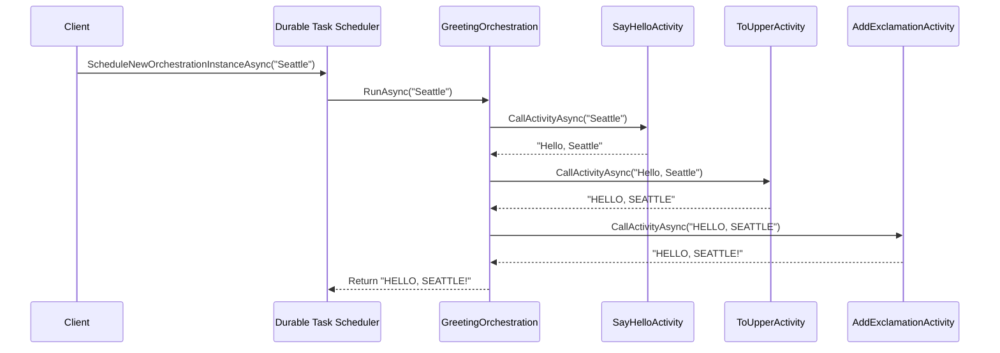

# Writing Task Orchestrations

Task orchestrations are the heart of the Durable Task .NET SDK. They define the workflow logic that coordinates activities, timers, external events, and sub-orchestrations with **Durable Task Scheduler**.

## Function Chaining Example

Here's the **GreetingOrchestration** from the Durable Task Scheduler samples, demonstrating function chaining:

```csharp
using Microsoft.DurableTask;
using Microsoft.Extensions.Logging;

/// <summary>
/// Greeting orchestration that chains multiple activity calls.
/// From: Azure-Samples/Durable-Task-Scheduler/dotnet/FunctionChainingSample
/// </summary>
[DurableTask(nameof(GreetingOrchestration))]
public class GreetingOrchestration : TaskOrchestrator<string, string>
{
    public override async Task<string> RunAsync(
        TaskOrchestrationContext context, 
        string name)
    {
        ILogger logger = context.CreateReplaySafeLogger<GreetingOrchestration>();
        
        logger.LogInformation("Starting greeting orchestration for {Name}", name);
        
        // Chain activities in sequence
        string greeting = await context.CallActivityAsync<string>(
            nameof(SayHelloActivity), name);
        
        string upperGreeting = await context.CallActivityAsync<string>(
            nameof(ToUpperActivity), greeting);
        
        string finalGreeting = await context.CallActivityAsync<string>(
            nameof(AddExclamationActivity), upperGreeting);
        
        logger.LogInformation("Completed greeting: {Greeting}", finalGreeting);
        
        return finalGreeting;
    }
}

// Activities
[DurableTask(nameof(SayHelloActivity))]
public class SayHelloActivity : TaskActivity<string, string>
{
    public override Task<string> RunAsync(TaskActivityContext context, string name)
    {
        return Task.FromResult($"Hello, {name}");
    }
}

[DurableTask(nameof(ToUpperActivity))]
public class ToUpperActivity : TaskActivity<string, string>
{
    public override Task<string> RunAsync(TaskActivityContext context, string input)
    {
        return Task.FromResult(input.ToUpperInvariant());
    }
}

[DurableTask(nameof(AddExclamationActivity))]
public class AddExclamationActivity : TaskActivity<string, string>
{
    public override Task<string> RunAsync(TaskActivityContext context, string input)
    {
        return Task.FromResult($"{input}!");
    }
}
```



## Orchestration Basics

### Class-Based Syntax

The recommended approach is to create a class that inherits from `TaskOrchestrator<TInput, TOutput>`:

```csharp
using Microsoft.DurableTask;

[DurableTask(nameof(MyOrchestration))]
public class MyOrchestration : TaskOrchestrator<MyInput, MyOutput>
{
    public override async Task<MyOutput> RunAsync(
        TaskOrchestrationContext context, 
        MyInput input)
    {
        // Orchestration logic here
        var result = await context.CallActivityAsync<string>("MyActivity", input);
        return new MyOutput(result);
    }
}
```

### Function-Based Syntax

For simpler scenarios, you can use function-based registration:

```csharp
services.AddDurableTaskWorker(options =>
{
    options.AddTasks(tasks =>
    {
        tasks.AddOrchestratorFunc<MyInput, MyOutput>("MyOrchestration", async (ctx, input) =>
        {
            var result = await ctx.CallActivityAsync<string>("MyActivity", input);
            return new MyOutput(result);
        });
    });
});
```

## Orchestration Constraints

**Important**: Orchestration code has specific constraints due to the replay mechanism. The framework replays orchestration code to rebuild state, so the code must be **deterministic**.

### ❌ Don't Do This

```csharp
public override async Task<string> RunAsync(TaskOrchestrationContext context, string input)
{
    // ❌ DON'T use DateTime.Now or DateTime.UtcNow
    var now = DateTime.UtcNow;
    
    // ❌ DON'T use Guid.NewGuid()
    var id = Guid.NewGuid();
    
    // ❌ DON'T use random numbers
    var random = new Random().Next();
    
    // ❌ DON'T make direct I/O calls
    var data = await httpClient.GetStringAsync("https://api.example.com");
    
    // ❌ DON'T use Thread.Sleep or Task.Delay
    await Task.Delay(TimeSpan.FromMinutes(5));
    
    // ❌ DON'T access environment variables directly
    var secret = Environment.GetEnvironmentVariable("SECRET");
    
    return "done";
}
```

### ✅ Do This Instead

```csharp
public override async Task<string> RunAsync(TaskOrchestrationContext context, string input)
{
    // ✅ Use context.CurrentUtcDateTime for time
    var now = context.CurrentUtcDateTime;
    
    // ✅ Use NewGuid activity for GUIDs
    var id = await context.CallActivityAsync<Guid>("NewGuid");
    
    // ✅ Use random number activity
    var random = await context.CallActivityAsync<int>("GetRandomNumber");
    
    // ✅ Use activities for I/O operations
    var data = await context.CallActivityAsync<string>("FetchData", "https://api.example.com");
    
    // ✅ Use CreateTimer for delays
    await context.CreateTimer(context.CurrentUtcDateTime.AddMinutes(5), CancellationToken.None);
    
    // ✅ Read config in activity or pass as input
    var secret = await context.CallActivityAsync<string>("GetSecret", "SECRET");
    
    return "done";
}
```

## The Replay Mechanism

### How Replay Works

When an orchestration runs:

1. Each action (scheduling activity, creating timer, etc.) is recorded as an event
2. Events are persisted to durable storage
3. If the orchestration needs to restart, events are replayed
4. During replay, completed actions return cached results immediately

### Example

```csharp
public override async Task<string> RunAsync(TaskOrchestrationContext context, string input)
{
    // First execution: Activity1 is scheduled and executed
    // Replay: Returns cached result immediately
    var result1 = await context.CallActivityAsync<string>("Activity1", input);
    
    // First execution: Activity2 is scheduled and executed
    // Replay: If Activity1 was cached, Activity2 might be scheduled
    var result2 = await context.CallActivityAsync<string>("Activity2", result1);
    
    return result2;
}
```

### Checking for Replay

You can check if the orchestration is currently replaying:

```csharp
public override async Task<string> RunAsync(TaskOrchestrationContext context, string input)
{
    if (!context.IsReplaying)
    {
        // This code only runs during actual execution, not replay
        // Useful for logging or metrics
    }
    
    // Use replay-safe logger
    ILogger logger = context.CreateReplaySafeLogger(nameof(MyOrchestration));
    logger.LogInformation("Processing {Input}", input); // Only logs once
    
    return await context.CallActivityAsync<string>("Activity1", input);
}
```

## Calling Activities

### Basic Activity Call

```csharp
// Call activity and get result
string result = await context.CallActivityAsync<string>("ActivityName", "input");
```

### With TaskName

```csharp
// Using TaskName for more control
TaskName activityName = new TaskName("ActivityName", "v1");
string result = await context.CallActivityAsync<string>(activityName, "input");
```

### Parallel Activity Execution (Fan-Out)

```csharp
public override async Task<List<string>> RunAsync(
    TaskOrchestrationContext context, 
    List<string> items)
{
    // Schedule all activities in parallel
    var tasks = items.Select(item => 
        context.CallActivityAsync<string>("ProcessItem", item));
    
    // Wait for all to complete (Fan-In)
    string[] results = await Task.WhenAll(tasks);
    
    return results.ToList();
}
```

### With Retry Options

```csharp
public override async Task<string> RunAsync(TaskOrchestrationContext context, string input)
{
    var retryOptions = new TaskOptions
    {
        Retry = new RetryPolicy(
            maxNumberOfAttempts: 5,
            firstRetryInterval: TimeSpan.FromSeconds(10),
            backoffCoefficient: 2.0,
            maxRetryInterval: TimeSpan.FromMinutes(5))
    };

    return await context.CallActivityAsync<string>("UnreliableActivity", input, retryOptions);
}
```

## Creating Timers

### Simple Timer

```csharp
// Wait for a specific duration
await context.CreateTimer(
    context.CurrentUtcDateTime.AddMinutes(30), 
    CancellationToken.None);
```

### Timer with Cancellation

```csharp
public override async Task<string> RunAsync(TaskOrchestrationContext context, string input)
{
    using var cts = new CancellationTokenSource();
    
    Task timerTask = context.CreateTimer(
        context.CurrentUtcDateTime.AddMinutes(5), 
        cts.Token);
    
    Task<string> activityTask = context.CallActivityAsync<string>("SlowActivity", input);
    
    Task winner = await Task.WhenAny(timerTask, activityTask);
    
    if (winner == timerTask)
    {
        // Timer fired first - timeout occurred
        return "Timeout";
    }
    else
    {
        // Activity completed first - cancel timer
        cts.Cancel();
        return await activityTask;
    }
}
```

## Waiting for External Events

### Basic Event Wait

```csharp
public override async Task<string> RunAsync(TaskOrchestrationContext context, string input)
{
    // Wait for an approval event
    bool approved = await context.WaitForExternalEvent<bool>("ApprovalEvent");
    
    if (approved)
    {
        return await context.CallActivityAsync<string>("ProcessApproved", input);
    }
    else
    {
        return "Rejected";
    }
}
```

### Event with Timeout

```csharp
public override async Task<string> RunAsync(TaskOrchestrationContext context, string input)
{
    using var cts = new CancellationTokenSource();
    
    Task<bool> approvalTask = context.WaitForExternalEvent<bool>("ApprovalEvent");
    Task timeoutTask = context.CreateTimer(
        context.CurrentUtcDateTime.AddHours(24), 
        cts.Token);
    
    Task winner = await Task.WhenAny(approvalTask, timeoutTask);
    
    if (winner == approvalTask)
    {
        cts.Cancel();
        return await approvalTask ? "Approved" : "Rejected";
    }
    else
    {
        return "Timeout - No response received";
    }
}
```

## Calling Sub-Orchestrations

### Basic Sub-Orchestration

```csharp
public override async Task<string> RunAsync(TaskOrchestrationContext context, string input)
{
    // Call a sub-orchestration
    var subResult = await context.CallSubOrchestratorAsync<string>(
        "ChildOrchestration", 
        input);
    
    return subResult;
}
```

### With Custom Instance ID

```csharp
public override async Task<string> RunAsync(TaskOrchestrationContext context, string input)
{
    var options = new TaskOptions().WithInstanceId($"child-{context.InstanceId}");
    
    var subResult = await context.CallSubOrchestratorAsync<string>(
        "ChildOrchestration", 
        input,
        options);
    
    return subResult;
}
```

### Parallel Sub-Orchestrations

```csharp
public override async Task<List<string>> RunAsync(
    TaskOrchestrationContext context, 
    List<string> apps)
{
    // Schedule billing for multiple apps in parallel
    var tasks = apps.Select(app => 
        context.CallSubOrchestratorAsync<string>("BillingOrchestration", app));
    
    var results = await Task.WhenAll(tasks);
    return results.ToList();
}
```

## Continue As New (Eternal Orchestrations)

For long-running workflows, use `ContinueAsNew` to reset the history:

```csharp
public override async Task<string> RunAsync(TaskOrchestrationContext context, int iteration)
{
    // Do some work
    for (int i = 0; i < 10; i++)
    {
        await context.CreateTimer(
            context.CurrentUtcDateTime.AddHours(1), 
            CancellationToken.None);
        await context.CallActivityAsync("PeriodicTask");
    }
    
    // Reset history and start fresh with new input
    context.ContinueAsNew(iteration + 1);
    return "This won't be returned";
}
```

### Preserving Unprocessed Events

```csharp
// Keep any events that arrived but weren't processed
context.ContinueAsNew(newInput, preserveUnprocessedEvents: true);
```

## Working with Durable Entities

### Calling Entities

```csharp
public override async Task<int> RunAsync(TaskOrchestrationContext context, string input)
{
    var entityId = new EntityInstanceId("Counter", "myCounter");
    
    // Call entity and wait for result
    int value = await context.Entities.CallEntityAsync<int>(entityId, "Get");
    
    return value;
}
```

### Signaling Entities

```csharp
public override async Task RunAsync(TaskOrchestrationContext context, string input)
{
    var entityId = new EntityInstanceId("Counter", "myCounter");
    
    // Signal entity (fire-and-forget)
    await context.Entities.SignalEntityAsync(entityId, "Add", 5);
}
```

### Locking Entities

```csharp
public override async Task<int> RunAsync(TaskOrchestrationContext context, string input)
{
    var entity1 = new EntityInstanceId("Account", "account1");
    var entity2 = new EntityInstanceId("Account", "account2");
    
    // Lock multiple entities for consistent operations
    using var lockHandle = await context.Entities.LockEntitiesAsync(entity1, entity2);
    
    // Operations on locked entities
    await context.Entities.CallEntityAsync(entity1, "Debit", 100);
    await context.Entities.CallEntityAsync(entity2, "Credit", 100);
    
    // Lock is released when disposed
}
```

## Best Practices

### 1. Keep Orchestrations Lightweight

```csharp
// ❌ Don't do heavy computation in orchestrations
public override async Task<double> RunAsync(TaskOrchestrationContext context, int[] data)
{
    double sum = 0;
    foreach (var item in data)
    {
        sum += Math.Sqrt(item); // Heavy computation
    }
    return sum;
}

// ✅ Move computation to activities
public override async Task<double> RunAsync(TaskOrchestrationContext context, int[] data)
{
    return await context.CallActivityAsync<double>("ComputeSum", data);
}
```

### 2. Handle Partial Failures

```csharp
public override async Task<OrderResult> RunAsync(TaskOrchestrationContext context, Order order)
{
    bool charged = false;
    
    try
    {
        await context.CallActivityAsync("ReserveInventory", order);
        await context.CallActivityAsync("ChargeCustomer", order);
        charged = true;
        await context.CallActivityAsync("ShipOrder", order);
        
        return new OrderResult(true);
    }
    catch (TaskFailedException ex)
    {
        // Compensate if needed
        if (charged)
        {
            await context.CallActivityAsync("RefundCustomer", order);
        }
        await context.CallActivityAsync("ReleaseInventory", order);
        
        return new OrderResult(false, ex.Message);
    }
}
```

### 3. Use Versioned Activity Names

```csharp
public override async Task<string> RunAsync(TaskOrchestrationContext context, string input)
{
    // Use version in activity name for breaking changes
    var activityName = new TaskName("ProcessData", "v2");
    return await context.CallActivityAsync<string>(activityName, input);
}
```

### 4. Limit Orchestration Payload Size

```csharp
// ❌ Don't pass large data through orchestrations
public override async Task<byte[]> RunAsync(TaskOrchestrationContext context, byte[] largeData)
{
    return await context.CallActivityAsync<byte[]>("ProcessLargeData", largeData);
}

// ✅ Pass references instead
public override async Task<string> RunAsync(TaskOrchestrationContext context, string blobUrl)
{
    // Activity fetches data from blob storage
    return await context.CallActivityAsync<string>("ProcessFromBlob", blobUrl);
}
```

## Next Steps

- [Writing Task Activities](Writing-Task-Activities.md) - Learn activity best practices
- [Error Handling & Compensation](Error-Handling-and-Compensation.md) - Handle failures gracefully
- [Durable Timers](Durable-Timers.md) - Work with timers
- [Sub-Orchestrations](Sub-Orchestrations.md) - Compose complex workflows
