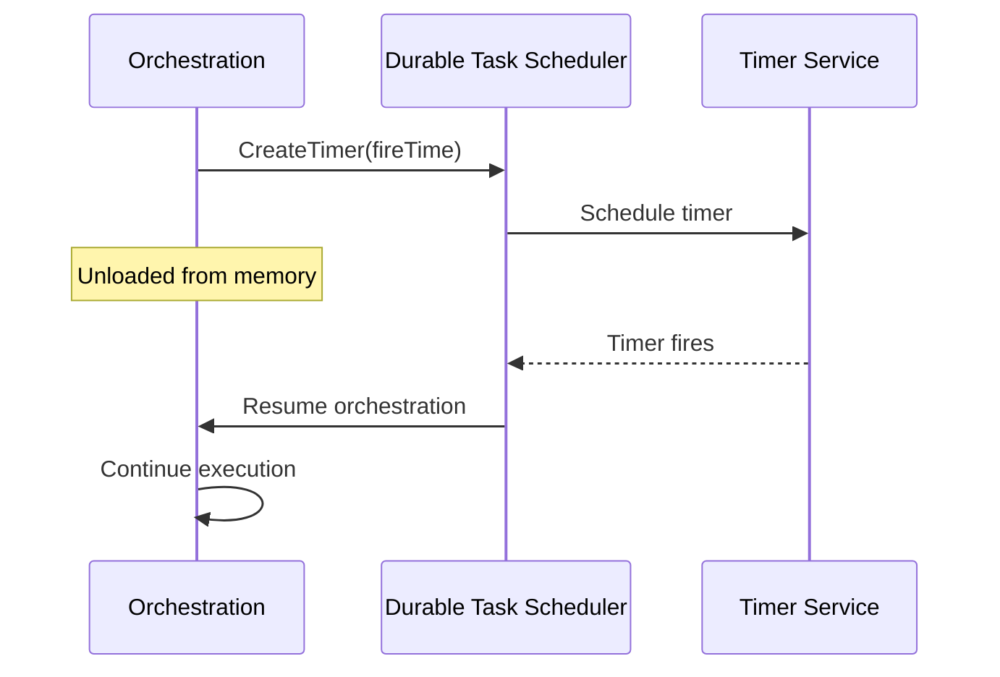

# Durable Timers

Durable timers allow orchestrations to pause execution for a specified duration and resume automatically with **Durable Task Scheduler**. Unlike `Thread.Sleep` or `Task.Delay`, durable timers survive process restarts.

## Overview



### Why Durable Timers?

Regular timers (`Task.Delay`) are not durable:
- They're lost if the process restarts
- They don't work with the replay mechanism
- They block orchestration resources

Durable timers:
- Persist their state to storage
- Resume correctly after process restarts
- Allow the orchestration to be unloaded from memory during the wait

## Basic Usage

### Creating a Timer

```csharp
public override async Task<string> RunAsync(
    TaskOrchestrationContext context, 
    string input)
{
    // Wait for 1 hour
    await context.CreateTimer(
        context.CurrentUtcDateTime.AddHours(1), 
        CancellationToken.None);
    
    // Continue after the delay
    return await context.CallActivityAsync<string>("ProcessAfterDelay", input);
}
```

### Timer with Specific Fire Time

```csharp
public override async Task<string> RunAsync(
    TaskOrchestrationContext context, 
    string input)
{
    // Wait until specific time (e.g., midnight)
    DateTime midnight = context.CurrentUtcDateTime.Date.AddDays(1);
    
    await context.CreateTimer(midnight, CancellationToken.None);
    
    return await context.CallActivityAsync<string>("DailyJob", input);
}
```

## Cancellable Timers

### Timer with Cancellation Support

```csharp
public override async Task<string> RunAsync(
    TaskOrchestrationContext context, 
    string input)
{
    using var cts = new CancellationTokenSource();
    
    // Create a cancellable timer
    Task timerTask = context.CreateTimer(
        context.CurrentUtcDateTime.AddMinutes(30), 
        cts.Token);
    
    // Start an activity
    Task<string> activityTask = context.CallActivityAsync<string>(
        "ProcessData", 
        input);
    
    // Wait for either to complete
    Task winner = await Task.WhenAny(timerTask, activityTask);
    
    if (winner == activityTask)
    {
        // Activity finished first, cancel the timer
        cts.Cancel();
        return await activityTask;
    }
    else
    {
        // Timer fired first
        return "Operation timed out";
    }
}
```

## Timer Patterns

### Timeout Pattern

Implement a timeout for activities or external events:

```csharp
public override async Task<ApprovalResult> RunAsync(
    TaskOrchestrationContext context, 
    ApprovalRequest request)
{
    // Send the approval request
    await context.CallActivityAsync("SendApprovalRequest", request);
    
    using var cts = new CancellationTokenSource();
    
    // Wait for approval event
    Task<bool> approvalTask = context.WaitForExternalEvent<bool>("ApprovalResponse");
    
    // Wait for timeout (24 hours)
    Task timeoutTask = context.CreateTimer(
        context.CurrentUtcDateTime.AddHours(24), 
        cts.Token);
    
    Task winner = await Task.WhenAny(approvalTask, timeoutTask);
    
    if (winner == approvalTask)
    {
        cts.Cancel();
        bool approved = await approvalTask;
        return new ApprovalResult 
        { 
            Status = approved ? "Approved" : "Rejected" 
        };
    }
    else
    {
        // Timeout - escalate
        await context.CallActivityAsync("EscalateApproval", request);
        return new ApprovalResult { Status = "Escalated" };
    }
}
```

### Periodic Task Pattern

Execute a task at regular intervals:

```csharp
public override async Task<string> RunAsync(
    TaskOrchestrationContext context, 
    PeriodicTaskInput input)
{
    // Execute task 10 times, once per hour
    for (int i = 0; i < 10; i++)
    {
        // Wait for the next interval
        await context.CreateTimer(
            context.CurrentUtcDateTime.AddHours(1), 
            CancellationToken.None);
        
        // Execute the periodic task
        await context.CallActivityAsync("PeriodicTask", new { Iteration = i });
    }
    
    return "Completed 10 iterations";
}
```

### Scheduled Task Pattern

Run a task at a specific time:

```csharp
public override async Task<string> RunAsync(
    TaskOrchestrationContext context, 
    ScheduledTaskInput input)
{
    DateTime scheduledTime = input.ScheduledTime;
    
    // If scheduled time is in the future, wait
    if (scheduledTime > context.CurrentUtcDateTime)
    {
        await context.CreateTimer(scheduledTime, CancellationToken.None);
    }
    
    // Execute the scheduled task
    return await context.CallActivityAsync<string>("ExecuteScheduledTask", input);
}
```

### Reminder Pattern

Send reminders at intervals until an event is received:

```csharp
public override async Task<string> RunAsync(
    TaskOrchestrationContext context, 
    TaskInfo taskInfo)
{
    // Send initial notification
    await context.CallActivityAsync("SendNotification", taskInfo);
    
    int reminderCount = 0;
    const int maxReminders = 5;
    
    while (reminderCount < maxReminders)
    {
        using var cts = new CancellationTokenSource();
        
        // Wait for completion event or reminder interval
        Task<bool> completionTask = context.WaitForExternalEvent<bool>("TaskCompleted");
        Task reminderTask = context.CreateTimer(
            context.CurrentUtcDateTime.AddHours(4), 
            cts.Token);
        
        Task winner = await Task.WhenAny(completionTask, reminderTask);
        
        if (winner == completionTask)
        {
            cts.Cancel();
            bool completed = await completionTask;
            if (completed)
            {
                return "Task completed";
            }
        }
        else
        {
            // Send reminder
            reminderCount++;
            await context.CallActivityAsync("SendReminder", 
                new { taskInfo, ReminderNumber = reminderCount });
        }
    }
    
    // Max reminders reached, escalate
    await context.CallActivityAsync("EscalateTask", taskInfo);
    return "Task escalated";
}
```

### Deadline Pattern

Ensure work completes by a deadline:

```csharp
public override async Task<ProcessResult> RunAsync(
    TaskOrchestrationContext context, 
    ProcessInput input)
{
    DateTime deadline = input.Deadline;
    var results = new List<string>();
    
    using var cts = new CancellationTokenSource();
    
    // Create deadline timer
    Task deadlineTask = context.CreateTimer(deadline, cts.Token);
    
    // Process items until deadline
    foreach (var item in input.Items)
    {
        Task<string> processTask = context.CallActivityAsync<string>(
            "ProcessItem", 
            item);
        
        Task winner = await Task.WhenAny(processTask, deadlineTask);
        
        if (winner == deadlineTask)
        {
            // Deadline reached, stop processing
            break;
        }
        
        results.Add(await processTask);
    }
    
    // Cancel deadline timer if still running
    if (!deadlineTask.IsCompleted)
    {
        cts.Cancel();
    }
    
    return new ProcessResult
    {
        ProcessedCount = results.Count,
        TotalItems = input.Items.Count,
        CompletedBeforeDeadline = !deadlineTask.IsCompleted
    };
}
```

### Batch Processing with Delay

Process items in batches with delays between batches:

```csharp
public override async Task<BatchResult> RunAsync(
    TaskOrchestrationContext context, 
    List<string> items)
{
    const int batchSize = 10;
    var results = new List<ProcessedItem>();
    
    for (int i = 0; i < items.Count; i += batchSize)
    {
        // Get batch
        var batch = items.Skip(i).Take(batchSize).ToList();
        
        // Process batch in parallel
        var tasks = batch.Select(item => 
            context.CallActivityAsync<ProcessedItem>("ProcessItem", item));
        var batchResults = await Task.WhenAll(tasks);
        results.AddRange(batchResults);
        
        // Wait between batches (rate limiting)
        if (i + batchSize < items.Count)
        {
            await context.CreateTimer(
                context.CurrentUtcDateTime.AddSeconds(5), 
                CancellationToken.None);
        }
    }
    
    return new BatchResult { ProcessedItems = results };
}
```

## Long-Running Timers

For timers longer than a few minutes, the orchestration will be unloaded from memory:

```csharp
public override async Task<string> RunAsync(
    TaskOrchestrationContext context, 
    string input)
{
    var logger = context.CreateReplaySafeLogger("LongTimerOrchestration");
    
    // Wait for 7 days
    logger.LogInformation("Starting 7-day wait at {Time}", context.CurrentUtcDateTime);
    
    await context.CreateTimer(
        context.CurrentUtcDateTime.AddDays(7), 
        CancellationToken.None);
    
    logger.LogInformation("Timer completed, resuming at {Time}", context.CurrentUtcDateTime);
    
    return await context.CallActivityAsync<string>("ProcessAfterWeek", input);
}
```

## Important Notes

### Always Use `context.CurrentUtcDateTime`

```csharp
// ❌ DON'T use DateTime.UtcNow
await context.CreateTimer(DateTime.UtcNow.AddHours(1), cts.Token);

// ✅ DO use context.CurrentUtcDateTime
await context.CreateTimer(context.CurrentUtcDateTime.AddHours(1), cts.Token);
```

Using `DateTime.UtcNow` breaks determinism and causes replay issues.

### Timer Resolution

Timers are not precise to the millisecond:
- The actual wake-up time may be slightly after the specified time
- Resolution depends on the backend implementation
- For precise timing requirements, use external scheduling services

### Timer State

During the timer wait:
- The orchestration can be unloaded from memory
- State is persisted in storage
- The orchestration resumes when the timer fires

## Azure Functions Integration

```csharp
[Function("TimerOrchestration")]
public static async Task<string> RunOrchestrator(
    [OrchestrationTrigger] TaskOrchestrationContext context)
{
    // Create a timer
    await context.CreateTimer(
        context.CurrentUtcDateTime.AddMinutes(5), 
        CancellationToken.None);
    
    return await context.CallActivityAsync<string>("AfterTimer", null);
}
```

## Best Practices

### 1. Always Handle Cancellation

```csharp
using var cts = new CancellationTokenSource();
try
{
    await context.CreateTimer(fireTime, cts.Token);
}
catch (OperationCanceledException)
{
    // Timer was cancelled - this is expected
}
```

### 2. Combine Timers with Events

```csharp
var eventTask = context.WaitForExternalEvent<string>("MyEvent");
var timeoutTask = context.CreateTimer(context.CurrentUtcDateTime.AddMinutes(10), cts.Token);

var winner = await Task.WhenAny(eventTask, timeoutTask);
```

### 3. Use Eternal Orchestrations for Recurring Timers

```csharp
public override async Task<string> RunAsync(
    TaskOrchestrationContext context, 
    int iteration)
{
    // Do work
    await context.CallActivityAsync("PeriodicWork");
    
    // Wait for next interval
    await context.CreateTimer(
        context.CurrentUtcDateTime.AddHours(1), 
        CancellationToken.None);
    
    // Continue as new to reset history
    context.ContinueAsNew(iteration + 1);
    return null!;
}
```

## Next Steps

- [External Events](External-Events.md) - Wait for external input
- [Eternal Orchestrations](Eternal-Orchestrations.md) - Long-running workflows
- [Writing Task Orchestrations](Writing-Task-Orchestrations.md) - Orchestration patterns
