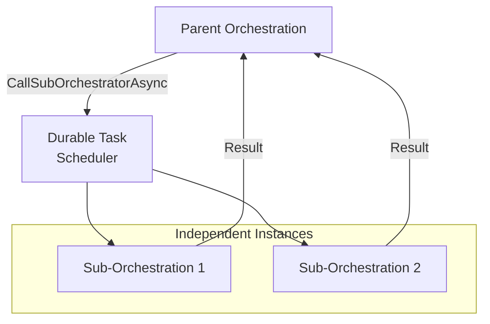

# Sub-Orchestrations

Sub-orchestrations allow you to compose complex workflows by calling other orchestrations from within an orchestration with **Durable Task Scheduler**. This enables code reuse, separation of concerns, and managing complexity in large workflows.

## Overview



Sub-orchestrations are orchestrations invoked from within a parent orchestration. They:
- Execute as independent orchestration instances
- Have their own execution history
- Can be monitored and managed separately
- Enable modular workflow design

## Basic Usage

### Calling a Sub-Orchestration

```csharp
public override async Task<OrderResult> RunAsync(
    TaskOrchestrationContext context, 
    OrderRequest request)
{
    // Call sub-orchestration and wait for result
    var paymentResult = await context.CallSubOrchestratorAsync<PaymentResult>(
        "PaymentOrchestration", 
        request.Payment);
    
    if (paymentResult.Success)
    {
        var shippingResult = await context.CallSubOrchestratorAsync<ShippingResult>(
            "ShippingOrchestration", 
            request.ShippingDetails);
        
        return new OrderResult
        {
            OrderId = request.OrderId,
            PaymentId = paymentResult.TransactionId,
            TrackingNumber = shippingResult.TrackingNumber
        };
    }
    
    return new OrderResult
    {
        OrderId = request.OrderId,
        Status = "PaymentFailed"
    };
}
```

### Sub-Orchestration Definition

```csharp
[DurableTask(nameof(PaymentOrchestration))]
public class PaymentOrchestration : TaskOrchestrator<PaymentRequest, PaymentResult>
{
    public override async Task<PaymentResult> RunAsync(
        TaskOrchestrationContext context, 
        PaymentRequest request)
    {
        // Validate payment
        var validation = await context.CallActivityAsync<ValidationResult>(
            "ValidatePayment", 
            request);
        
        if (!validation.IsValid)
        {
            return new PaymentResult { Success = false, Error = validation.Error };
        }
        
        // Process payment
        var transaction = await context.CallActivityAsync<TransactionResult>(
            "ProcessPayment", 
            request);
        
        // Send confirmation
        await context.CallActivityAsync(
            "SendPaymentConfirmation", 
            new { request.Email, transaction.TransactionId });
        
        return new PaymentResult
        {
            Success = true,
            TransactionId = transaction.TransactionId
        };
    }
}
```

## Specifying Instance ID

You can specify a custom instance ID for the sub-orchestration:

```csharp
public override async Task<string> RunAsync(
    TaskOrchestrationContext context, 
    ProcessRequest request)
{
    // Use custom instance ID for tracking
    string subInstanceId = $"process-{request.ProcessId}-{context.InstanceId}";
    
    var options = new SubOrchestrationOptions
    {
        InstanceId = subInstanceId
    };
    
    var result = await context.CallSubOrchestratorAsync<ProcessResult>(
        "ProcessingOrchestration",
        request.Data,
        options);
    
    return result.Output;
}
```

## Parallel Sub-Orchestrations

### Fan-Out Pattern

```csharp
public override async Task<AggregatedResult> RunAsync(
    TaskOrchestrationContext context, 
    BatchRequest request)
{
    // Start multiple sub-orchestrations in parallel
    var tasks = new List<Task<ItemResult>>();
    
    foreach (var item in request.Items)
    {
        var task = context.CallSubOrchestratorAsync<ItemResult>(
            "ProcessItemOrchestration", 
            item);
        tasks.Add(task);
    }
    
    // Wait for all to complete
    var results = await Task.WhenAll(tasks);
    
    return new AggregatedResult
    {
        ProcessedCount = results.Length,
        Results = results.ToList()
    };
}
```

### Parallel with Unique Instance IDs

```csharp
public override async Task<BatchResult> RunAsync(
    TaskOrchestrationContext context, 
    BatchInput input)
{
    var tasks = input.Items.Select((item, index) =>
    {
        var options = new SubOrchestrationOptions
        {
            InstanceId = $"{context.InstanceId}-item-{index}"
        };
        
        return context.CallSubOrchestratorAsync<ItemResult>(
            "ItemOrchestration",
            item,
            options);
    });
    
    var results = await Task.WhenAll(tasks);
    
    return new BatchResult { Items = results.ToList() };
}
```

## Hierarchical Orchestrations

### Multi-Level Workflow

```csharp
// Top-level orchestration
[DurableTask(nameof(OrderFulfillmentOrchestration))]
public class OrderFulfillmentOrchestration : TaskOrchestrator<Order, FulfillmentResult>
{
    public override async Task<FulfillmentResult> RunAsync(
        TaskOrchestrationContext context, 
        Order order)
    {
        // Level 1: Order validation
        await context.CallSubOrchestratorAsync(
            "OrderValidationOrchestration", 
            order);
        
        // Level 1: Inventory management (which has its own sub-orchestrations)
        var inventoryResult = await context.CallSubOrchestratorAsync<InventoryResult>(
            "InventoryManagementOrchestration", 
            order.Items);
        
        // Level 1: Shipping workflow
        var shippingResult = await context.CallSubOrchestratorAsync<ShippingResult>(
            "ShippingWorkflowOrchestration", 
            new ShippingRequest { Order = order, Inventory = inventoryResult });
        
        return new FulfillmentResult
        {
            OrderId = order.Id,
            TrackingNumber = shippingResult.TrackingNumber,
            EstimatedDelivery = shippingResult.EstimatedDelivery
        };
    }
}

// Level 2: Inventory management orchestration
[DurableTask(nameof(InventoryManagementOrchestration))]
public class InventoryManagementOrchestration : TaskOrchestrator<List<OrderItem>, InventoryResult>
{
    public override async Task<InventoryResult> RunAsync(
        TaskOrchestrationContext context, 
        List<OrderItem> items)
    {
        var allocations = new List<AllocationResult>();
        
        foreach (var item in items)
        {
            // Level 2: Item allocation sub-orchestration
            var allocation = await context.CallSubOrchestratorAsync<AllocationResult>(
                "ItemAllocationOrchestration", 
                item);
            allocations.Add(allocation);
        }
        
        return new InventoryResult { Allocations = allocations };
    }
}
```

## Error Handling

### Try-Catch in Parent

```csharp
public override async Task<ProcessingResult> RunAsync(
    TaskOrchestrationContext context, 
    ProcessingRequest request)
{
    var logger = context.CreateReplaySafeLogger("ParentOrchestration");
    
    try
    {
        var result = await context.CallSubOrchestratorAsync<SubResult>(
            "SubOrchestration", 
            request.Data);
        
        return new ProcessingResult
        {
            Success = true,
            Data = result
        };
    }
    catch (TaskFailedException ex)
    {
        logger.LogError(ex, "Sub-orchestration failed: {Message}", ex.Message);
        
        // Handle failure - could retry, compensate, or fail gracefully
        await context.CallActivityAsync("HandleFailure", 
            new FailureDetails { Request = request, Error = ex.Message });
        
        return new ProcessingResult
        {
            Success = false,
            Error = ex.Message
        };
    }
}
```

### Sub-Orchestration with Retry

```csharp
public override async Task<OrderResult> RunAsync(
    TaskOrchestrationContext context, 
    OrderRequest request)
{
    var retryOptions = new TaskOptions
    {
        Retry = new RetryPolicy(
            maxNumberOfAttempts: 3,
            firstRetryInterval: TimeSpan.FromSeconds(5))
    };
    
    var paymentResult = await context.CallSubOrchestratorAsync<PaymentResult>(
        "PaymentOrchestration",
        request.Payment,
        retryOptions);
    
    return new OrderResult { PaymentId = paymentResult.TransactionId };
}
```

## Patterns

### Saga Pattern with Sub-Orchestrations

```csharp
public override async Task<SagaResult> RunAsync(
    TaskOrchestrationContext context, 
    SagaRequest request)
{
    var completedSteps = new Stack<string>();
    
    try
    {
        // Step 1: Reserve inventory
        await context.CallSubOrchestratorAsync(
            "ReserveInventoryOrchestration", 
            request.Items);
        completedSteps.Push("ReserveInventory");
        
        // Step 2: Process payment
        await context.CallSubOrchestratorAsync(
            "ProcessPaymentOrchestration", 
            request.Payment);
        completedSteps.Push("ProcessPayment");
        
        // Step 3: Create shipment
        var shipment = await context.CallSubOrchestratorAsync<ShipmentResult>(
            "CreateShipmentOrchestration", 
            request.Shipping);
        completedSteps.Push("CreateShipment");
        
        return new SagaResult { Success = true, Shipment = shipment };
    }
    catch (TaskFailedException)
    {
        // Compensate in reverse order
        while (completedSteps.TryPop(out var step))
        {
            await context.CallSubOrchestratorAsync(
                $"Compensate{step}Orchestration",
                request);
        }
        
        return new SagaResult { Success = false, Message = "Transaction rolled back" };
    }
}
```

### Pipeline Pattern

```csharp
public override async Task<PipelineResult> RunAsync(
    TaskOrchestrationContext context, 
    PipelineInput input)
{
    // Stage 1: Data extraction
    var extractedData = await context.CallSubOrchestratorAsync<ExtractedData>(
        "DataExtractionOrchestration", 
        input.Source);
    
    // Stage 2: Data transformation
    var transformedData = await context.CallSubOrchestratorAsync<TransformedData>(
        "DataTransformationOrchestration", 
        extractedData);
    
    // Stage 3: Data validation
    var validatedData = await context.CallSubOrchestratorAsync<ValidatedData>(
        "DataValidationOrchestration", 
        transformedData);
    
    // Stage 4: Data loading
    var loadResult = await context.CallSubOrchestratorAsync<LoadResult>(
        "DataLoadingOrchestration", 
        validatedData);
    
    return new PipelineResult
    {
        RecordsProcessed = loadResult.RecordCount,
        Status = "Completed"
    };
}
```

### Dynamic Sub-Orchestration Selection

```csharp
public override async Task<ProcessingResult> RunAsync(
    TaskOrchestrationContext context, 
    WorkItem workItem)
{
    // Select orchestration based on work item type
    string orchestrationName = workItem.Type switch
    {
        "Order" => "OrderProcessingOrchestration",
        "Return" => "ReturnProcessingOrchestration",
        "Exchange" => "ExchangeProcessingOrchestration",
        _ => "DefaultProcessingOrchestration"
    };
    
    var result = await context.CallSubOrchestratorAsync<ProcessingResult>(
        orchestrationName, 
        workItem.Data);
    
    return result;
}
```

### Conditional Sub-Orchestration Chains

```csharp
public override async Task<ApprovalResult> RunAsync(
    TaskOrchestrationContext context, 
    ApprovalRequest request)
{
    // Basic approval
    var basicApproval = await context.CallSubOrchestratorAsync<ApprovalResponse>(
        "BasicApprovalOrchestration", 
        request);
    
    if (!basicApproval.Approved)
    {
        return new ApprovalResult { Status = "Rejected", Stage = "Basic" };
    }
    
    // Additional approval for high-value requests
    if (request.Value > 10000)
    {
        var managerApproval = await context.CallSubOrchestratorAsync<ApprovalResponse>(
            "ManagerApprovalOrchestration", 
            request);
        
        if (!managerApproval.Approved)
        {
            return new ApprovalResult { Status = "Rejected", Stage = "Manager" };
        }
    }
    
    // Executive approval for very high-value requests
    if (request.Value > 100000)
    {
        var execApproval = await context.CallSubOrchestratorAsync<ApprovalResponse>(
            "ExecutiveApprovalOrchestration", 
            request);
        
        if (!execApproval.Approved)
        {
            return new ApprovalResult { Status = "Rejected", Stage = "Executive" };
        }
    }
    
    return new ApprovalResult { Status = "Approved" };
}
```

## Fire-and-Forget Sub-Orchestrations

Start sub-orchestrations without waiting:

```csharp
public override async Task<string> RunAsync(
    TaskOrchestrationContext context, 
    NotificationRequest request)
{
    // Start notification sub-orchestration without waiting
    // Note: This is done via activity that schedules the orchestration
    await context.CallActivityAsync("StartNotificationOrchestration", request);
    
    // Continue with other work immediately
    await context.CallActivityAsync("ProcessRequest", request);
    
    return "Complete";
}

// Activity to start orchestration
[DurableTask(nameof(StartNotificationOrchestrationActivity))]
public class StartNotificationOrchestrationActivity : TaskActivity<NotificationRequest, string>
{
    private readonly DurableTaskClient _client;
    
    public StartNotificationOrchestrationActivity(DurableTaskClient client)
    {
        _client = client;
    }
    
    public override async Task<string> RunAsync(
        TaskActivityContext context, 
        NotificationRequest request)
    {
        string instanceId = await _client.ScheduleNewOrchestrationInstanceAsync(
            "NotificationOrchestration", 
            request);
        
        return instanceId;
    }
}
```

## Best Practices

### 1. Keep Sub-Orchestrations Focused

```csharp
// ✅ Single responsibility
"PaymentProcessingOrchestration"
"InventoryReservationOrchestration"
"ShippingOrchestration"

// ❌ Too broad
"DoEverythingOrchestration"
```

### 2. Use Meaningful Instance IDs

```csharp
// ✅ Traceable instance IDs
var options = new SubOrchestrationOptions
{
    InstanceId = $"payment-{orderId}-{context.CurrentUtcDateTime:yyyyMMdd}"
};

// ❌ Random or generic IDs
var options = new SubOrchestrationOptions
{
    InstanceId = Guid.NewGuid().ToString()
};
```

### 3. Handle Failures Appropriately

```csharp
// ✅ Proper error handling
try
{
    await context.CallSubOrchestratorAsync("SubOrchestration", input);
}
catch (TaskFailedException ex)
{
    // Log, compensate, or handle gracefully
    logger.LogError(ex, "Sub-orchestration failed");
}
```

### 4. Consider History Size

```csharp
// ✅ Break up large fan-outs into batches
var batchSize = 10;
for (int i = 0; i < items.Count; i += batchSize)
{
    var batch = items.Skip(i).Take(batchSize);
    var batchTasks = batch.Select(item =>
        context.CallSubOrchestratorAsync<Result>("ProcessItem", item));
    await Task.WhenAll(batchTasks);
}
```

## Next Steps

- [Writing Task Orchestrations](Writing-Task-Orchestrations.md) - Orchestration basics
- [Error Handling and Compensation](Error-Handling-and-Compensation.md) - Handle failures
- [Fan-Out-Fan-In](Fan-Out-Fan-In.md) - Parallel patterns
