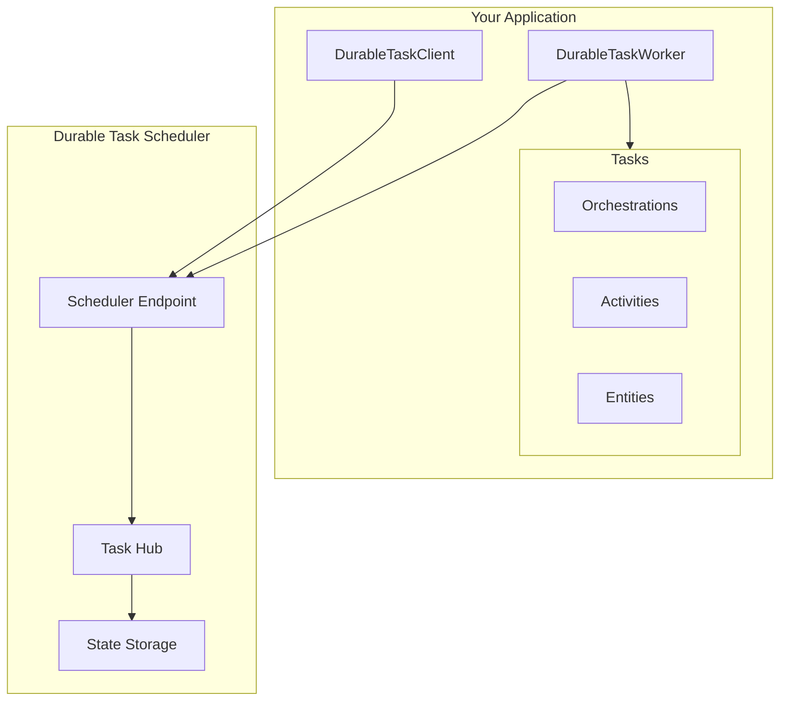

# Durable Task Scheduler

The durable task scheduler is a solution for durable execution in Azure. Durable execution is a fault-tolerant approach to running code that handles failures and interruptions through automatic retries and state persistence. Scenarios where durable execution is required include distributed transactions, multi-agent orchestration, data processing, infrastructure management, and others. Coupled with a developer orchestration framework like Durable Functions or the Durable Task SDKs, the durable task scheduler enables developers to author stateful apps that run on any compute environment without the need to architect for fault tolerance.



## Key Features

| Feature | Description |
|---------|-------------|
| **Durable Execution** | Workflows survive crashes, restarts, and deployments |
| **Built-in Patterns** | Function chaining, fan-out/fan-in, human interaction, and more |
| **Durable Entities** | Manage small pieces of state reliably |
| **Orchestration Versioning** | Deploy new versions without breaking in-flight orchestrations |
| **Auto-scaling** | Scale workers based on orchestration load |
| **Local Development** | Full-featured emulator in Docker |
| **Multiple Hosting Options** | ASP.NET Core, Azure Container Apps, AKS, or Azure Functions |

## Quick Start

### 1. Start the Emulator

```bash
docker pull mcr.microsoft.com/dts/dts-emulator:latest
docker run -d -p 8080:8080 -p 8082:8082 mcr.microsoft.com/dts/dts-emulator:latest
```

### 2. Install NuGet Packages

```bash
dotnet add package Microsoft.DurableTask.Worker.AzureManaged
dotnet add package Microsoft.DurableTask.Client.AzureManaged
dotnet add package Microsoft.DurableTask.Generators
```

### 3. Create Your First Orchestration

```csharp
using Microsoft.DurableTask;

[DurableTask]
public class GreetingOrchestration : TaskOrchestrator<string, string>
{
    public override async Task<string> RunAsync(
        TaskOrchestrationContext context, 
        string name)
    {
        string greeting = await context.CallActivityAsync<string>(
            nameof(SayHelloActivity), name);
        
        return greeting;
    }
}
```

[Get Started]({{ site.baseurl }}/docs/Getting-Started/){: .btn .btn-primary .fs-5 .mb-4 .mb-md-0 .mr-2 }
[View on GitHub](https://github.com/Azure-Samples/Durable-Task-Scheduler){: .btn .fs-5 .mb-4 .mb-md-0 }

---

## Resources

- **SDK Repository**: [microsoft/durabletask-dotnet](https://github.com/microsoft/durabletask-dotnet)
- **Samples Repository**: [Azure-Samples/Durable-Task-Scheduler](https://github.com/Azure-Samples/Durable-Task-Scheduler)
- **Documentation**: [Durable Task Scheduler on MS Learn](https://learn.microsoft.com/azure/azure-functions/durable/durable-task-scheduler/)
